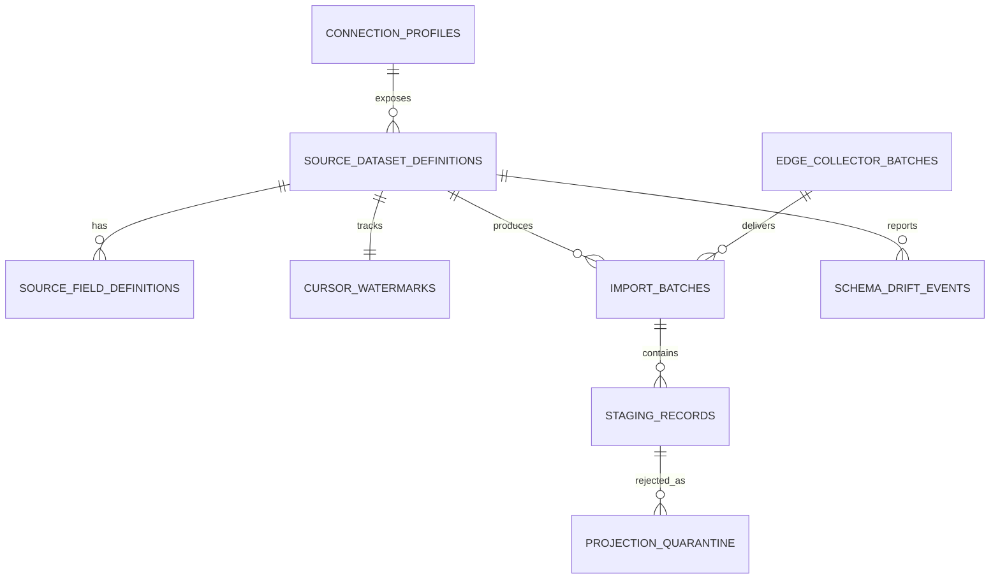
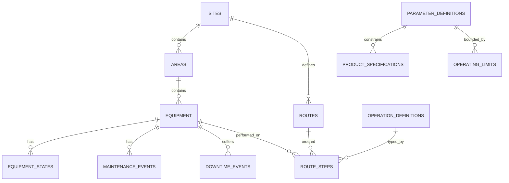
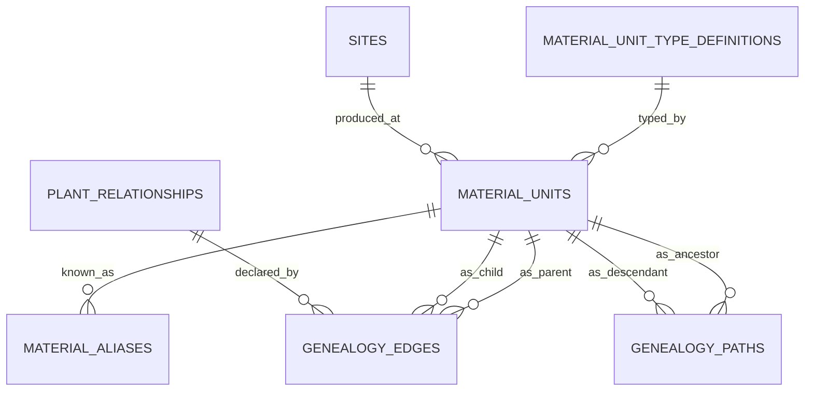
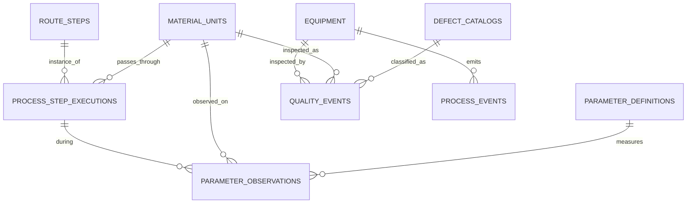
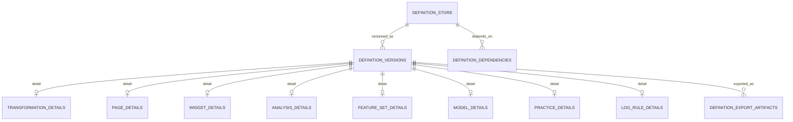
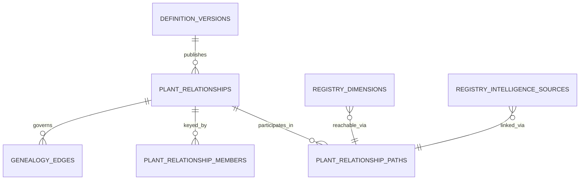
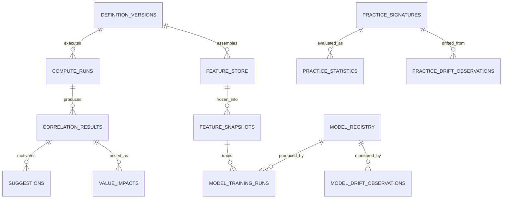
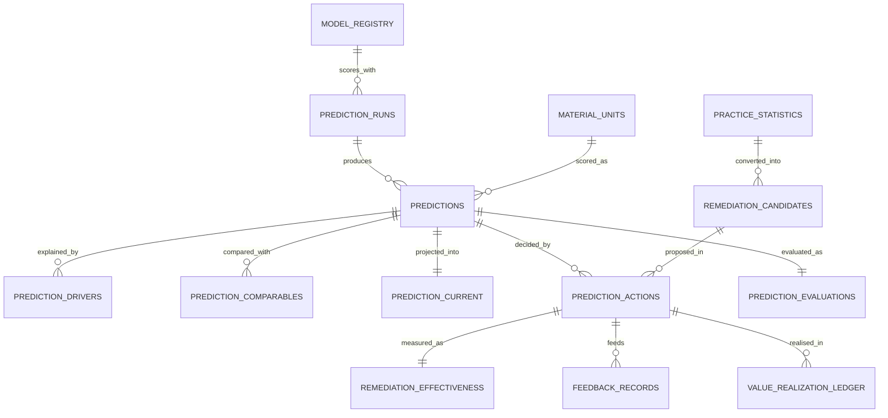
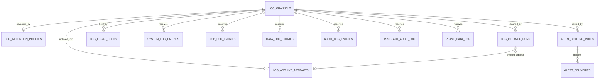
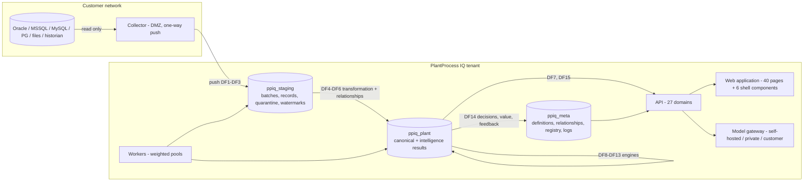

# PlantProcess IQ - Master Design Document

**Version 4.9 | Author: Karim, SOU Industrial Software, Dusseldorf** | **MASTER DESIGN FREEZE CANDIDATE**

> **Change log — Operational-Regime, Multi-Objective Practice and Period-Driver Hardening (22 August 2026, v4.9).** v4.9 closes the two generic gaps exposed by the first oil-plant requirement review without introducing oil-specific vocabulary: process transitions/changeovers and stabilisation become first-class governed context so statistics cannot mix distinct operating regimes; practice learning gains customer-declared multi-objective objective sets with Pareto/non-dominance and explicit preference resolution rather than silently choosing one KPI; exact period-to-period operational driver decomposition is added so the Assistant can explain changes in cost/productivity drivers from Layer-A facts before the monetary Value Engine is available. The release also binds the September checkpoint/fallback to the single v2.13 execution workbook. The six chapters remain the only design authority.


> **Change log - Consistency correction (v4.6 to v4.6.1).** The data asset lifecycle row for the donor schemas said RETIRE after capture is proven while the gate three paragraphs below requires four conditions; the row now says RETIRE after the retirement gate passes. Rule 2 now states explicitly that the generator emits staging and canonical operational data while the analytical rows are computed by the real engines.
>
> **Change log - M1 Presentation Data Topology (v4.5 to v4.6).** No product capability added, no target architecture changed. One section added, 4.5.2a, recording the governed M1 presentation-data exception, the one-Fleet-v2 rule, the data asset lifecycle, the `src_*` donor role with its retirement gate, and the M1 to M2a convergence where the frozen generator emits native customer-source fixtures. Three consistency corrections outside that section: the authority paragraph now names 4.5.2a as the one transitional exception it carries; the staging isolation rule is corrected because it forbade what C1 and DF4 require, since the S1 authoring surface must read staging shapes to declare how staged data becomes canonical; and the retirement gate is strengthened from three proof dimensions to nine, because a generator can match row counts and categorical distributions while silently losing numeric ranges, null profiles, timestamp horizons, genealogy conservation and the phenomenon manifest.
>
> **Change log - Second-Order Consistency Pass (v4.4 to v4.5). MASTER DESIGN FREEZE CANDIDATE.** No product capability added. Seven structural corrections: the global `remediation_candidates` template is separated from the per-prediction `prediction_remediation_evaluations`, because actionability is a property of one unit at one moment and not of a historical template; `can_accept` is defined in 4.5.12a as the **complete** seven-condition server authority for the whole decision boundary, so no client re-derives it; `prediction_current` becomes the complete operational read model with the deadline, latency, scoring mode, fallback state and `can_accept` projected onto it, and `prediction_runs` gains `scoring_mode` separate from `trigger_kind`; serving identity is fixed as `(tenant_id, model_code, outcome_code, grain_code)` with tenant-aware uniqueness stated as a general rule and a CHECK forbidding one version being both primary and fallback; Reject and Defer are gated by `can_accept` exactly as Accept is, and `RM10` protects the whole boundary; `backoff_rule`, `sensitivity_state` and `delivery_latency_seconds` become `NOT NULL` with `not_tested` and `deadline_basis` as explicit unavailability states; and `remediation_escalations` is promoted to DDL grade in 4.5.12b.

---

> **CURRENT AUTHORITY — Master Design v4.9.** PlantProcess IQ has exactly six current design-authority chapters and one current execution-authority backlog workbook. No other file may define, amend, override, supplement or reinterpret current product design or implementation scope. A design change edits the owning chapter directly; a scope change edits the backlog directly. Transitional reviews, amendment packs, ledgers, mandates and prior revisions are historical evidence only after their accepted content is integrated. Validation scripts are code/enforcement instruments, not design documentation.


# CHAPTER 3 - GENERAL SOFTWARE PRODUCT TECHNICAL FUNCTION DESCRIPTION

> **Target audience (4.7):** the customer's advanced IT, database and software staff, and our own developers taking hand-over for further development.
>
> **Voice (4.8):** senior software engineer and technical lead.
>
> **Authority.** Chapter 2 is the naming, structure and positioning authority. This chapter uses its canonical journey **J1 to J15**, its technical codes **DF1 to DF15**, its inventory of **40 route pages and 6 global shell components**, its glossary (Ch2 3.9), its plant model (Ch2 3.14), its relationship model (Ch2 3.15) and its positioning rule (Ch2 3.19) without variation.
>
> **Target design authority.** This chapter states the target product contract. It contains no current endpoint namespace, no current limitation and no plaintext credential. Build state lives in the Implementation Status Register; credential values live in the protected deployment runbook. **The single exception is section 4.5.2a**, which records the governed M1 presentation-data exception together with its mandatory M2a convergence and retirement boundary. It is recorded here rather than in the register because it is a governed architectural boundary with an expiry, not a build status. **It does not redefine the target architecture**, and nothing in it survives M2a unproven.

---

## 4.0 Reading guide

### 4.0.1 Three ways to read this chapter

- **A customer database administrator** reads 4.2 DF1 to DF6, then 4.5 and 4.6, to approve the installation: what touches their systems, where data lands, who can see it, what is retained and for how long.
- **A customer IT security reviewer** reads 4.5.8 tenancy, 4.6 credentials and secrets, and 4.6.6 API governance.
- **A developer taking hand-over** reads it in order, then Chapter 4.

### 4.0.2 The eleven-field step contract

Every one of the fifteen DF steps in 4.2 is specified with the same eleven fields, without exception. A step missing a field is an incomplete specification, not a shorter one.

```
CONCEPT      what this step exists to achieve
ACTOR        which role or system performs it
PRECONDITION what must already be true
SURFACE      the page or shell component, and its route
SEQUENCE     the ordered interaction or processing, step by step
CALLS        endpoint -> meaning, in order
PAYLOAD      the essential request and response content
PERSISTS     what rows are written, in which schema
VALIDATION   client-side and server-side, with the exact refusal
FAILURE      what the user or operator sees when each layer fails
ACCEPTANCE   the observable condition that proves the step
```

### 4.0.3 The ten-field page contract

Every one of the 40 route pages and 6 shell components in 4.4 is specified with the same ten fields.

```
AIM            what the user achieves
ROLES          who acts, who reads, who is denied
LAYOUT         region by region, in logical terms
CONTROLS       every control: label, type, colour token, position, enabled-when
HOOKS          each hook and what it owns
CALLS          mount calls, then action calls
STATES         empty / loading / populated / filtered-empty / blocked / refused / failed
SELECTIONS     associative participation
EMPTY-INSTALL  what it shows on day one at a customer
A11Y + RTL     keyboard path and mirrored verification
```

### 4.0.4 How this chapter answers the positioning checklist

Chapter 2 3.19 imposes eight questions on every authoring capability and nine on every intelligence capability. This chapter answers them structurally rather than per paragraph:

| Question | Answered by |
|---|---|
| As generic and flexible as a mature analytics product? | 4.4 D1, D2, D3 control tables; 4.3 inventory |
| Creatable without a code change? | 4.2 DF7; 4.5.11 definition store |
| Every customer-specific option registry-driven? | 4.5.5 registry tables; 4.2 DF7 CALLS |
| Uses the permanent relationship model? | 4.5.10, and the consumer column in every affected step |
| Consumes canonical data **and** intelligence? | 4.5.13 bindable intelligence sources; 4.2 DF7 |
| Every result carries evidence and provenance? | 4.5.1 provenance triple; 4.5.16 join path JP5 |
| Clear at enterprise scale? | 4.4 states, 4.5.17 index rationale, Ch4 5.1.3 |
| Complete backend, database and validation contract? | 4.2 CALLS, PERSISTS, VALIDATION per step |
| Which plant entities does it use? | 4.5.4 clusters; per-step PERSISTS |
| Features through genealogy and route context? | 4.2 DF10; 4.5.12 feature tables |
| Which method computes it? | 4.2 DF9, DF11, DF12, DF13; Ch4 5.5, 5.6 |
| Where is the result stored? | 4.5.12 |
| How displayed and filtered? | 4.4 D4 to D12; 4.5.13 |
| How is evidence inspected? | 4.4 evidence drawer; 4.5.16 JP5 |
| How is the decision recorded? | 4.2 DF14; 4.5.14 |
| How is the outcome captured? | 4.2 DF14; 4.5.14 |
| How does feedback contribute to governed learning? | 4.2 DF14, DF15; Ch4 5.4.4 |

---

## 4.1 The list of data-flow steps

Fifteen technical steps, DF1 to DF15, mapped to the canonical user journey J1 to J15 of Chapter 2 3.3.1. **The journey is never renumbered.** DF codes exist so that a technical step and a journey step can never be confused.

| DF | Technical step | Journey | Owner subsystem | Runs as |
|---|---|---|---|---|
| DF1 | Source connection and read-only proof | J4 | Acquisition | User action |
| DF2 | Dataset registration, columns, business key, watermark | J5 | Acquisition | User action |
| DF3 | Incremental import into staging | J6 | Acquisition | Job, class `import` |
| DF4 | Transformation authoring and relationship publication | J7 | Authoring | User action, then publish |
| DF5 | Canonical projection with validation and quarantine | J8 | Projection | Job, class `projection` |
| DF6 | Genealogy and identity resolution | J9 | Projection | Inside DF5, inspected in J9 |
| DF7 | Page, widget and filter binding; associative query | J10, J11 | Presentation | User action, then query |
| DF8 | Readiness evaluation | J12 | Engine | Synchronous, and inside every analytical job |
| DF9 | Statistical and correlation run | J12 | Engine | Job, class `analysis` |
| DF10 | Incremental feature refresh and snapshot | J12 | Engine | Job, class `analysis` |
| DF11 | Model training, evaluation, registration | J12 | Engine | Job, class `ml` |
| DF12 | Practice learning | J13 | Engine | Job, class `analysis` |
| DF13 | Prediction scoring, drivers, remediation candidates | J13 | Engine | Job, class `ml` |
| DF14 | Decision, action tracking, outcome, evaluation, value, feedback | J14 | Governance | User action, then job |
| DF15 | Assistant retrieval, Supervisor, logging, routing, retention | J15 | Platform | Mixed |

**Dependency order.** DF1 to DF6 are strictly sequential per dataset. DF7 depends only on DF5. DF8 precedes DF9, DF11, DF12 and DF13. DF10 precedes DF11 and DF13. DF12 precedes the remediation half of DF13. DF13 precedes DF14. DF15 is continuous. The machine-readable form of this ordering is the job dependency graph of Chapter 4 5.3.6.

---

## 4.2 Each data-flow step, to endpoint level

### DF1 - Source connection and read-only proof

**CONCEPT.** Establish a read-only path to one customer database or file share, prove it is read-only, and record how it may be used: schedule window and load budget. This is the only door for plant data.

**ACTOR.** Administrator or Data Engineer.

**PRECONDITION.** Licence active (J2). The customer's DBA has created a read-only account and opened the port to the collector.

**SURFACE.** B1 Connections, `/data-integration/connections`.

**SEQUENCE.**
1. The page loads existing profiles and the connector catalogue in parallel; both panels render skeletons until settled.
2. **New Connection Profile** switches the panel to form mode.
3. The author enters name, provider type, host, port, database, schema, credentials, and for file providers the path. Provider-dependent fields appear and disappear on provider change.
4. The author sets the **source system tag** (MES, level 2, historian, LIMS, ERP, inspection) - lineage only, never a behaviour branch.
5. The author sets the **load budget**: max rows per read, statement timeout, requests per minute, approved window.
6. **Test connection** proves reachability, authentication, permission and **read-only status**.
7. **Save** persists the profile; credentials go to the vault and the row stores only a vault reference.

**CALLS.**

| Endpoint | Meaning |
|---|---|
| `GET /api/connections` | Existing profiles, credentials masked, always |
| `GET /api/connections/catalog` | Connector classes with honest availability, backend-served so the interface cannot invent one |
| `POST /api/connections` | Create; body per PAYLOAD; response `{ id, code, providerType, isActive }` |
| `PUT /api/connections/{id}` | Update; credentials only by explicit re-entry |
| `POST /api/connections/{id}/test` | Reachability, authentication, permission, read-only verification |
| `POST /api/connections/{id}/activate` / `/deactivate` | Availability for scheduling |
| `PUT /api/connections/{id}/budget` | Load budget |
| `PUT /api/connections/{id}/schedule` | Approved window |

**PAYLOAD.** Request: `{ name, code?, providerType, host, port, database, schema, username, secretRef, filePath?, sourceSystemTag, budget { maxRowsPerRead, statementTimeoutSeconds, requestsPerMinute, approvedWindow { from, to, daysOfWeek } } }`. Test response: `{ success, reachedAt, latencyMs, serverVersion?, readOnlyVerified, failedLayer? }`.

**PERSISTS.** `ppiq_meta.connection_profiles` one row; the secret in the vault; `ppiq_meta.audit_log_entries` one create entry.

**VALIDATION.**
- Client: required field empty produces an inline error and **no network call**. Non-numeric port inline. Provider-specific required field inline.
- Server: unknown `providerType` returns 400 naming the accepted set. **A credential proven write-capable fails the test with `CN03 read-only verification failed`** - a read-write account violates the platform boundary and is refused, not warned.

**FAILURE.**

| Layer | Rendering |
|---|---|
| Network unreachable | In-page red result naming host and port tried, code `CN01` |
| Authentication | "Authentication failed for user `<name>`", code `CN02`; no stack trace |
| Permission | "Connected, but the account cannot read `<schema>`", code `CN04` |
| Vault unavailable | Save refused with `CN05`; **no profile is created without its secret stored** |
| API down | Contained error card in that panel; the other panel keeps working |

**ACCEPTANCE.** Two profiles of different provider types created through the interface; both tests green including read-only verification; credentials masked on re-open; a stopped source produces a named in-page failure and no exception page; one row per profile with a vault reference and no secret in the row.

---

### DF2 - Dataset registration, columns, business key, watermark

**CONCEPT.** Choose which source objects enter the product, and declare per object the imported columns, the business key and the incremental cursor. Registration is what makes a dataset due for import.

**ACTOR.** Data Engineer.

**PRECONDITION.** DF1 profile active and tested.

**SURFACE.** B2 Dataset Registry `/data-integration/registry`; B3 Prepare Import `/data-integration/prepare`.

**SEQUENCE.**
1. Select a connection. A live browse loads the schema tree, then tables, then columns with observed types and row estimates, all under the load budget.
2. Select a table. The discovery service marks likely keys and likely timestamps as **suggestions the author confirms**, never as decisions.
3. **Register** creates the dataset with its staging target name.
4. On Prepare Import: choose imported columns; choose the business key columns and their order; choose the watermark column and its type. Save.
5. Register the taxonomy sources first, because canonical projection resolves vocabulary before it resolves facts.

**CALLS.**

| Endpoint | Meaning |
|---|---|
| `GET /api/connections/{id}/discover` | Schemas, tables and views the link can see |
| `GET /api/connections/{id}/discover/{schema}/{table}/columns` | Columns with observed type, nullability, row estimate |
| `POST /api/datasets` | Register; response `{ id, stagingTableName, isDue }` |
| `GET /api/datasets` | Registered datasets |
| `PUT /api/datasets/{id}/columns` | Imported column set |
| `PUT /api/datasets/{id}/business-key` | Ordered business-key members |
| `PUT /api/datasets/{id}/cursor` | Watermark column, type and initial value |
| `GET /api/datasets/{id}/preview` | First rows, read under the budget, for verification before first import |

**PAYLOAD.** Register: `{ connectionProfileId, sourceSchema, sourceTable, isTaxonomy }`. Business key: `{ members: [{ sourceField, memberOrder }] }`. Cursor: `{ watermarkColumn, watermarkType, initialValue? }`.

**PERSISTS.** `ppiq_meta.source_dataset_definitions`; one `source_field_definitions` row per included column; `ppiq_meta.business_key_definitions` and `business_key_members`; `ppiq_staging.cursor_watermarks` one row. **The staging table itself is created on first import, not at registration**, so a registration that is later removed leaves no orphan table.

**VALIDATION.**
- Client: zero columns selected is an inline error. **No watermark is a warning, not an error**, with the sentence "Without a watermark every run re-reads the whole table."
- Server: `DS01` watermark column absent from the source, naming the column. `DS02` watermark type not orderable, naming the type. `DS03` business-key member not in the imported column set. `DS04` a dataset with no watermark cannot be scheduled below the daily floor - the cadence is forced and the reason stated.

**FAILURE.** Discovery timeout returns `DS05` naming the budget rule and the measured elapsed time, with a link to raise the timeout. A partial discovery renders what it retrieved and states what it could not reach.

**ACCEPTANCE.** Two datasets registered from a live browse, one taxonomy; business key and watermark persisted across reload; an import job row exists per dataset; a dataset without a watermark is visibly forced to the daily floor with the reason.

---

### DF3 - Incremental import into staging

**CONCEPT.** Move only the delta into staging, exactly as it arrived, with the batch as the unit of lineage and retry, inside the declared source-load budget.

**ACTOR.** The `import` job class, or a Data Engineer running now.

**PRECONDITION.** DF2 complete for the dataset.

**SURFACE.** B4 Importing `/data-integration/importing`; B5 Jobs Monitor `/data-integration/jobs`; progress also visible in G6 the activity tray from any page.

**SEQUENCE.**
1. The scheduler admits the run through the `import` pool, after jitter and the skip-if-running policy.
2. The reader evaluates the budget **before touching the source**; an over-budget read is refused before the source sees a statement.
3. Rows are read as `WHERE watermark > :last AND watermark <= :now`, bounded by the row cap.
4. Rows land in the staging table with the staging envelope: batch id, load timestamp, source watermark, row number, raw payload.
5. The cursor advances **to the last row actually read**. A batch that hit the cap reports itself partial and the next cycle continues rather than restarting.
6. Progress streams per the protocol of Chapter 4 5.3.7: rows read, stage, heartbeat.
7. The batch reaches a terminal state and, on success, raises the projection dependency for DF5.

**CALLS.**

| Endpoint | Meaning |
|---|---|
| `POST /api/imports/run` | Start for a dataset or a connection; returns the batch identity immediately |
| `POST /api/imports/run-due` | Start every due dataset, admitted through the pool |
| `GET /api/imports/batches?dataset=&status=&from=&to=` | Batch history with watermark range, counts, outcome, duration |
| `GET /api/imports/batches/{id}` | One batch with its failure reason if terminal-failed |
| `POST /api/imports/backfill` | Historical load with window, throttle and checkpoint; pausable and resumable by batch |
| `POST /api/imports/backfill/{id}/pause` / `/resume` | Backfill control |
| `GET /api/imports/watermarks` | Current watermark per dataset: the freshness ground truth DF8 reads |
| `GET /api/runs/{runId}/stream` | Progress events, per Chapter 4 5.3.7 |

**PAYLOAD.** Batch record: `{ id, datasetId, sourceObjectName, sourceSystem, status, startedAtUtc, finishedAtUtc, rowCount, watermarkFrom, watermarkTo, checksum, isPartial, failureReason?, failureCode? }`.

**PERSISTS.** `ppiq_staging.import_batches` one row per run; `ppiq_staging.staging_records` one row per source row with `raw_json`; `ppiq_staging.cursor_watermarks` advanced; `ppiq_meta.job_log_entries` progress and outcome; `ppiq_staging.schema_drift_events` where a column appeared, disappeared or changed type.

**VALIDATION.** Server-side, all before the source is touched: `IM01` outside the approved window, naming the window; `IM02` row cap would be exceeded, naming the cap; `IM03` rate limit, naming requests per minute; `IM04` concurrent-read limit for this source. Cursor faults: `IM05` cursor type mismatch, `IM06` null cursor value in source rows, `IM07` unparseable timestamp with the offending value echoed.

**FAILURE.** A source down reaches a terminal failed state with a clean message, never an unhandled exception. **A partial batch is never visible downstream**: DF5 admits only terminal-successful batches. A run killed mid-flight is moved to `reaped` by the reaper. A repeated failure opens the source circuit breaker and stops admitting that class, with the reason recorded.

**ACCEPTANCE.** Batches and staging rows grow; a second run with no new source rows completes with a small or zero delta, proving the cursor; one row inserted in the source propagates as exactly one staging row; a stopped source fails cleanly and opens its breaker; an over-budget read is refused with the rule named and the source shows no statement.

---

### DF4 - Transformation authoring and relationship publication

**CONCEPT.** The customer's own engineer declares how staged data becomes the canonical model, and **publishing that declaration emits the permanent plant relationship model.** This is the step that makes everything downstream possible.

**ACTOR.** Data Engineer authors; Administrator publishes.

**PRECONDITION.** DF3 has produced at least one successful batch for each dataset the definition reads.

**SURFACE.** C1 Transformation Studio `/prep/canvas`; C6 Relationship Browser `/relationships` to inspect the result.

**SEQUENCE.**
1. The author drags staged tables from the schema tree onto the board as nodes with typed ports.
2. The author declares joins with **ordered composite key pairs** from typed dropdowns fed by live schema; the edge is labelled with the equality.
3. The author declares **grain on both sides** and, where the join converts grain, the **attribution rule** whose weights must sum to exactly one per child.
4. The author declares aliases: which source field plays which business-key member role, resolving the customer's several identifiers for one physical unit.
5. The author maps to canonical targets; expression blocks configure filters and derived columns.
6. **Validate** runs the full rule set; refusals name the rule and echo the offending fragment.
7. **Preview** dry-runs against staging with row counts per node and a cost estimate.
8. **Compiled SQL** shows exactly what will run.
9. **Impact preview** names every definition, page, analysis, model and relationship that depends on what is about to change.
10. **Publish** freezes an immutable version **and emits the relationship records**, ambiguity-checked and validation-stamped.

**CALLS.**

| Endpoint | Meaning |
|---|---|
| `POST /api/definitions` | Create a definition of surface `S1`; response the definition identity |
| `PUT /api/definitions/{id}/draft` | Save a draft version: graph or SQL |
| `POST /api/definitions/{id}/validate` | Full rule set; returns typed diagnostics |
| `GET /api/definitions/{id}/compile` | The compiled statement |
| `POST /api/definitions/{id}/preview` | Bounded dry-run, rows per node, cost estimate |
| `GET /api/definitions/{id}/impact` | Downstream dependency impact before publishing |
| `POST /api/definitions/{id}/publish` | Freeze immutable version, **emit relationships** |
| `GET /api/definitions/{id}/versions` | Version history with status and publisher |
| `POST /api/definitions/{id}/rollback` | Set the rollback pointer to a prior version |
| `GET /api/definitions/{id}/export` / `POST /api/definitions/import` | The definition as a portable artifact |
| `GET /api/relationships` | The published model, filterable by entity |
| `GET /api/relationships/{id}` | One relationship with members, grain, attribution, paths, states |
| `POST /api/relationships/{id}/validate` | Prove a relationship against real data |
| `GET /api/relationships/paths?from=&to=` | Resolved paths with hop count and which is preferred |

**PAYLOAD.** Publish response: `{ definitionId, versionNumber, definitionHash, outputSchema, relationshipsEmitted: [{ id, leftEntity, rightEntity, cardinality, grainLeft, grainRight, attributionRule?, ambiguityState, validationState }] }`.

**PERSISTS.** `ppiq_meta.definition_store` and `definition_versions` (immutable on publish) and `definition_dependencies`; `ppiq_meta.transformation_details` as the one-to-one detail row; `ppiq_meta.plant_relationships`, `plant_relationship_members`, `plant_relationship_paths`; `ppiq_meta.business_key_definitions` extended; audit entries for validate, publish and rollback.

**VALIDATION.** Authoring rules, all refused at drag time or at validate, each with a sentence and a code:

| Code | Rule |
|---|---|
| `TR01` | Dataset wired into a value input, or the reverse |
| `TR02` | Type mismatch into an operation |
| `TR03` | Cycle in the graph, naming the cycle |
| `TR04` | Required input unconnected at run |
| `TR05` | Aggregate outside an aggregation context |
| `TR06` | Column absent from the upstream node's output |
| `TR07` | **Two tables compared with no join declared between them** - the mistake a plant engineer actually makes, named with the fix |
| `TR08` | Composite key members declared out of order or incomplete |
| `TR09` | Grain conversion declared with no attribution rule |
| `TR10` | Attribution weights that cannot sum to one |
| `TR11` | **Relationship ambiguity**: two equally valid paths and no preferred path chosen. The publish is refused, not resolved by guess |
| `TR12` | Safe-SQL refusal: statement other than `SELECT` or `WITH`, forbidden construct, or unlisted identifier. Persisted as a first-class status |

**FAILURE.** A published version is immutable; an attempted edit forks a draft rather than failing. Publishing while a dependent definition is mid-edit warns with the dependency named. A relationship that fails its data validation publishes with `validationState = unproven` and **every consumer treats an unproven relationship as unusable for automated analysis while still allowing manual exploration**, with the state visible on C6.

**ACCEPTANCE.** Two staged tables joined on a composite key; the relationship appears in C6 with grain, cardinality, members in order and attribution; a third table with no join produces `TR07` naming the fix; an ambiguous second path produces `TR11` and refuses publish; export and re-import into a second instance reproduces the definition and the relationships; re-publishing a corrected version deactivates the prior relationship rather than deleting it.

---

### DF5 - Canonical projection with validation and quarantine

**CONCEPT.** Run the published definition over staged rows into the canonical model, **rejecting bad rows individually with typed reasons instead of corrupting the model or failing the batch.**

**ACTOR.** The `projection` job class.

**PRECONDITION.** DF4 published; DF3 batch terminal-successful.

**SURFACE.** B4 Importing for the run; C2 Mapping Health for coverage, drift and **the quarantine queue**; C3 Data Quality for the standing issue list.

**SEQUENCE.**
1. **Pre-flight.** On the first projection of a new definition version, a bounded sample dry-run reports the projected error profile, so the author fixes a type fault on two hundred rows rather than two million.
2. Taxonomy targets project first; facts second; genealogy last, because edges reference resolved units.
3. Each staged row is validated against the fifteen validation classes below.
4. A valid row is written with the provenance triple and the tenant id; a superseding row updates in place under the filtered unique index, so re-projection is idempotent.
5. An invalid row is written to `projection_quarantine` with its code, detail, offending value and lineage, and **is not written to canonical**.
6. The run reports `Mapped / Quarantined / Total` and per-code counts.
7. Genealogy weights are checked per child after edge insertion; a child whose weights do not sum to one quarantines the offending edges rather than storing an invalid graph.

**CALLS.**

| Endpoint | Meaning |
|---|---|
| `POST /api/definitions/{id}/project?batchId=&mode=preflight\|full` | Run projection; returns a run identity |
| `GET /api/projection/runs/{runId}` | Mapped, quarantined, total, per-code counts, duration |
| `GET /api/quarantine?definitionId=&code=&batchId=` | Quarantined rows grouped by code, with examples |
| `GET /api/quarantine/{id}` | One quarantined row with its raw payload and lineage |
| `POST /api/quarantine/reprocess` | **Reprocess only the quarantined rows** for a definition version, after a fix |
| `POST /api/quarantine/{id}/dismiss` | Accept a row as permanently invalid, with a reason, audited |
| `GET /api/mapping-health/summary` | Coverage, unmapped columns, orphan rate, drift, quarantine totals |
| `GET /api/data-quality?class=&source=` | Standing data-quality issues |

**PAYLOAD.** Projection result: `{ runId, definitionVersionId, batchId, mapped, quarantined, total, byCode: { PV01: n, ... }, startedAtUtc, finishedAtUtc }`.

**PERSISTS.** Canonical rows in `ppiq_plant`; `ppiq_staging.projection_quarantine`; `ppiq_plant.data_quality_issues`; `ppiq_meta.job_log_entries` and `ppiq_meta.data_log_entries`; staging rows marked processed with their canonical target.

**VALIDATION.** The fifteen classes, each with a stable code.

| Code | Class | Example refusal sentence |
|---|---|---|
| `PV01` | Schema validation: expected column absent from the staged payload | "Row 4,812: the staged payload has no field `piece_id` declared by this mapping." |
| `PV02` | Type compatibility | "Row 219: `temp` = `n/a` cannot become a number." |
| `PV03` | Required field and nullability | "Row 77: `observed_at` is empty; ParameterObservation requires a time." |
| `PV04` | Business-key uniqueness | "Rows 12 and 3,405 both declare material `<code>` for site `<site>`." |
| `PV05` | Duplicate detection within the batch | "Row 908 duplicates row 41 on the declared business key." |
| `PV06` | Orphan reference | "Row 91: defect code `<code>` is not in the imported catalogue." |
| `PV07` | Unknown taxonomy value | "Row 3: unit type `<value>` is not a registered material unit type." |
| `PV08` | Invalid unit of measure | "Row 55: unit `<value>` is not a registered unit for parameter `<code>`." |
| `PV09` | Impossible value or outside the configured range | "Row 5,120: `speed` = `-40` is outside the declared expected range." |
| `PV10` | Cardinality violation | "Row 77 declares a second parent for a one-to-one relationship." |
| `PV11` | Grain mismatch | "Row 44 targets a `<child_grain>` entity with a `<parent_grain>` identifier." |
| `PV12` | Genealogy cycle | "Edge `<parent>` to `<child>` would create a cycle." |
| `PV13` | Attribution-weight violation | "Child `<code>`: weights sum to 0.85, not 1.0." |
| `PV14` | Relationship ambiguity at projection | "Two paths resolve `<A>` to `<B>` and neither is preferred." |
| `PV15` | Referential validation across batches | "Row 12 references material `<code>` not present in any prior batch." |

Every quarantine row carries: the code, the readable explanation, the offending value, the source lineage (batch, staging row number, source object), and **a suggested correction** derived from the code.

**FAILURE.** A projection that fails wholesale writes nothing to canonical and records the reason; canonical is never left half-projected. `PV15` rows are held rather than dismissed, because the referenced row may arrive in a later batch, and the reprocess sweep retries them automatically. A quarantine row approaching the staging retention horizon is surfaced before it is pruned, never silently dropped.

**ACCEPTANCE.** A deliberately wrong mapping quarantines rows with the correct code and writes nothing invalid to canonical; the quarantine page groups by code with examples and the fix named; correcting the definition and reprocessing clears only the affected rows and repeats no import; re-projecting an unchanged batch changes no counts; a genealogy weight fault quarantines the edges and leaves the graph valid.

---

### DF6 - Genealogy and identity resolution

**CONCEPT.** Resolve the customer's several identifiers into one physical unit, and build the parent-child graph with weighted attribution, so that a parameter at one grain can be attributed to an outcome at another.

**ACTOR.** The `projection` job class, inside DF5. Inspected by an engineer at J9.

**PRECONDITION.** Units and aliases projected; edge source rows staged.

**SURFACE.** C5 Genealogy Explorer `/materials/{id}`; C4 Plant Model Explorer `/plant-model`.

**SEQUENCE.**
1. Alias resolution: each declared alias system and value resolves to one unit identity; a value resolving to two units is `PV04`.
2. Edge construction from the declared relationship of grain-converting type.
3. Attribution: weights assigned per the declared rule, then checked to sum to exactly one per child.
4. Transition marking: a child descending from more than one parent is flagged, because that is the case where blended attribution actually matters.
5. Path materialisation: transitive paths refreshed for the affected subtree so a walk is a lookup rather than a recursive search at query time.

**CALLS.**

| Endpoint | Meaning |
|---|---|
| `GET /api/plant/materials?search=` | Resolve a customer identifier to a unit |
| `GET /api/plant/materials/{id}` | The unit with type, grain, identifiers, aliases, route position, provenance |
| `GET /api/plant/materials/{id}/genealogy?direction=back\|forward\|both&depth=` | The walk with edges, weights and per-hop provenance |
| `GET /api/plant/materials/{id}/thread` | The time-aligned thread: parameters, executions, events, quality, downtime |
| `GET /api/plant/materials/{id}/provenance` | The JP5 walk-back to source rows (4.5.16) |
| `GET /api/plant/layout` | Sites, areas, equipment, inspection devices, routes, steps, operations |

**PAYLOAD.** Genealogy walk response: `{ rootMaterialUnitId, direction, depth, nodes: [{ materialUnitId, materialCode, unitType, grain, aliases[], provenance }], edges: [{ parentMaterialUnitId, childMaterialUnitId, relationshipType, contributionWeight, isTransition, plantRelationshipId, provenance }], weightSumByChild: { <childId>: 1.0 } }`. Thread response: `{ materialUnitId, timeline: [{ atUtc, atLocal, kind: "parameter"|"execution"|"event"|"quality"|"downtime", ref, summary }] }`. Provenance response: the JP5 chain `{ importBatchId, datasetId, connectionProfileId, sourceObjectName, sourceRecordId }`.

**PERSISTS.** `ppiq_plant.material_units`, `material_aliases`, `genealogy_edges`, `genealogy_paths`.

**VALIDATION.** `GN01` alias collision; `GN02` cycle; `GN03` weight sum; `GN04` self-edge; `GN05` edge between units of the same grain where the relationship declares conversion; `GN06` orphan edge whose parent or child is absent.

**FAILURE.** A unit with no edges states "No genealogy edges were declared for this unit" and names the definition that would add them. A weight set that does not sum to one renders in the error colour with the measured sum, and is a data defect surfaced rather than a rendering rounded.

**ACCEPTANCE.** One imported unit fully navigable backward and forward on the customer's own key names; a transition unit shows two parents with weights summing to exactly one; provenance resolves to source rows; a nonexistent identifier produces a designed not-found state.

---

### DF7 - Page, widget and filter binding, and associative query

**CONCEPT.** Compose analysis surfaces from data and from intelligence, with the freedom of a professional analytics platform, and resolve every query and every selection through the published relationship model.

**ACTOR.** Engineer and above, within the authoring quota.

**PRECONDITION.** DF5 has produced canonical rows; DF4 has published relationships. Intelligence sources additionally require their producing step.

**SURFACE.** D2 Page Builder `/page-builder`; D1 Interactive Workspace `/workspace/:code`.

**SEQUENCE.**
1. Create a page; choose audience roles; add sheets.
2. **Add widget** opens the kind picker (chart, table, pivot, KPI, calculated label, filter, container, text), then the shared shell in binding mode.
3. Bind by **catalogue** - chart type, dimension, measure from the registry - or by **query** - author, run, inspect returned columns, map columns to roles.
4. **The bindable source may be canonical data or intelligence**: findings, predictions, drivers, practices, drift, remediation candidates, suggestion decisions, value impacts, quality conditions, readiness states.
5. Optionally save a **widget-level filter** as the widget's permanent scope.
6. Create master dimensions, measures and filters for reuse; create hierarchies and drill-through targets.
7. Preview at real size, then save. The definition versions like any other.
8. On the workspace, a selection on any visual publishes to every widget; possible, excluded and alternative states are computed **through the relationship model**, and every dependent widget - including intelligence widgets - re-queries.

**CALLS.**

| Endpoint | Meaning |
|---|---|
| `GET /api/registry/metadata` | Dimensions, measures, hierarchies, chart types with capability flags, widget kinds, **and the intelligence sources registered as bindable** |
| `GET /api/registry/fields?search=` | Field search across canonical and intelligence sources |
| `POST /api/pages` / `PATCH /api/pages/{id}` | Page definition with layout and audience |
| `POST /api/pages/{id}/sheets` | Sheets and sections |
| `POST /api/pages/{id}/widgets` | Widget: kind, name, binding, saved filter |
| `PATCH /api/pages/{id}/widgets/{wid}` | Update binding or layout |
| `POST /api/pages/{id}/widgets/{wid}/clone` | Clone |
| `DELETE /api/pages/{id}/widgets/{wid}` | Deactivate |
| `POST /api/workspace/widgets/execute` | Write-run-inspect: expression in, columns and rows and warnings out, through the one safe-query engine |
| `POST /api/workspace/widgets/query` | Render-time query for a saved widget |
| `POST /api/workspace/state` | Current selection in; selected, possible, excluded, alternative per field with counts |
| `POST /api/workspace/select` | Add, remove or **pivot** one value |
| `POST /api/workspace/clear` | Clear all or one field |
| `POST /api/definitions` (surface `S2`) | Master dimension, measure, filter or saved query |
| `POST /api/pages/bookmarks` | Bookmark: selection plus page state |
| `GET /api/pages/{id}/drill?target=` | Drill-through resolution along the relationship path |

**PAYLOAD.** Widget: `{ kind, name, binding: { mode: "catalogue"|"query", chartType?, dimensionCode?, measureCode?, expression?, columnRoles? }, savedFilter?, sourceKind: "canonical"|"intelligence", intelligenceSource? }`. Associative response: `{ fields: [{ field, selected[], possible[{value,count}], excluded[], alternative[] }], affectedWidgets[] }`.

**PERSISTS.** `ppiq_meta.definition_store` and `definition_versions` for every page, widget, filter, master item, hierarchy and bookmark, with `dashboard_details` and `widget_details` as one-to-one detail rows; `widget_expression_status` recording declared against served.

**VALIDATION.** `WD01` chart type does not support the chosen dimension or measure, naming the flag; `WD02` neither dimension nor measure chosen; `WD03` measure requires a dimension; `WD04` query refused by the safe-SQL contract, with the fragment echoed; `WD05` a column mapped to a role that no longer exists in the result schema, **requiring re-mapping rather than silently rendering nothing**; `WD06` authoring quota exhausted, naming the limit and the administrator; `WD07` an intelligence source not reachable from the page's other bindings through any relationship path; `WD08` returned row count exceeds the absolute cap.

**FAILURE.** **Widget-level isolation**: one widget's query failing renders an error inside that card only and the page stays interactive. Filtered-to-empty is worded differently from genuinely empty and names the selection to relax. A field outside the registry renders as unavailable with the missing registration named, and the rest of the strip keeps working.

**ACCEPTANCE.** A page authored entirely through the interface with a chart, a table, a KPI and two filter kinds; a widget bound by authored query rendering from its result columns and surviving reload; **a prediction charted beside the process parameter that drove it, in one widget**; clicking a value narrows every widget including the intelligence widgets; clicking an excluded value pivots the selection; a saved widget filter composing with the page filter by AND; forcing one widget to fail leaves the page usable; a master measure changed once propagating to every consumer with an impact preview first.

### DF8 - Readiness evaluation

**CONCEPT.** Decide, from the data alone, whether an analytical run can produce a defensible answer, and if not abstain with a named reason and a measured value.

**ACTOR.** The engine, inside every analytical job; and synchronously on request from any surface.

**PRECONDITION.** Canonical rows projected; the outcome and grain registered.

**SURFACE.** D3 Analysis Toolbox readiness panel; D8 ML Readiness matrix; the readiness meter on A2 Home; and inline on any analytical surface that is currently blocked.

**SEQUENCE.**
1. Resolve the population for the requested outcome, grain and window through the relationship model.
2. Measure five dimensions: independent units, outcome events, minority-class balance, freshness factor, required-field completeness.
3. Compare each against its per-tenant threshold; assign `Ready`, `Partial` or `Blocked`.
4. Compute the overall state as the **worst** dimension, never an average.
5. Build the evidence string per dimension from the measured value and the threshold.
6. Return the report. Inside a job, a `Blocked` overall aborts before compute and **persists a blocked run**.

**CALLS.**

| Endpoint | Meaning |
|---|---|
| `GET /api/readiness/evaluate?outcome=&grain=&window=` | The live verdict, calling the same function the engine calls |
| `GET /api/readiness/matrix` | Every registered outcome by grain, for D8 |
| `GET /api/readiness/thresholds` | Current per-tenant thresholds with their governed change history |
| `PUT /api/readiness/thresholds` | Governed change; **requires a justification string**; audited; refused for any non-human principal |

**PAYLOAD.** `{ overall, dimensions: [{ name, measured, threshold, state, reason }], evidence, evaluatedAtUtc, canRun }`.

**PERSISTS.** `ppiq_plant.compute_runs.gate_state` and `gate_evidence` and `blocking_dimension` for every analytical run; `ppiq_meta.readiness_thresholds` and `readiness_threshold_changes` for governed changes; `ppiq_meta.audit_log_entries`.

**VALIDATION.** `RG01` outcome not registered; `RG02` grain not registered for that outcome; `RG03` window outside the absolute lookback ceiling; `RG04` **a threshold change attempted by an automated principal is refused** - the honesty machinery is outside every automated write scope by construction, not by convention; `RG05` a threshold change with no justification.

**FAILURE.** If the evaluation itself cannot run - for example the population query times out - the result is `Blocked` with the reason "readiness could not be measured", never `Ready` by default. **Fail-closed is the rule.**

**ACCEPTANCE.** Known datasets produce the expected verdicts; the live endpoint and the engine return identical verdicts for identical inputs; overall equals the worst dimension in every case; a blocked run is reconstructable from the database with no application running; an automated attempt to lower a threshold is refused and audited.

---

### DF9 - Statistical and correlation run

**CONCEPT.** Compute associations between registered factors and registered outcomes across a population, under a statistical discipline that cannot be switched off.

**ACTOR.** The `analysis` job class.

**PRECONDITION.** DF8 not blocked. Definition published.

**SURFACE.** D3 Analysis Toolbox to author and run; D4 Findings to read; any authored page to chart.

**SEQUENCE.**
1. Resolve the population and the factor set through the relationship model, including cross-grain paths via genealogy.
2. Choose the method to fit the data, or use the author's explicit method; record which.
3. Compute the statistic per factor.
4. Apply the discipline chain, in order and always: effect-size ranking, false-discovery control, stratification, bootstrap stability, confounder check.
5. Persist each result with its population description, method, statistics, framing text and the run's gate evidence.
6. Emit candidate suggestions where a result crosses the suggestion threshold.

**CALLS.**

| Endpoint | Meaning |
|---|---|
| `POST /api/definitions` (surface `S3`) | Analysis definition |
| `GET /api/analyses/options` | Registered outcomes, grains, windows, methods, stratification dimensions - all registry-driven |
| `POST /api/analyses/{id}/run` | Gated execution; returns the run identity |
| `GET /api/analyses/runs/{runId}` | Population, method, statistics, framing, gate evidence, discipline outputs |
| `GET /api/findings?outcome=&window=&significance=&factor=` | Evidence-ranked findings |
| `GET /api/findings/{id}` | One finding with every discipline output |
| `GET /api/findings/{id}/evidence` | Drill-through to the population and the source rows |
| `GET /api/findings/{id}/comparables` | Comparable cases for the finding |

**PAYLOAD.** Finding: `{ id, runId, factorCode, outcomeCode, method, effectSize, pValue, qValue, sampleSize, oddsRatio?, populationDescription, stability: { lower, upper, signConsistency, isStable }, stratumSurvival: { survives, strata[], reason }, framingText, llmParticipated: false }`.

**PERSISTS.** `ppiq_plant.compute_runs`; `ppiq_plant.correlation_results`; `ppiq_plant.suggestions` where emitted.

**VALIDATION.** `ST01` factor column not numeric where the method requires it; `ST02` grouping cardinality above the limit; `ST03` outcome not registered; `ST04` cross-grain analysis attempted with no genealogy path, naming the missing attribution block; `ST05` expected cell count below five for a contingency method, naming the cells; `ST06` sample size below the method's minimum; `ST07` **an attempt to order results by p-value is refused** - ranking is by effect size with p as tie-break only.

**FAILURE.** A method that cannot fit falls back to its declared non-parametric alternative **with a note recorded on the result**, never silently. A run exceeding its statement timeout is cancelled and recorded failed with the timeout named. A non-significant result is a first-class stored finding, not an absence.

**ACCEPTANCE.** A planted relation is recovered with q below threshold; a planted null control is stored and displayed as not significant; ranking is by effect size and cannot be forced to p-value order; every number on the page equals the stored row; the framing text is stored as data and survives an export.

---

### DF10 - Incremental feature refresh and snapshot

**CONCEPT.** Maintain a materialised feature and outcome history so that the cost of an analysis is proportional to what changed, not to what exists, and take an immutable snapshot for any training or scoring run.

**ACTOR.** The `analysis` job class for refresh; the `ml` class consumes snapshots.

**PRECONDITION.** DF5 has landed new canonical rows.

**SURFACE.** D8 ML Readiness and Models; B5 Jobs Monitor.

**SEQUENCE.**
1. Read the feature set definition and its version.
2. Read `feature_refresh_watermarks` for the last batch watermark processed.
3. **Changed-entity resolution**: resolve the distinct entity identities touched by canonical rows from batches after that watermark, expanded through genealogy to the feature grain.
4. Recompute features only for those entities, through the relationship model's declared paths.
5. **Late-arriving data**: a batch whose watermark precedes the last processed watermark marks the affected entities dirty and they are recomputed on the next pass; the arrival is recorded rather than ignored.
6. Advance the watermark only after a fully successful pass. **Partial success advances nothing** and records which entities remain dirty.
7. On a training or scoring request, take an immutable **feature snapshot**: the feature set version, the entity list, the values and the lineage, so the run is reproducible.

**CALLS.**

| Endpoint | Meaning |
|---|---|
| `POST /api/definitions` (surface `S4`) | Feature set definition |
| `POST /api/features/refresh?featureSetVersion=` | Trigger a refresh; returns a run |
| `GET /api/features/refresh/runs/{runId}` | Entities resolved, recomputed, dirty remaining, duration |
| `GET /api/features/watermarks` | Per feature set version |
| `POST /api/features/snapshots` | Create an immutable snapshot for a run |
| `GET /api/features/snapshots/{id}` | The snapshot with its lineage |
| `POST /api/features/backfill` | Recompute a historical window, throttled and checkpointed |
| `POST /api/features/invalidate?featureSetVersion=` | Mark a feature set invalid after a definition or relationship change |

**PAYLOAD.** Snapshot: `{ id, featureSetVersion, entityCount, takenAtUtc, sourceBatchRange, lineageHash, retentionUntil }`.

**PERSISTS.** `ppiq_plant.feature_store`; `ppiq_plant.feature_snapshots` and `feature_snapshot_rows`; `ppiq_plant.feature_refresh_watermarks`; `ppiq_plant.feature_refresh_runs`.

**VALIDATION.** `FS01` feature set version not found; `FS02` a feature referencing a column absent from canonical; `FS03` a cross-grain feature with no declared attribution; `FS04` **a relationship change since the last refresh invalidates the feature set** - the refresh refuses and names the relationship, because silently mixing two path definitions in one feature history is the worst possible failure; `FS05` snapshot requested for an invalidated feature set.

**FAILURE.** Refresh is idempotent: re-running over the same watermark range produces identical values. A retry after partial failure resumes from the dirty list, never from the beginning. A snapshot is never deleted while a model trained on it is still registered as active.

**ACCEPTANCE.** A single new batch recomputes only the entities it touched, proven by the run's entity count; a late-arriving batch marks and later recomputes the affected entities; a relationship change invalidates the feature set and refuses refresh with the relationship named; two consecutive refreshes over the same range produce identical values; a snapshot reproduces a training run exactly.

---

### DF11 - Model training, evaluation and registration

**CONCEPT.** Train a model on an immutable feature snapshot, evaluate it honestly, and register it with everything required to reproduce it.

**ACTOR.** The `ml` job class.

**PRECONDITION.** DF8 not blocked for the outcome and grain; DF10 snapshot available.

**SURFACE.** D8 ML Readiness and Models.

**SEQUENCE.**
1. Select the snapshot and the model definition version.
2. Apply the **declared missing-value policy** - drop, impute with a named statistic, or flag - and record it. Silent imputation is refused.
3. Apply the **declared split strategy**, defaulting to time-based; a random split on a time-ordered dataset warns with the leakage explained.
4. Apply scaling and store its parameters with the model so scoring reuses them.
5. Train; evaluate on the untouched validation partition; compute calibration for a classifier.
6. Compute permutation feature importance.
7. Register the model with its features, snapshot, window, policies, parameters and metrics.

**CALLS.**

| Endpoint | Meaning |
|---|---|
| `POST /api/models/{definitionId}/train?snapshotId=` | Training run |
| `GET /api/models/training-runs/{runId}` | Policies applied, metrics, duration, artifacts |
| `GET /api/models` / `GET /api/models/{id}` | The registry |
| `POST /api/models/{id}/activate` / `/retire` | Serving state |
| `GET /api/models/{id}/importance` | Permutation importance with intervals |
| `GET /api/models/{id}/calibration` | Calibration curve |
| `GET /api/models/{id}/drift` | Drift observations |

**PAYLOAD.** Train request: `{ definitionVersionId, snapshotId, hyperparameterOverrides?, idempotencyKey }`. Training-run response: `{ runId, modelRegistryId, modelCode, modelVersion, policiesApplied: { missingValue, split, scaling }, trainRows, validationRows, overlapRows: 0, metrics: { ... }, calibration?, importance[], acceptanceFloorMet, status, failureCode?, startedAtUtc, finishedAtUtc }`. Activation request: `{ modelRegistryId, justification }`; response `{ modelCode, activeVersion, previousActiveVersion?, activatedAtUtc }`.

**PERSISTS.** `ppiq_plant.model_registry`; `ppiq_plant.model_training_runs`; `ppiq_plant.model_drift_observations`; the model artifact in object storage with its reference on the registry row.

**VALIDATION.** `ML01` feature schema mismatch between snapshot and definition, with counts on both sides; `ML02` validation partition overlaps training, naming the row count; `ML03` minority class below the gate minimum; `ML04` no missing-value policy declared; `ML05` random split on a time-ordered dataset (warning with confirmation); `ML06` scaling parameters absent; `ML07` metric below the definition's declared acceptance floor - the model registers as `rejected`, not `active`.

**FAILURE.** A failed training leaves no active model and no partial artifact. A model whose acceptance floor is not met is registered and inspectable but cannot be activated.

**ACCEPTANCE.** A model trains from a snapshot and reproduces the same metrics on a retrain from the same snapshot; a leaky split is warned; an undeclared missing-value policy is refused; a model below its floor cannot be activated; retirement stops scoring while historical scores remain readable and labelled with their version.

---

### DF12 - Practice learning

**CONCEPT.** Learn from the plant's own validated history which operating practices coincided with the best outcomes and which preceded failures, with enough statistical support to be stated as a benchmark.

**ACTOR.** The `analysis` job class, on a schedule, dependent on DF10.

**PRECONDITION.** DF8 not blocked for the outcome; DF10 fresh for the practice feature set.

**SURFACE.** D10 Practice Insights; D12 Benchmarking.

**SEQUENCE.**
1. **Window generation.** Divide history into comparable production periods per context, using the route and operation sequence to define boundaries rather than arbitrary clock time.
2. **Signature generation.** For each period, normalise the parameter combination in force into a comparable signature: continuous values binned by declared tolerance, sequences represented as ordered operation codes, and the whole hashed.
3. **Context selection.** Group periods by comparable context: grade family, route, product specification.
4. **Outcome linkage.** Attach the period's outcomes: productivity, yield, quality events, downtime and production-impact minutes, energy where registered.
5. **Comparison cohort.** For each signature, form the comparison population from other signatures in the same context and window class.
6. **Confounder handling.** Stratify by declared confounders; report survival per stratum.
7. **Support and confidence.** Compute support count and confidence interval; a signature below the minimum support is stored as `observed_unproven`, never as a benchmark.
8. **Ranking.** Rank best-practice candidates by outcome with confidence, and failure-practice candidates by lead-time association.
9. **Drift.** Compare current operation against the ranked best practice per context, per parameter.
10. **Conversion.** Emit qualifying practices as remediation candidates for DF13.
11. **Incremental recomputation.** Only contexts whose periods changed since the last run are recomputed; the rest are carried forward with their prior statistics and a `computed_at` stamp.

**CALLS.**

| Endpoint | Meaning |
|---|---|
| `POST /api/definitions` (surface `S4`, kind `practice`) | Practice-learning definition: context dimensions, parameter set, tolerances, window rule, outcomes, confounders, minimum support |
| `POST /api/practices/learn?definitionVersionId=` | Run; returns a run identity |
| `GET /api/practices/runs/{runId}` | Contexts processed, signatures generated, benchmarks produced, unproven count |
| `GET /api/practices?outcome=&context=&state=&similarityLevel=&sensitivityState=` | Practice statistics, filterable, each carrying the full disclosure envelope of PAYLOAD |
| `GET /api/practices/{signatureId}` | One practice with its parameter combination, support, confidence, strata, similarity level, relaxed dimensions and sensitivity state |
| `GET /api/practices/{signatureId}/evidence` | The periods behind it, drillable to units and rows |
| `GET /api/practices/best?outcome=&context=&maxSimilarityLevel=` | The ranked best demonstrated practices. `maxSimilarityLevel` defaults to 5; setting it to 0 returns exact benchmarks only |
| `GET /api/practices/{signatureId}/sensitivity` | The tolerance-sensitivity test result: the band evaluated, the verdict and what changed at each end |
| `GET /api/practices/failure?outcome=&context=` | The failure-associated practices with lead time |
| `GET /api/practices/drift?context=&period=` | Current operation against own best, per parameter |

**PAYLOAD.** Practice statistic, **including every field the mandatory disclosure of Chapter 4 5.6.4b requires**:

```
{ signatureId, signatureHash, practiceJson, contextJson, outcomeCode,
  outcomeRate, supportCount, confidenceLow, confidenceHigh,
  comparisonCohortSize, strataSurvival,
  state: "benchmark" | "observed_unproven" | "failure_associated",
  rank?, leadTimeHours?, computedAtUtc, definitionVersionId,

  similarityLevel:      0..5,            // 0 = exact; above 0 = reached by back-off
  exactSupportCount:    integer,         // support at L0, ALWAYS returned
  relaxedSupportCount:  integer | null,  // support at the level actually used
  relaxedDimensions:    [ { dimension, fromTolerance, toTolerance, rule } ] | null,
  backoffRule:          "exact" | "widened_tolerance" | "coarsened_dimensions"
                        | "sequence_generalisation" | "context_widening"
                        | "weighted_similarity",
  sensitivityState:     "stable" | "fragile" | "unstable",
  sensitivityDetail:    { bandLow, bandHigh, rankChangedAt?, lostSupportAt?, note } }
```

**Contract rule.** `similarityLevel`, `exactSupportCount`, `backoffRule` and `sensitivityState` are **non-nullable on every response**, including an exact match, where they carry `0`, the exact count, `"exact"` and the measured sensitivity. **A client must never have to infer that a benchmark was exact from the absence of a field.** `relaxedSupportCount` and `relaxedDimensions` are null only when `similarityLevel = 0`.

Best-practice response adds `{ isBenchmark, demotedFrom? }`; the drift response is `{ contextJson, parameterCode, currentValue, benchmarkValue, deviation, tolerance, isOutOfTolerance, periodFromUtc, periodToUtc, sourceSignatureId, sourceSimilarityLevel }`.

**PERSISTS.** `ppiq_plant.practice_signatures`; `ppiq_plant.practice_statistics` including the similarity, back-off and sensitivity columns of 4.5.12; `ppiq_plant.practice_drift_observations`; `ppiq_plant.practice_learning_runs`; `ppiq_plant.remediation_candidates` where converted.

**VALIDATION.** `PR01` context dimension not registered; `PR02` tolerance not declared for a continuous parameter - **required, because a signature without tolerance is not comparable**; `PR03` window rule produces overlapping periods; `PR04` support below minimum, producing `observed_unproven` rather than a refusal; `PR05` comparison cohort smaller than the declared minimum; `PR06` a confounder not registered; `PR07` an outcome whose direction of goodness is not declared - the platform will not guess whether higher is better.

**FAILURE.** A run that cannot form a comparison cohort for a context records that context as unprocessed with the reason, and processes the others. Drift with no current data states so rather than showing zero drift.

**ACCEPTANCE.** A benchmark is produced only above minimum support, and below it the practice appears as observed-but-unproven with its count; the same run repeated produces identical statistics; a changed period recomputes only its context; a practice's evidence drills to the actual periods and units; a declared confounder appears in the stratum survival; a qualifying practice appears as a remediation candidate in DF13.

---

### DF13 - Prediction scoring, drivers and remediation candidates

**CONCEPT.** Score active units and production contexts against historically risky conditions, explain each score, and search the plant's own history for what was done differently at later stages in comparable cases that ended well.

**ACTOR.** The `ml` job class, scheduled and event-triggered.

**PRECONDITION.** DF11 active model; DF10 fresh features; DF8 not blocked; DF12 for the remediation half.

**SURFACE.** D9 Early Warning; D5 Risk Dashboard; any authored page.

**SEQUENCE.**
1. **Scope resolution.** Identify units and contexts currently in process and not yet past the outcome stage, through route and stage context.
2. **Model-version selection.** The active model whose feature schema matches the current feature set version. A mismatch refuses rather than coercing.
3. **Feature snapshot.** Take or reuse a snapshot for the scoring scope so the run is reproducible.
4. **Score.** Batch scoring with the declared batch size and latency budget.
5. **Persist predictions**: unit, outcome, risk score, risk class, horizon stage, confidence, calibration context, model version, run.
6. **Persist drivers**: contribution, direction, current value, the normal operating range, the historical distribution reference, the genealogy stage.
7. **Comparables.** Retrieve comparable successful and unsuccessful historical cases for each prediction.
8. **Remediation search.** For each prediction, find historical units in a comparable early condition that finished well, and identify the later-stage practice difference. Score each candidate by historical success rate and support count.
9. **Threshold and support gate.** A candidate below minimum support is reported as insufficient support with its count, and **no card is rendered**.
10. **Queue update.** The Early Warning current-state projection refreshes.

**CALLS.**

| Endpoint | Meaning |
|---|---|
| `POST /api/predictions/score?modelId=&scope=` | Scoring run |
| `GET /api/predictions/runs/{runId}` | Units scored, gate state, duration, model version |
| `GET /api/predictions/queue?horizon=&outcome=&riskClass=&stage=` | The **current-state** queue, from the projection, not from raw history |
| `GET /api/predictions/{id}` | One prediction with confidence and calibration context |
| `GET /api/predictions/{id}/drivers` | Drivers with contribution, direction, current value, normal range |
| `GET /api/predictions/{id}/comparables?outcome=success\|failure` | Comparable historical cases |
| `GET /api/predictions/{id}/remediations` | Candidates with support count, expected effect, limitations, and `eligibility_state` |
| `GET /api/predictions/{id}/remediations/gate` | The full nine-check gate evaluation for audit, per candidate, from `prediction_remediation_evaluations` |
| `POST /api/predictions/{id}/remediations/re-evaluate` | Re-run the gate for this prediction after a stage advance, a limit change or a controllability registration; writes new evaluation rows and refreshes `prediction_current` |
| `POST /api/models/{id}/approve-fallback` | Approve a version as `serving_fallback`, with a justification; audited; refused where any fallback condition already fails |
| `GET /api/predictions/{id}/evidence` | Genealogy and source evidence |
| `GET /api/risk/summary?groupBy=` | The aggregate view for D5 |

**PAYLOAD.** Prediction, carrying everything D9 must display or act upon:

```
{ id, runId, materialUnitId, materialCode, outcomeCode,
  riskScore, riskClass, horizonStage, horizonExpectedAtUtc,
  confidenceLow, confidenceHigh, calibrationNote,
  modelRegistryId, modelCode, modelVersion, modelServingRole,
  fallbackInUse: boolean, fallbackReason?,
  featureSnapshotId, scoredAtUtc,

  actionableDeadlineUtc:   timestamp,        // Chapter 4 5.8.8, Core
  timeRemainingSeconds:    integer | null,   // computed at read time, null once past
  metActionableDeadline:   boolean,
  deliveryLatencySeconds:  integer,
  scoringMode:             "event" | "micro_batch" | "scheduled",
  isPastActionableStage:   boolean,          // drives the D9 historical-evidence state

  queueState: { isOpen, acknowledgedAtUtc?, acknowledgedBy?, assigneeId?,
                dueStage?, decision?, evaluationState } }
```

Remediation candidate, carrying the full gate result of Chapter 4 5.6.4d:

```
{ id, conditionSignatureHash, practiceSignatureId, proposedPractice, proposedStage,
  historicalSuccessRate, supportCount, expectedEffectLow, expectedEffectHigh,
  limitations, comparableCaseIds,

  // --- the per-prediction evaluation, from prediction_remediation_evaluations ---
  evaluationId,
  eligibilityState: "actionable" | "evidence_only" | "exploratory" | "suppressed",
  failedChecks: [ { checkNumber: 1..9, checkName, reason, errorCode } ] | null,
  remainingStageState: "ahead" | "imminent" | "passed",
  stagesRemaining,
  controllabilityResult: { parameters: [ { code, isControllable,
                            controllableAtStages[], adjustmentRange, verdict } ] },
  limitCheckResult, safetyCheckResult,
  gateEvaluatedAtUtc,
  upliftEstimate: { estimate, low, high, cohortSize } | null,
  upliftBasis: "uplift" | "association_only" | "insufficient_data",
  sourcePracticeSimilarityLevel, sourcePracticeSensitivityState,

  canAccept: boolean,
  canAcceptBlockers: [ { condition, detail } ] | null }
```

**Contract rule.** The response carries **the global template joined to its per-prediction evaluation**; the template alone never determines actionability, because the same template is actionable for one unit and not for another that has passed the stage (Chapter 3 4.5.12).

**`canAccept` is the complete server-side authority for the whole decision boundary** - Accept, Reject and Defer alike - and already includes all seven conditions of 4.5.12a. A client must never derive a decision affordance from `supportCount`, from `eligibilityState`, from the deadline, from the stage state, or from any combination of them. **`canAcceptBlockers` exists only so the interface can explain, in words, why the decision group is absent.**

Driver: `{ featureCode, displayName, contribution, direction, currentValue, normalRangeLow, normalRangeHigh, normalRangeBasis, historicalPercentile, genealogyStage, rank }`. Comparable: `{ comparableMaterialUnitId, materialCode, outcomeKind, similarity, laterStageDifference }`.

**PERSISTS.** `ppiq_plant.prediction_runs`; `ppiq_plant.predictions`; `ppiq_plant.prediction_drivers`; `ppiq_plant.prediction_comparables`; `ppiq_plant.remediation_candidates` (the global templates, where new ones are generated); **`ppiq_plant.prediction_remediation_evaluations`** (one row per prediction per candidate, carrying `can_accept`); and the complete operational read model `ppiq_plant.prediction_current` refreshed.

**VALIDATION.** `PD01` feature schema mismatch between model and current feature set; `PD02` no active model for the outcome; `PD03` unit already past the horizon stage - excluded from scope with the reason; `PD04` gate blocked - the run is persisted blocked and the queue shows the gate state instead of scores; `PD05` remediation support below minimum, rendered as insufficient support; `PD06` a remediation whose proposed stage is already passed for that unit - suppressed, because a recommendation that cannot be acted on is noise; `PD07` model drift beyond threshold - scoring stops and the model moves to review; `PD08` no valid serving fallback, so scoring is reported unavailable rather than run on an unsafe model (Chapter 4 5.6.7a); `PD09` a configured cadence that cannot meet the actionable deadline, refused at F4; `PD10` a prediction generated after its deadline, stored with `met_actionable_deadline = false` and excluded from the actionable queue.

**The eligibility gate.** Between candidate generation and presentation, every candidate passes the nine-check remediation eligibility and safety gate of Chapter 4 5.6.4d, which sets `eligibility_state`. **Only an `actionable` candidate is presented as a recommendation and only an `actionable` candidate carries an accept action**; `evidence_only` and `exploratory` candidates are visible in the drill-down with their failed checks named, and `suppressed` candidates are recorded on the run rather than shown.

**FAILURE.** A scoring run that fails leaves the prior current-state projection intact rather than emptying the queue.

**Model unavailability follows the fallback policy of Chapter 4 5.6.7a and nothing else.** A fallback is used **only** where a version is explicitly approved as `serving_role = 'serving_fallback'` and satisfies all six conditions: approved as a fallback, lifecycle status not `retired`, `rejected` or `review`, schema-compatible with the current feature set, within drift and validity limits, approved for the **same outcome and the same grain**, and meeting its own acceptance floor. **There is no fallback to "the last active version".** Where no candidate satisfies all six the run records `PD08`, the queue **states that scoring is unavailable for that outcome with the reason**, and the prior `prediction_current` projection is left intact. Where a fallback is used it is recorded on `prediction_runs.fallback_model_registry_id` with its reason, every prediction produced under it carries that version, and the queue displays a **persistent degraded-mode notice** naming the fallback version and the reason.

**ACCEPTANCE.** Units in process are scored and appear ranked with drivers; a driver shows current value against normal range; comparable successful and unsuccessful cases resolve to real units; a remediation below support shows the count and no card; a remediation for an already-passed stage is suppressed; drift beyond threshold stops scoring and moves the model to review; the queue is never silently emptied by a failed run.

---

### DF14 - Decision, action tracking, outcome, evaluation, value and feedback

**CONCEPT.** Close the loop: record what a human decided, what was actually done and when, what outcome followed, whether the prediction was correct and the remediation effective, what it was worth, and feed validated feedback into governed review.

**ACTOR.** Engineer decides and records; the `analysis` class evaluates when the outcome arrives.

**PRECONDITION.** DF13 prediction or DF9 suggestion exists.

**SURFACE.** D9 Early Warning for a prediction; D6 Suggestions for a finding-derived suggestion; D7 Value Dashboard for the money.

**SEQUENCE.**
1. **Acknowledge.** A user takes ownership of a prediction; the queue records who and when.
2. **Assign.** An assignee and a due stage are set.
3. **Decide.** Accept, reject or defer the remediation, with a reason. A rejection reason is required, because a rejection without a reason teaches nothing.
4. **Plan.** The planned action is recorded, with the stage at which it will be performed.
5. **Perform.** The actual action taken, its timestamp and its process stage are recorded - which may differ from the plan, and the difference is the point.
6. **Outcome arrival.** When the unit passes the outcome stage, the actual outcome is read from canonical data, not entered by hand.
7. **Prediction evaluation.** Correct, incorrect or inconclusive, with the observed outcome and the horizon actually elapsed.
8. **Remediation effectiveness.** Successful, unsuccessful or inconclusive, compared against the comparable cohort rather than against nothing.
9. **Value.** The realised impact is computed and compared against the expected range in the realisation ledger.
10. **Feedback quality check.** Feedback is validated before it can influence anything: the action record must be complete, the outcome must come from canonical data, and a single user cannot generate a disproportionate share of the feedback for one model without review.
11. **Governed review.** Validated feedback becomes an input to the Supervisor's proposals in DF15. **It never retrains a model automatically.**

**CALLS.**

| Endpoint | Meaning |
|---|---|
| `POST /api/predictions/{id}/acknowledge` | Ownership |
| `POST /api/predictions/{id}/assign` | `{ assigneeId, dueStage }` |
| `POST /api/predictions/{id}/decide` | `{ decision: accept\|reject\|defer, remediationCandidateId?, reason }` |
| `POST /api/predictions/{id}/action` | `{ plannedAction, actualAction, actionAtUtc, processStage, comment }` |
| `POST /api/predictions/{id}/escalate` | Escalate a non-actionable candidate for engineering investigation: `{ remediationCandidateId, reason }`. **Records the escalation; never creates a remediation decision and never makes the candidate acceptable** |
| `GET /api/predictions/{id}/evaluation` | Prediction correctness and remediation effectiveness once evaluated |
| `POST /api/suggestions/{id}/decide` | Same decision model for finding-derived suggestions |
| `GET /api/suggestions/{id}/audit` | The full decision history |
| `POST /api/feedback` | Explicit user feedback with its reason and provenance |
| `GET /api/feedback/quality` | The quality check result and any flagged concentration |
| `GET /api/value/impacts?finding=&prediction=` | Bounded impact ranges with inputs |
| `PUT /api/value/assumptions` | Per-tenant cost inputs, audited |
| `GET /api/value/realization?period=` | Expected against observed |

**PAYLOAD.** Decision request: `{ decision: "accept"|"reject"|"defer", remediationCandidateId?, reason, idempotencyKey }`; a rejection with an empty reason is refused by `DC01`. Action request: `{ plannedAction, actualAction, actionAtUtc, processStage, comment? }`. Evaluation response: `{ predictionId, verdict: "correct"|"incorrect"|"inconclusive"|"pending", observedOutcomeCode?, observedAtUtc?, observedFrom: "canonical", horizonElapsedHours, remediation?: { verdict, cohortSize, cohortOutcomeRate, observedOutcomeRate, delta } }`. Feedback request: `{ subjectKind, subjectId, feedback, reason? }`; response adds `{ qualityState, exclusionReason? }` so the user sees immediately whether the feedback is eligible. Value response: `{ lowerBound, upperBound, currency: "EUR", inputs, basisStatus, missingInputs[] }`.

**PERSISTS.** `ppiq_plant.remediation_escalations` (specified at DDL grade in 4.5.12b) - **an escalation is a record, never a decision**; `ppiq_plant.prediction_actions`; `ppiq_plant.prediction_evaluations`; `ppiq_plant.remediation_effectiveness`; `ppiq_plant.suggestion_decisions` and `suggestion_audit`; `ppiq_plant.feedback_records` with provenance; `ppiq_plant.value_impacts`; `ppiq_plant.value_realization_ledger`; `ppiq_meta.cost_assumptions` and `cost_assumption_audit`; audit entries for every decision.

**VALIDATION.** `DC01` decision without a reason on a rejection; `DC02` action recorded for a stage already passed; `DC03` outcome entered manually where canonical data exists - **refused, because a hand-entered outcome is not evidence**; `DC04` evaluation requested before the horizon has elapsed; `DC05` value computation with a missing cost input, producing `InsufficientBasis` rather than a number; `DC06` feedback whose action record is incomplete - accepted as a record but excluded from governed learning, with the exclusion visible; `DC07` feedback concentration above the review threshold for one model from one actor - flagged for review before use.

**FAILURE.** An outcome that never arrives leaves the evaluation `pending` indefinitely rather than defaulting to correct or incorrect. A deferred prediction returns to the queue at its next stage boundary rather than disappearing.

**ACCEPTANCE.** A full cycle is walkable: acknowledge, assign, accept, record the action, the outcome arrives from canonical data, the prediction is evaluated, the remediation effectiveness is computed against the cohort, the value appears in the realisation ledger; a rejection without a reason is refused; a hand-entered outcome is refused; incomplete feedback is recorded but excluded from learning with the exclusion visible; nothing retrains automatically.

---

### DF15 - Assistant retrieval, Supervisor governance, logging, routing and retention

**CONCEPT.** The continuous platform layer: answering questions with citations, proposing governed improvements, recording what the platform did, routing what matters to people, and retaining history under the customer's own policy.

**ACTOR.** The assistant on request; the `analysis` class for the Supervisor; the platform for logging; the `report` class for retention cleanup.

**PRECONDITION.** For the assistant: Pro Plus entitlement, a built retrieval index, and at least one permitted tool for the caller's role. For the Supervisor: at least one completed analytical run and, where the proposal derives from feedback, at least one `eligible` feedback record. For logging: none - the log families exist from install. For routing: at least one enabled routing rule. For retention: a policy on the channel and no open legal hold.

**SURFACE.** G1 the assistant dock on every page; E2 Assistant Configuration; E4 Supervisor; E3 Plant Data Log; E6 Alert Routing; F5 Logging and Audit; F6 Log Channels; F9 Log Retention and Archival.

**SEQUENCE - the assistant.**
1. The dock sends the question plus a page-context envelope: route, page definition code, current selection, visible window, selected entity.
2. Intent and entity resolution against the plant glossary, its synonyms and the registry.
3. Retrieval of permission-scoped chunks; and typed, role-scoped tool calls whose computation is performed by the engine, never by the model.
4. Grounding: every numeric claim must carry a resolvable evidence handle.
5. The **no-fabrication guard** rejects any sentence containing an uncited number **before display**.
6. The **egress plan** decides exactly what may leave the tenant for the configured serving mode.
7. The answer renders with citation chips, or a refusal with its reason.

**SEQUENCE - the Supervisor.**
1. Observe completed runs, their effects, stability and stratum survival, plus validated feedback from DF14.
2. Propose a bounded adjustment with a stated expected improvement.
3. **Shadow dry-run** in an isolated context against held-out history, writing only shadow results.
4. Compare against the current production configuration.
5. Record a provenance row: job, parameter, before, after, justification, evidence handle.
6. Await human approval. **Nothing changes automatically.**
7. Apply atomically on approval, and prove that live result counts are unchanged by the dry-run.

**SEQUENCE - logging, routing, retention.**
1. Every subsystem writes to its family: system, job, data, audit, assistant, plant data, plus customer channels.
2. A **refusal is logged like a result**, so the job family answers "why not" as readily as "what".
3. Alert routing evaluates severity, recipients, working hours, deduplication, suppression, grouping and rate limits, then delivers, retries and dead-letters, recording delivery status.
4. Retention cleanup runs on schedule per channel: dropping a whole partition where one falls entirely outside retention, batching partial partitions, archiving first where configured, and **deleting nothing if the archive step failed**.

**CALLS.**

| Endpoint | Meaning |
|---|---|
| `POST /api/assistant/ask` | Question plus context envelope; answer plus citations, or refusal |
| `GET` / `PUT /api/assistant/config` | Tools per role and tier, sources, glossary, guardrails, citation ceiling, serving mode, no-egress |
| `POST /api/assistant/reindex` | Rebuild the retrieval index; reports chunk counts per family |
| `GET /api/assistant/audit` | Every call with its retrieval scope and tools |
| `GET /api/supervisor/proposals` | Open proposals with expected improvement |
| `POST /api/supervisor/proposals/{id}/dry-run` | Shadow execution; returns the comparison |
| `POST /api/supervisor/proposals/{id}/approve` / `/reject` | Governed application |
| `GET /api/supervisor/provenance?jobId=` | Every adjustment ever applied |
| `POST /api/log/rules` | Plant-data rule: condition, severity, message template |
| `GET /api/log/entries?family=&severity=&actor=&runId=&from=&to=` | Log query across families |
| `GET /api/log/stream?family=` | **Live tail** |
| `GET /api/log/correlate/{runId}` | Every entry sharing a run identifier, across families |
| `POST /api/log/export` | Self-describing export with the filter in its header |
| `GET` / `POST /api/admin/log-channels` | Channel definition |
| `GET /api/admin/log-retention` | Per-channel policy, stored rows, size, oldest, newest, next cleanup, last result |
| `PUT /api/admin/log-retention/{channelId}` | Set retention, archive policy, schedule, batch size |
| `POST /api/admin/log-retention/{channelId}/preview` | **Dry-run**: rows to remove, storage recovered, exact cutoff, channels affected |
| `POST /api/admin/log-retention/{channelId}/run` | Run cleanup now |
| `GET /api/admin/log-retention/runs` | Cleanup history |
| `POST` / `DELETE /api/admin/log-retention/{channelId}/legal-hold` | Place or remove a hold |
| `GET` / `POST /api/alert-routing/rules` | Routing rules |
| `GET /api/alert-routing/deliveries?status=` | Delivery status, retries, dead letters |

**PAYLOAD.** Assistant request: `{ question, context: { route, pageDefinitionCode?, selection?, window?, entityRef? }, conversationId? }`; response `{ answer, citations: [{ handle, kind, label, resolvesTo }], toolsInvoked[], refused: false }` or `{ refused: true, refusalCode, refusalReason, whatWouldAnswerIt }`. Supervisor proposal: `{ targetKind, targetId, parameter, valueBefore, valueAfter, justification, expectedImprovement, evidenceHandles[] }`; dry-run response `{ shadowResult, productionComparison, liveRowCountsBefore, liveRowCountsAfter }` where the two count objects are equal by constraint. Log query response: `{ entries: [{ id, family, channelCode, occurredAtUtc, severity, message, runId?, correlationId?, actorId?, context }], nextCursor }`. Retention preview response: `{ channelId, cutoffUtc, rowsToRemove, storageRecoveredBytes, channelsAffected[], partitionsDroppable }`. Delivery record: `{ deliveryId, ruleId, recipient, channel, state, attemptCount, nextAttemptAtUtc?, failureReason? }`.

**PERSISTS.** `ppiq_plant.assistant_chunks`, `ppiq_meta.assistant_audit_log`; `ppiq_meta.supervisor_proposals`, `supervisor_shadow_runs`, `supervisor_provenance`; the six log tables plus `log_channels`, `log_retention_policies`, `log_cleanup_runs`, `log_archive_artifacts`, `log_legal_holds`; `ppiq_meta.alert_routing_rules` and `alert_deliveries`.

**VALIDATION.** `AS01` a sentence with an uncited number - rejected before display; `AS02` retrieval outside the role scope - refused; `AS03` a tool call requesting computation the model tried to perform itself - refused; `SV01` a Supervisor proposal targeting a readiness threshold, refusal logic or an evidence requirement - **refused by construction, because the Supervisor holds no credential that can write those rows**; `SV02` approval without a provenance row; `LG01` a channel targeting the audit family - refused; `LG02` audit retention below its governed minimum - refused, naming the minimum and the authority required; `LG03` cleanup with a failed archive - **zero rows deleted**; `LG04` cleanup on a channel under legal hold - refused; `LG05` deleting a rule or channel that would orphan history - refused; history is preserved with a soft-deleted parent.

**FAILURE.** A refusal by the assistant renders amber and evidential; **a transport failure renders red and says the request failed** - a transport fault is never dressed as an evidential abstention. A cleanup that fails mid-run is resumable and has deleted only what it archived. A routing delivery that exhausts its retries lands in the dead-letter list with its reason, visible rather than lost.

**ACCEPTANCE.** A grounded question returns citations that resolve to real rows; an unanswerable question refuses in amber and a stopped API fails in red; a viewer cannot retrieve engineer-scoped chunks; a Supervisor dry-run demonstrates recovery on injected drift and leaves live result counts identical; a Supervisor attempt to write a threshold is refused and audited; an administrator sets one, two or three months' retention from the HMI and the policy survives reload; entries older than the cutoff are removed and newer ones remain; the dry-run changes nothing; cleanup history records the exact result; a legal hold prevents deletion; audit retention cannot be lowered below its minimum; deleting an alert rule does not delete its historical entries; a failed archive causes zero deletion; retention works under tenant isolation; log search remains responsive at the declared retention volume.

---

## 4.3 The UI inventory

**40 route pages and 6 global shell components**, per Chapter 2 3.4. The assistant has no route: it is shell component G1.

| # | Route page | Route | Journey |
|---|---|---|---|
| A1 | Login | `/login` | J1 |
| A2 | Home | `/` | J1 |
| B1 | Connections | `/data-integration/connections` | J4 |
| B2 | Dataset Registry | `/data-integration/registry` | J5 |
| B3 | Prepare Import | `/data-integration/prepare` | J5 |
| B4 | Importing | `/data-integration/importing` | J6, J8 |
| B5 | Jobs Monitor | `/data-integration/jobs` | J6, J8, J12 |
| B6 | Connector Truth | `/data-integration/connector-truth` | J4 |
| C1 | Transformation Studio | `/prep/canvas` | J7 |
| C2 | Mapping Health | `/mapping-health` | J8 |
| C3 | Data Quality | `/data-quality` | J8 |
| C4 | Plant Model Explorer | `/plant-model` | J9 |
| C5 | Genealogy Explorer | `/materials` (search landing), `/materials/{id}` (a unit) | J9 |
| C6 | Relationship Browser | `/relationships` | J7 |
| D1 | Interactive Workspace | `/workspace/:dashboardCode` | J11 |
| D2 | Page Builder | `/page-builder` | J10 |
| D3 | Analysis Toolbox | `/analysis/toolbox` | J12 |
| D4 | Findings | `/correlations` | J13 |
| D5 | Risk Dashboard | `/risk` | J13 |
| D6 | Suggestions | `/suggestions` | J13, J14 |
| D7 | Value Dashboard | `/value` | J13, J14 |
| D8 | ML Readiness and Models | `/ml-readiness` | J12 |
| D9 | Early Warning | `/early-warning` | J13, J14 |
| D10 | Practice Insights | `/practice-insights` | J13 |
| D11 | Scenario Simulation | `/scenarios` | J13 |
| D12 | Benchmarking | `/benchmarking` | J13 |
| E2 | Assistant Configuration | `/assistant-config` | J15 |
| E3 | Plant Data Log | `/data-integration/alerting` | J15 |
| E4 | Supervisor | `/supervisor` | J15 |
| E5 | Reports | `/reports` | J15 |
| E6 | Alert Routing and Escalation | `/alert-routing` | J15 |
| F1 | Users and Roles | `/admin/users` | J3 |
| F2 | Licence and Entitlement | `/admin/license` | J2 |
| F3 | Authoring Quota and Limits | `/admin/quota` | J3 |
| F4 | Jobs Administration | `/admin/jobs` | J15 |
| F5 | Logging and Audit | `/admin/logs` | J15 |
| F6 | Log Channel Configuration | `/admin/log-channels` | J15 |
| F7 | System Settings | `/admin/settings` | J1 |
| F8 | Translation and Language | `/admin/translation` | J1 |
| F9 | Log Retention and Archival | `/admin/log-retention` | J15 |

| # | Global shell component | Present |
|---|---|---|
| G1 | Assistant dock | Every authenticated page |
| G2 | Application header and navigation | Every authenticated page |
| G3 | Global search and command palette | Every authenticated page |
| G4 | Notification and toast host | Every authenticated page |
| G5 | Refusal and error boundary | Every region that can fail |
| G6 | Activity and progress tray | Every authenticated page |

---

## 4.4 Per-page and per-component specification

Every entry uses the ten-field contract of 4.0.3.
### A1 Login - `/login`

**AIM.** Prove identity and obtain a session.
**ROLES.** Unauthenticated. No navigation is rendered.
**LAYOUT.** Single centred `StandardCard` on the Deep Navy Black field. Block-start: wordmark. Centre: form. Block-end: build identifier and language selector.
**CONTROLS.**

| Control | Type | Token | Position | Enabled when |
|---|---|---|---|---|
| Username | `StandardInput` | Industrial Blue field | card, first | always |
| Password | `StandardInput type=password` | as above | card, second | always |
| Sign in | primary button | Electric Blue | card footer, full width | both fields non-empty |
| Second factor code | `StandardInput` | as above | replaces form after step 1 | challenge issued |
| Language | select | Muted Steel | block-end | always |

**HOOKS.** `useAuth` owns the credential exchange, token custody and redirect. `useInlineFormValidation` owns empty-field refusal with no network call. `useV5I18n` owns the language switch.
**CALLS.** Actions: `POST /api/auth/login` -> `{ accessToken, user, entitlements }`; `POST /api/auth/refresh`; `POST /api/auth/logout`.
**STATES.** Error: "Sign-in failed. Check your username and password." Never which half failed. Locked: "This account is locked. Contact your administrator." Refused: expired licence states that the installation is read-only and login still succeeds.
**SELECTIONS.** None.
**EMPTY-INSTALL.** Identical. The vendor support account exists; the customer administrator was created at commissioning.
**A11Y + RTL.** Autofocus on username; Enter submits from either field; the card is a labelled form region. **Access token is held in memory with a rotating refresh cookie, never in browser storage** (Chapter 1.7).

### A2 Home - `/`

**AIM.** Answer "is the installation healthy, how far is commissioning, and what is new" in one screen.
**ROLES.** All authenticated roles; content is permission-scoped.
**LAYOUT.** Block-start: page header with site name. Then the journey rail, ten nodes, current node highlighted. Then a `StandardStatGrid` of four figures. Then two columns: readiness meter (inline-start), recent findings (inline-end). Block-end: collecting-data state when the installation is young.
**CONTROLS.**

| Control | Type | Token | Position | Enabled when |
|---|---|---|---|---|
| Journey rail node | link chip | Cyan Green complete, Electric Cyan current, Muted Steel pending | rail | node's page permitted |
| Stat tile | `StandardStatGrid` cell | Near-White value, Muted Steel label | grid | always |
| Readiness dimension bar | progress bar | Cyan Green / Amber / Hot Red | inline-start column | gate evaluated |
| Finding row | link | Near-White | inline-end column | findings exist |
| Refresh | secondary | Corporate Blue | header inline-end | always |

**HOOKS.** `useApiResource` per region, so one failing region never blanks the page. `useEntitlements` hides tier-locked tiles. `useLatestOnlyPolling` refreshes figures without a slow response overwriting a newer one.
**CALLS.** Mount, in parallel: `GET /api/pages/home/overview`; `GET /api/readiness/evaluate`; `GET /api/findings?limit=5`; `GET /api/imports/watermarks`.
**STATES.** Empty (no data yet): the collecting-data state naming the next commissioning action and linking to it. **Never a blank landing page.** Filtered-empty does not apply. Error: per-region card.
**SELECTIONS.** None.
**EMPTY-INSTALL.** Journey rail with node 1 current, all figures zero and labelled as such, readiness meter showing measured zeros with thresholds, and the sentence naming step 4 as the next action.
**A11Y + RTL.** Rail is a navigation list; each stat tile is a labelled figure; column order is logical.

---

## Group B - Connect and import

### B1 Connections - `/data-integration/connections`

**AIM.** Create and prove a read-only path to one customer source, and record how it may be used.
**ROLES.** Administrator and Data Engineer act. Engineer reads. Viewer denied.
**LAYOUT.** `DataIntegrationLayout` header: title "Data Integration", subtitle "Connect plant sources, map them to the canonical model, run imports and watch every job.", **Refresh** button inline-end, and the permanent line "Connections are read-only toward your source systems at all times." Then two stacked `StandardCard` panels: "DB Link Configuration" (subtitle "Connection profiles to customer source databases and files"), then "Supported Connectors" (subtitle "Available and planned data source provider types"). In FORM mode panel 1 expands and panel 2 collapses.
**CONTROLS.**

| Control | Type | Token | Position | Enabled when |
|---|---|---|---|---|
| Refresh | secondary, `RefreshCw` | Corporate Blue | layout header, inline-end | always |
| New Connection Profile | primary, `Plus` | Electric Blue | panel 1 header, inline-end | LIST mode |
| Back | secondary | Corporate Blue | panel 1 header, inline-start | FORM mode |
| Name / Code / Host / Port / Database / Schema / Username | `StandardInput` | Industrial Blue field | form grid, two columns | always |
| Password | `StandardInput type=password` | as above | form grid | always |
| Provider type | `StandardSelect` | as above | form grid | provider types loaded |
| Source system tag | `StandardSelect` | as above | form grid | always |
| File path | `StandardInput` | as above | form grid | provider is file-based |
| Max rows / Timeout / Requests per minute / Approved window | `StandardInput`, time pickers | as above | budget group | always |
| Test connection | secondary | Corporate Blue | form footer | host, database and credentials non-empty |
| Save | primary | Electric Blue | form footer, inline-end | client validation passes |
| Row Edit / Test / Activate / Deactivate | icon buttons | Muted Steel, hover Electric Cyan | table row, inline-end | per row state |

Provider-dependent fields show and hide on provider change. **Oracle and MySQL do not ask identical questions.**
**HOOKS.** `useDataIntegration` owns the layout load and the Refresh fan-out. `useApiResource` per panel for failure isolation. `useOptimisticSave` shows the row immediately and reverts with a named error on failure. `useInlineFormValidation` refuses empty required fields with no network call. `useStandardToast` for the auto-dismissing success toast. `useEntitlements` hides tier-locked provider cards.
**CALLS.** Mount, parallel: `getConnectionProfiles(includeSecrets)` -> `GET /api/connections`; `getProviderTypes()` -> `GET /api/connections/catalog`. Actions: `createConnectionProfile`, `updateConnectionProfile`, `testConnectionProfile`, `activateConnectionProfile`, `deactivateConnectionProfile`, `updateConnectionImportSchedule`.
**STATES.** Empty: "No connections yet. Create the first read-only link to a plant database." with the primary action inline. Error: contained card naming the layer - network, authentication or permission. **Refused:** a write-capable credential fails the test with the read-only verification named.
**SELECTIONS.** None.
**EMPTY-INSTALL.** Empty profile list; full provider catalogue with availability badges, unavailable providers dimmed and badged Planned.
**A11Y + RTL.** Tab follows the form grid; Escape leaves FORM mode; Enter submits. Panels use inline-start and inline-end only.

### B2 Dataset Registry - `/data-integration/registry`

**AIM.** Choose which source objects enter the product.
**ROLES.** Data Engineer acts; Engineer reads; Viewer denied.
**LAYOUT.** Layout header. Inline-start: connection selector then the three-level source tree (schema, table, column with observed type). Inline-end: the registered-dataset table.
**CONTROLS.**

| Control | Type | Token | Position | Enabled when |
|---|---|---|---|---|
| Connection selector | `StandardSelect` | Industrial Blue | inline-start, block-start | profiles exist |
| Tree node expander | disclosure | Muted Steel | tree | node has children |
| Register | primary | Electric Blue | tree row, inline-end | a table is selected |
| Unregister | secondary | Corporate Blue | registered row | row selected |
| Filter tables | `StandardInput` search | Industrial Blue | above tree | tree loaded |

**HOOKS.** `useApiResource` for discovery and for the registered list separately. `useOptimisticSave` for Register. `useDebugLog` surfaces discovery refusals with their reason.
**CALLS.** `listSourceTables(profileId)` -> `GET /api/connections/{id}/discover`; `listSourceColumns(profileId, schema, table)` -> `GET /api/connections/{id}/discover/{schema}/{table}/columns`; `registerSourceTable` -> `POST /api/datasets`; `getSourceDatasets` -> `GET /api/datasets`.
**STATES.** Empty tree: "Select a connection to browse its tables." Discovery timeout: "The source did not answer within `<n>`s under the configured budget", with a link to raise the timeout. Filtered-empty on the search: distinguished, with "clear filter".
**SELECTIONS.** None.
**EMPTY-INSTALL.** No connections, so the selector states so and links to B1.
**A11Y + RTL.** The tree is a treegrid with full keyboard traversal; column type is announced with the name.

### B3 Prepare Import - `/data-integration/prepare`

**AIM.** Declare, per dataset, the imported columns, the business key and the watermark.
**ROLES.** Data Engineer acts.
**LAYOUT.** Layout header. Inline-start: dataset list. Inline-end: three stacked groups - Columns, Business key, Watermark - then the footer action.
**CONTROLS.**

| Control | Type | Token | Position | Enabled when |
|---|---|---|---|---|
| Dataset row | list item | Near-White | inline-start | always |
| Column include | checkbox per column, plus select-all | Electric Cyan when checked | Columns group | dataset selected |
| Business key | multi-select of columns | Industrial Blue | Business key group | dataset selected |
| Watermark column | `StandardSelect` of orderable columns only | Industrial Blue | Watermark group | dataset selected |
| Save preparation | primary | Electric Blue | footer, inline-end | at least one column included |

**HOOKS.** `useInlineFormValidation`, `useOptimisticSave`, `useStandardToast`.
**CALLS.** `getSourceDatasets`; `updateDatasetCursor(id, req)` -> `PUT /api/datasets/{id}/cursor`.
**STATES.** **Warning, not error**, when no watermark is chosen: "Without a watermark every run re-reads the whole table." Refused: a watermark column of a non-orderable type is rejected server-side with the type named.
**SELECTIONS.** None.
**EMPTY-INSTALL.** "No datasets registered yet", linking to B2.
**A11Y + RTL.** Select-all is a labelled checkbox with an indeterminate state; groups are fieldsets.

### B4 Importing - `/data-integration/importing`

**AIM.** Run imports, watch batches, and schedule the projection per mapping.
**ROLES.** Data Engineer acts; Engineer reads.
**LAYOUT.** Layout header. Block-start: batch table. Block-end: the mapping refresh schedule card.
**CONTROLS.**

| Control | Type | Token | Position | Enabled when |
|---|---|---|---|---|
| Run due imports | primary | Electric Blue | batch card header | at least one dataset is due |
| Batch row expander | disclosure | Muted Steel | batch table | always |
| Re-run batch | secondary | Corporate Blue | expanded row | batch is terminal |
| Mapping selector | `StandardSelect` | Industrial Blue | schedule card | mappings exist |
| Interval minutes | `StandardInput` numeric, default 15 | Industrial Blue | schedule card | mapping selected |
| Save schedule | primary | Electric Blue | schedule card footer | interval valid |

**HOOKS.** `useApiResource` per card. `useLatestOnlyPolling` for live batch progress. `useStandardToast`.
**CALLS.** `getImportBatches()` -> `GET /api/imports/batches`; `runDueSourceImports()` -> `POST /api/imports/run-due`; `getStagingSummary()`; `updateMappingRefreshSchedule(mappingId, { scheduleExpression, refreshIntervalMinutes })` -> `PUT /api/transformations/{id}/schedule`. Toast: "Canonical refresh schedule saved and JobDefinition updated".
**STATES.** Batch failed: the message in the row, never an exception page. Progress: streamed counts, not a spinner.
**SELECTIONS.** None.
**EMPTY-INSTALL.** "No import batches yet. Register a dataset and run the first import."
**A11Y + RTL.** Row expansion is a disclosure button with expanded state announced.

### B5 Jobs Monitor - `/data-integration/jobs`

**AIM.** One surface answering what ran, what is running, what failed and why, across every job family.
**ROLES.** Operator and above read. Data Engineer and Administrator may act.
**LAYOUT.** Layout header. Filter bar: family, status, time range. Then the job table. Row expansion reveals the run log.
**CONTROLS.**

| Control | Type | Token | Position | Enabled when |
|---|---|---|---|---|
| Family / Status / Time filter | `StandardSelect` | Industrial Blue | filter bar | always |
| Run now | primary small | Electric Blue | row, inline-end | job runnable and not running |
| Pause / Resume | secondary small | Corporate Blue | row, inline-end | per state |
| Cancel | destructive small | Hot Red | row, inline-end | job running |
| Status pill | `StatusPill` | Cyan Green / Amber / Hot Red / Muted Steel | Status column | always |

Columns: Job, Type, Target, Status, Last Run, Duration, Runtime, Actions.
**HOOKS.** `useApiResource`, `useLatestOnlyPolling`, `useCustomerSafeAction` (guards Cancel behind a confirmation), `useStandardToast`.
**CALLS.** `getAdminJobsMonitor()` -> `GET /api/jobs`; `getJobHistory(id)` -> `GET /api/jobs/{id}/runs`; `runJobNow(id, "Admin UI")`, `pauseJob(id)`, `resumeJob(id)`; `GET /api/log/entries?layer=job`.
**STATES.** **A refused run appears as a real run** with status blocked and the failing dimension named, not as an absence. Paused is a first-class state and survives a restart. Error severity renders in Hot Red with a clean message.
**SELECTIONS.** None.
**EMPTY-INSTALL.** "No jobs defined yet. Registering a dataset creates its import job."
**A11Y + RTL.** The table is sortable by keyboard; status is announced as text, not colour alone.

### B6 Connector Truth - `/data-integration/connector-truth`

**AIM.** State honestly, per connector, what is proven.
**ROLES.** All read; nobody acts.
**LAYOUT.** Layout header. A matrix: connector down, capability across (discover, read, incremental, taxonomy view, read-only certified, load budget honoured).
**CONTROLS.** Filter by state; export the matrix. No mutating control exists on this page by design.
**HOOKS.** `useApiResource`.
**CALLS.** `getConnectorTruth()` -> `GET /api/connections/truth`.
**STATES.** Every cell is proven, planned or not applicable. **There is no "probably" state**, because the page exists to remove that word.
**SELECTIONS.** None.
**EMPTY-INSTALL.** Fully populated; this page describes the product, not the customer's data.
**A11Y + RTL.** Matrix is a table with row and column headers; state is text plus icon.

---

## Group C - Model the plant

### C1 Transformation Studio - `/prep/canvas`

**AIM.** Declare, once and permanently, how staged data becomes the canonical model.
**ROLES.** Data Engineer authors. Administrator publishes. Viewer denied. **SQL mode requires Pro upward and an authoring role.**
**LAYOUT.** Four regions. Block-start: mode toggle (Block / SQL), always present, plus the canvas toolbar and the global validity indicator beside Run. Inline-start: three-level schema tree; **on S1 only it presents two groups** - staging shapes and the plant schema - because S1's purpose is to move data between them. Centre: the board, or the SQL editor in SQL mode. Inline-end: the block palette, grouped and searchable, **hidden entirely and not disabled in SQL mode**. Block-end: the debug log, always present.
**CONTROLS.**

| Control | Type | Token | Position | Enabled when |
|---|---|---|---|---|
| Mode toggle Block / SQL | segmented control | Electric Cyan active | block-start, inline-start | SQL requires tier and role |
| Zoom in / out / **Zoom fit** / **Arrange** | icon buttons | Muted Steel, hover Electric Cyan | canvas toolbar | board has nodes |
| Validity indicator | badge | Cyan Green valid, Hot Red invalid | beside Run | always |
| Preview (dry-run) | secondary | Corporate Blue | toolbar inline-end | graph valid |
| Compiled SQL | secondary | Corporate Blue | toolbar inline-end | graph valid |
| Publish version | primary | Electric Blue | toolbar inline-end | graph valid and previewed |
| Export / Import definition | icon buttons | Muted Steel | toolbar overflow | always / always |
| Node status badge | badge on node | Cyan Green OK, Amber warning, Hot Red error | each node | always |
| Node inspector fields | typed controls fed from live schema | Industrial Blue | inline-end when a node is selected | node selected |
| Debug log severity filter | segmented | Muted Steel | log header | log has entries |

**Port colours by type** (Chapter 1.9.1): key `#00D4FF`, number `#0A84FF`, text `#7AA7C7`, date `#B48CFF`. **The colour communicates the type and the type enforces legality**; a colour that does not correspond to an enforced rule is a lie told by the interface.
**HOOKS.** `useDebugLog` owns the three-severity log. `useApiResource` owns dry-run state. `useOptimisticSave` owns graph saves. `useInlineFormValidation` owns node-level refusal.
**CALLS.** `listStagedDatasets()`, `createSession()`, `saveGraph()`, `runDryRun()`, `runAuthoredSql()`, `saveSqlVersion()`, `publishVersion()`; `previewJoin()`, `materializeJoin()`; `createMappingDefinition(body)` -> `POST /api/transformations`; `executeMapping(id, batchId, stopOnFirstError)`.
**STATES.** Empty board: "Drag a staged table from the left to begin." Dry-run empty distinguished from filtered-empty. **Refused:** the wire never lands and the log carries the sentence naming the rule. Published version is locked with an explicit unlock and a stated reason.
**SELECTIONS.** None.
**EMPTY-INSTALL.** The tree lists registered datasets only; with none it says so and links to B2.
**A11Y + RTL.** Full keyboard node placement and wiring; the palette is a listbox, the tree a treegrid. Every layout property is logical; no name encodes a side.

### C2 Mapping Health - `/mapping-health`

**AIM.** Show whether the authored model still matches the sources.
**ROLES.** Data Engineer and Engineer read; Data Engineer acts on drift.
**LAYOUT.** Header. Block-start: summary tiles (coverage, unmapped columns, orphan rate, drift events). Then a per-mapping table. Row expansion shows column-level coverage.
**CONTROLS.**

| Control | Type | Token | Position | Enabled when |
|---|---|---|---|---|
| Time range | `StandardSelect` | Industrial Blue | header | always |
| Re-validate | secondary | Corporate Blue | header inline-end | a definition is selected |
| Open in Studio | link per row | Electric Cyan | mapping row | always |
| Acknowledge drift | secondary | Corporate Blue | drift row | drift unacknowledged |
| Quarantine group expander | disclosure per error code, with count and examples | Muted Steel | quarantine section | quarantined rows exist |
| **Reprocess quarantined** | primary, **confirmed** | Electric Blue | quarantine section header | unresolved quarantined rows exist for the selected definition version |
| Dismiss row | destructive small, confirmed, **reason required** | Hot Red | quarantine example row | row selected |
| Export quarantine | secondary | Corporate Blue | quarantine section header | rows present |

**Reprocess targets only the unresolved quarantined rows for the selected definition version.** It does not re-import from the source and it does not reprocess rows that already projected successfully, which is what makes correcting a mapping cheap on a large table.
**HOOKS.** `useApiResource`, `useStandardToast`.
**CALLS.** Mount: `GET /api/mapping-health/summary`; `GET /api/mapping-health/mappings/{id}`; `GET /api/quarantine?definitionId=&code=&batchId=`. Actions: `POST /api/quarantine/reprocess`; `POST /api/quarantine/{id}/dismiss`; `GET /api/quarantine/{id}`.
**STATES.** Empty: no mappings published yet, linking to C1. Loading: skeleton. Populated: coverage tiles, the mapping table and the quarantine groups. Filtered-empty: distinguished. **Blocked:** not applicable. **Refused:** dismissing a row without a reason is refused; reprocessing while the projection job is running is refused naming the run. Failed: G5.
Drift present renders Amber with the changed column named and the date first seen. Zero drift renders a designed all-clear, not an empty table. **Quarantined rows are grouped by error code**, each group carrying its count, example rows, the readable explanation and the suggested correction from 4.5.14.
**SELECTIONS.** None.
**EMPTY-INSTALL.** "No mappings authored yet", linking to C1.
**A11Y + RTL.** Tiles are labelled figures; drift severity is text plus colour.

### C3 Data Quality - `/data-quality`

**AIM.** Turn "the data is bad" into a named, countable list.
**ROLES.** Engineer reads; Data Engineer acts.
**LAYOUT.** Header. Filter bar: class, source, severity, time. Then the issue table grouped by class. Row expansion shows example rows.
**CONTROLS.** Class / Source / Severity filters; Run scan (primary); Export (secondary); Open the affected dataset (link).
**HOOKS.** `useApiResource`, `useLatestOnlyPolling` during a scan, `useStandardToast`.
**CALLS.** `getDataQualityDashboard()` -> `GET /api/data-quality`; `POST /api/data-quality/scan`.
**STATES.** Zero issues renders "No data-quality issues detected in this window", with the window stated. Filtered-empty tells the user which filter to relax.
**SELECTIONS.** None.
**EMPTY-INSTALL.** "No data imported yet."
**A11Y + RTL.** Grouped rows use row-group semantics.

### C4 Plant Model Explorer - `/plant-model`

**AIM.** Confirm the product's structural picture of the plant matches reality.
**ROLES.** All read; Administrator corrects identity in F7.
**LAYOUT.** Header. Inline-start: hierarchy tree - site, area, equipment. Inline-end: detail panel for the selected node, plus routes and operations that reference it.
**CONTROLS.** Tree expanders; search; Show unmapped only (toggle); Open in Genealogy (link where a unit is selected).
**HOOKS.** `useApiResource`.
**CALLS.** `getPlantLayout()` -> `GET /api/plant/layout`; `GET /api/plant/equipment/{id}`.
**STATES.** Unmapped equipment renders Amber with the source object that referenced it. Empty renders "The plant model is built from imported data. Nothing has been projected yet."
**SELECTIONS.** None.
**EMPTY-INSTALL.** Empty tree with the sentence above.
**A11Y + RTL.** Treegrid with keyboard traversal; the detail panel is a labelled region updated on selection.

### C5 Genealogy Explorer - `/materials` and `/materials/{id}`

**AIM.** Walk a unit's ancestry and descendants on the customer's own keys, and read the thread that surrounds it.
**ROLES.** All read.
**TWO STATES, ONE PAGE.** `/materials` is the **search landing state**: the main menu opens it directly, because a user arriving from the menu has no unit in mind yet. It renders the search box, recently viewed units, and an empty detail region explaining that a unit must be chosen. Selecting a result navigates to `/materials/{id}`, the **unit state** specified below. The two are one page contract in two states, not two pages.
**LAYOUT.** In the unit state, header with the unit's own code as the title. Block-start: identity and provenance strip (source system, source record, import batch). Then the genealogy graph, backward and forward. Then the time-aligned thread: parameters, process events, quality events, downtime.
**CONTROLS.**

| Control | Type | Token | Position | Enabled when |
|---|---|---|---|---|
| Search unit | `StandardInput` | Industrial Blue | header inline-end | always |
| Direction toggle back / forward / both | segmented | Electric Cyan active | graph header | graph loaded |
| Depth | stepper | Muted Steel | graph header | graph loaded |
| Edge weight badge | badge | Near-White on Industrial Blue | each edge | weight present |
| Drill to source rows | link per node | Electric Cyan | node detail | provenance present |
| Open in Workspace | secondary | Corporate Blue | header inline-end | always |

**HOOKS.** `useApiResource` for the unit and the graph separately.
**CALLS.** `getMaterialInvestigation(id)` -> `GET /api/plant/materials/{id}`; `GET /api/plant/materials/{id}/genealogy?direction=&depth=`; `GET /api/plant/materials/{id}/thread`; `searchDashboardMaterials(q)`.
**STATES.** Not found renders a designed state, never a crash. A unit with no edges states "No genealogy edges were declared for this unit" and names the mapping that would add them. **Where a unit spans two parents the weights are shown and they sum to 1.0**; a set that does not sum is a data defect and is flagged Hot Red rather than rendered silently.
**SELECTIONS.** None on this page; Open in Workspace carries the unit as a selection.
**EMPTY-INSTALL.** The landing state renders with the search box disabled and the sentence that material units appear after the first projection, linking to C1. **The menu entry is never hidden**, because a user needs to be able to find the page before there is data in it.
**A11Y + RTL.** The graph has an equivalent nested-list rendering for screen readers; the thread is a time-ordered table.

---

### C6 Relationship Browser - `/relationships`

**AIM.** See, search and audit the permanent plant relationship model the customer authored, and confirm what every downstream consumer will traverse.
**ROLES.** Engineer and Data Engineer read; Data Engineer validates; Administrator retires. Viewer denied.
**LAYOUT.** Header with entity search and a state filter. Inline-start: the entity list with a relationship count each. Centre: a graph of entities and their declared relationships, with the preferred path highlighted. Inline-end: the detail panel for the selected relationship. Block-end: the consumer panel listing which of the sixteen consumers currently resolve through this relationship.
**CONTROLS.**

| Control | Type | Token | Position | Enabled when |
|---|---|---|---|---|
| Entity search | `StandardInput` | Industrial Blue | header | always |
| State filter: all / validated / unproven / ambiguous / superseded | `StandardSelect` | Industrial Blue | header | always |
| Graph node | selectable | Near-White; ambiguous Amber; superseded Muted Steel | centre | always |
| Preferred-path badge | badge | Cyan Green | on the edge | a preferred path exists |
| Ambiguity badge | badge | Amber | on the edge | two equally valid paths |
| Member list | read-only ordered rows | Near-White | detail panel | relationship selected |
| Grain, cardinality, attribution rule | read-only fields | Near-White | detail panel | relationship selected |
| Validate against data | secondary | Corporate Blue | detail panel | validationState is unproven |
| Set preferred path | secondary, confirmed | Corporate Blue | detail panel | ambiguityState is ambiguous |
| Open source definition | link | Electric Cyan | detail panel | always |
| Path finder: from / to | two selects plus Find | Industrial Blue | header | two entities chosen |
| Retire relationship | destructive, confirmed | Hot Red | detail panel | Administrator, and no active dependent |

**HOOKS.** `useApiResource` for the model and for path resolution separately; `useCustomerSafeAction` for Validate, Set preferred path and Retire; `useStandardToast`.
**CALLS.** Mount: `GET /api/relationships`, `GET /api/relationships/entities`. Actions: `GET /api/relationships/{id}`, `POST /api/relationships/{id}/validate`, `PUT /api/relationships/{id}/preferred`, `POST /api/relationships/{id}/retire`, `GET /api/relationships/paths?from=&to=`, `GET /api/relationships/{id}/consumers`.
**STATES.** Empty: "No relationships published yet. Author and publish a transformation to declare how your sources join", linking to C1. **Ambiguous** renders Amber with both paths shown and the sentence that automated analysis will refuse until a preferred path is chosen. **Unproven** renders with the sentence that manual exploration is allowed and automated analysis is not. Superseded renders greyed with its retirement date and the version that replaced it. Refused: retiring a relationship with an active dependent names the dependent.
**SELECTIONS.** None; this is a model surface, not an analytical one.
**EMPTY-INSTALL.** The empty state above.
**A11Y + RTL.** The graph has an equivalent nested-list rendering; every badge carries text as well as colour; the path finder is fully keyboard operable.

## Group D - See, analyse, predict

### D1 Interactive Workspace - `/workspace/:dashboardCode`

**AIM.** See the whole plant on one surface and narrow it by clicking anything.
**ROLES.** All read within page permissions; Engineer and above may edit layout and widgets.
**LAYOUT.** Block-start: page header with the sheet selector. Then the **always-present selections bar**, reading "No selections applied" when empty. Then the associative strip. Then the twelve-column responsive grid. Inline-start, collapsible: the sheet navigator with layout thumbnails.
**CONTROLS.**

| Control | Type | Token | Position | Enabled when |
|---|---|---|---|---|
| Sheet selector | `StandardSelect` | Industrial Blue | header | more than one sheet |
| Filter bar field | dropdown per field | Industrial Blue | filter bar | field is filterable |
| Clear all | secondary | Corporate Blue | selections bar, inline-end | a selection exists |
| Selection chip | removable chip | Cyan Green selected, Muted Steel excluded | selections bar | per selection |
| Card hover tools: maximise, collapse, export, clone, remove, edit | icon buttons | Muted Steel, hover Electric Cyan | card header, inline-end | per permission |
| Chart-type switcher | select on card | Industrial Blue | card header | server registry accepts the type for this binding |
| Save layout / Reset layout | primary / secondary | Electric Blue / Corporate Blue | header inline-end | layout dirty |
| Edit mode toggle | segmented | Electric Cyan active | header | edit permission |

**Associative tri-state:** selected renders Cyan Green, possible renders Near-White, excluded renders struck Muted Steel and **remains clickable**, because clicking an excluded value pivots the selection to it.
**HOOKS.** `useDashboardFilters` and `useDashboardSelection` implement publish and subscribe: widgets publish selections, all widgets subscribe to the merged filter set. `useAssociative` owns selected, possible and excluded computation. `useDashboardGridLayout` and `useDashboardLayoutPersistence` own drag, resize with live neighbour displacement, and persistence to `layout_json`. `useLatestOnlyPolling` prevents a slow response overwriting a newer one. `useEntitlements` hides tier-locked widget kinds.
**CALLS.** Mount: `GET /api/pages/{code}` for the page definition. Per widget: `POST /api/workspace/widgets/query`. Actions: `PATCH /api/pages/{id}` for layout; `PATCH /api/pages/{id}/widgets/{wid}` for widget layout and binding; `POST /api/pages/{id}/widgets/{wid}/clone`; `DELETE /api/pages/{id}/widgets/{wid}`.
**BINDING RULE.** Data access is **exclusively** through the widget-query contract. No page-private fetch for an analytics visual, enforced by an architecture test.
**FILTER COMPOSITION RULE.** A widget's saved filter is that widget's **permanent scope**. The page filter bar and any associative click apply **on top of it**, narrowing further inside that scope, combined with AND. Leave the saved filter empty and the widget follows the page alone. The two compose; they never compete. This sentence appears in the authoring panel's own hint text so a user reads it where the choice is made.
**STATES.** **Widget-level isolation:** one widget's endpoint failing shows an error inside that card only and the page stays interactive. Filtered-to-empty is distinguished from genuinely empty and names the filter to relax. A widget whose dimension is outside the safety registry degrades honestly rather than breaking.
**SELECTIONS.** Full participation. Every selection is visible in the breadcrumb and individually removable.
**EMPTY-INSTALL.** "This page has no widgets yet", with Add widget inline for a permitted role.
**A11Y + RTL.** Grid is keyboard-reorderable; every chart has a table equivalent; selection state is announced as text. The grid uses logical columns and mirrors correctly.

### D2 Page Builder - `/page-builder`

**AIM.** Author pages, widgets and filters without code.
**ROLES.** Engineer and above; subject to the F3 quota.
**LAYOUT.** Header. Inline-start: the page list with Create page. Centre: the page preview with the grid. Inline-end: the authoring panel, which is the shared shell in S2 mode.
**CONTROLS.**

| Control | Type | Token | Position | Enabled when |
|---|---|---|---|---|
| Create page | primary | Electric Blue | inline-start header | quota not exhausted |
| Add widget | primary | Electric Blue | preview header | page selected, quota available |
| Kind picker: chart, table, KPI, calculated label, calendar filter, filter | tile picker | Electric Cyan on select | modal step 1 | Add widget pressed |
| Widget name | `StandardInput` | Industrial Blue | modal step 2 | kind chosen |
| Binding mode: Catalogue / Query | segmented | Electric Cyan active | shell, block-start | always; Query needs Pro and role |
| Chart type / Dimension / Measure | `StandardSelect` | Industrial Blue | shell, catalogue mode | catalogue mode |
| Query editor | monospace editor, IBM Plex Mono | Panel Navy field | shell, query mode | query mode |
| Run test | secondary | Corporate Blue | shell footer | query non-empty |
| Result columns to axes | mapping rows | Industrial Blue | shell, after Run test | test returned columns |
| Saved filter | filter rows | Industrial Blue | shell | always |
| Preview | secondary | Corporate Blue | shell footer | binding valid |
| Save | primary | Electric Blue | shell footer, inline-end | binding valid |

**Catalogue mode is a simplified face of the same shell, not a second surface.** Switching Catalogue to Query carries the catalogue selection in as a starting query. **Dimension and measure hide themselves for a chart type whose `supportsDimension` or `supportsMeasure` is false**, and the form refuses only when neither a dimension nor a measure is chosen.
**HOOKS.** `useApiResource`, `useOptimisticSave`, `useInlineFormValidation`, `useDebugLog` for the query result and its refusals, `useEntitlements` for the Query mode gate, `useStandardToast`.
**CALLS.** `GET /api/registry/metadata` (dimensions, measures, hierarchies, chart types with their capability flags, widget kinds and the registered intelligence sources); `GET /api/registry/fields?search=`; `POST /api/workspace/widgets/execute`; `createDashboardDefinition`, `updateDashboardDefinition`, `deleteDashboardDefinition`; `createDashboardWidgetDefinition`, `updateDashboardWidgetDefinition`; `pageBuilder.create | update | delete | listMine | getBySlug`.
**STATES.** Query refused: the debug log names what was refused and echoes the offending fragment; the widget is not saved. Quota exhausted: the create action is disabled with the reason and the administrator named. Test returning zero rows is a **warning**, not an error, and says so.
**SELECTIONS.** The preview participates so the author sees the widget behave before saving.
**EMPTY-INSTALL.** "No pages yet. Create the first analysis page."
**A11Y + RTL.** The kind picker is a radiogroup; the editor announces its language; every step of the modal is reachable and escapable by keyboard.

### D3 Analysis Toolbox - `/analysis/toolbox`

**AIM.** Declare an analysis and run it under the gate.
**ROLES.** Engineer and above; ML methods require Pro Plus.
**LAYOUT.** Header. Inline-start: definition list. Centre: the three blocks - Outcome, Grain, Window - then the method block. Inline-end: the payload panel and the readiness panel.
**CONTROLS.**

| Control | Type | Token | Position | Enabled when |
|---|---|---|---|---|
| New definition | primary | Electric Blue | inline-start header | quota available |
| Outcome / Grain / Window blocks | selects fed from `definition-options` | Industrial Blue | centre | options loaded |
| Method | `StandardSelect` from the method registry | Industrial Blue | centre | outcome and grain chosen |
| Population filters | filter rows | Industrial Blue | centre | always |
| Parity line | badge | Cyan Green IDENTICAL | payload panel | payload built |
| Check readiness | secondary | Corporate Blue | readiness panel | outcome, grain, window chosen |
| Run governed analysis | primary | Electric Blue | footer inline-end | definition valid |
| Save definition | primary | Electric Blue | footer | definition valid |

**Every option comes from the registry.** The payload panel shows exactly what the engine will receive, and the parity line asserts the interface payload and the engine payload are identical.
**HOOKS.** `useApiResource`, `useInlineFormValidation`, `useOptimisticSave`, `useDebugLog`, `useEntitlements`, `useStandardToast`.
**CALLS.** `getAnalysisJobDefinitionOptions()` -> `GET /api/analysis-jobs/definition-options`; `listAnalysisJobDefinitions()`; `getAnalysisJobDefinition(code)`; `createAnalysisJobDefinition`; `updateAnalysisJobDefinition`; `runAnalysisJobDefinition(code)` -> `POST /api/analysis-jobs/{code}/run`; `getAnalysisJobDefinitionResults(code)`; `getAnalysisReadinessGates()` -> `GET /api/readiness/evaluate`.
**STATES.** **Blocked is a first-class state**, rendered Hot Red with the failing dimension, its measured value and its threshold, plus the sentence that the engine will compute when the dimension is satisfied. Refused: an unregistered outcome is rejected naming it, never a silent empty result.
**SELECTIONS.** None.
**EMPTY-INSTALL.** "No outcomes registered yet. Outcomes appear once data is projected."
**A11Y + RTL.** The three blocks are fieldsets in reading order; the readiness panel is a status region announced on change.

### D4 Findings - `/correlations`

**AIM.** Present what was found, ranked so the important thing is first, with everything needed to disbelieve it.
**ROLES.** All read within permission; Engineer drills through.
**LAYOUT.** Header. Filter bar: outcome, window, method, significance. Then the findings table. Row click opens the evidence drawer.
**CONTROLS.**

| Control | Type | Token | Position | Enabled when |
|---|---|---|---|---|
| Outcome / Window / Method / Significance filters | `StandardSelect` | Industrial Blue | filter bar | always |
| Sortable column headers | `SortableDataTable` | Near-White | table head | always |
| Evidence drawer | drawer | Panel Navy | inline-end on row click | row selected |
| Drill to population | link | Electric Cyan | drawer | population recorded |
| Export | secondary | Corporate Blue | header inline-end | rows present |
| Add to page | secondary | Corporate Blue | drawer footer | authoring permission |

Columns: Feature, Outcome, Method, Effect size, q-value, Sample size, Stability, Stratum survival, Population, Run.
**Ranking is by effect size**, with the p-value only as a tie-breaker. **The default sort is not user-defeatable into p-value order**, because ranking by p-value is prohibited by Chapter 1.5.8.
**HOOKS.** `useApiResource`, `useDashboardFilters` (shares the page filter vocabulary).
**CALLS.** `GET /api/findings?outcome=&window=`; `GET /api/findings/{id}/evidence`; `getCorrelationRuns()`; `getGenealogyAwareCorrelation()`.
**STATES.** **A non-significant result renders as a first-class honest answer**, labelled not significant, never hidden. Zero findings after a completed run states that the run completed and found nothing at this threshold, which is different from no run having happened.
**SELECTIONS.** Filters compose with the workspace vocabulary so a finding can be carried into a page.
**EMPTY-INSTALL.** "No analysis has run yet", linking to D3.
**A11Y + RTL.** Sort state is announced; the drawer traps focus and returns it on close.

### D5 Risk Dashboard - `/risk`

**AIM.** Show predictive risk with its drivers and its horizon.
**ROLES.** Pro Plus; Engineer and above.
**LAYOUT.** Header. Block-start: distribution summary. Then the scored-unit table. Inline-end drawer: drivers for the selected unit.
**CONTROLS.** Horizon select; risk-class filter; Recalculate (secondary); Open in Genealogy (link); Export.
**HOOKS.** `useApiResource`, `useEntitlements`, `useLatestOnlyPolling` during recalculation.
**CALLS.** `getRiskDashboard()` -> `GET /api/risk`; `calculateRiskScore(id)`, `calculateRiskScoresBatch(req)`; `getMaterialFeatureVector(id)`.
**STATES.** Below the gate: the page shows the gate state and the readiness meter instead of scores, and says which dimension blocks. **It never shows a score computed on insufficient data.**
**SELECTIONS.** Carries a unit into Genealogy Explorer.
**EMPTY-INSTALL.** Tier-locked for Light and Pro, stated as a capability of Pro Plus rather than as an error.
**A11Y + RTL.** Risk class is text plus colour; the driver drawer is a labelled region.

### D6 Suggestions - `/suggestions`

**AIM.** Turn a finding into an action, and record what happened.
**ROLES.** Pro Plus; Engineer decides; Viewer reads.
**LAYOUT.** Header. Suggestion cards in a single column, each with its evidence references, its proposed action, and its decision controls. Inline-end: outcome tracking.
**CONTROLS.** Generate suggestions (primary); Accept / Reject / Defer (per card, Accept primary, Reject Hot Red); Comment (`StandardTextArea`); Open the evidence (link per reference).
**HOOKS.** `useApiResource`, `useCustomerSafeAction` (a decision is confirmed), `useStandardToast`.
**CALLS.** `generateSuggestions()`; `decideSuggestion(id, decision)`; `getSuggestionHealth()`.
**STATES.** Empty: "No suggestions yet. Suggestions are generated from findings." Every card carries its evidence handles; **a suggestion without a resolvable handle is not rendered.**
**SELECTIONS.** None.
**EMPTY-INSTALL.** Tier-locked, stated as capability.
**A11Y + RTL.** Cards are articles; decision controls are a labelled group per card.

### D7 Value Dashboard - `/value`

**AIM.** State the euro consequence with every input traceable.
**ROLES.** Pro Plus; Engineer and commercial roles read; Administrator edits assumptions.
**LAYOUT.** Header. Block-start: the impact range cards. Then the input table with drill-through. Block-end: the scenario comparison.
**CONTROLS.** Period select; Edit cost assumptions (secondary, Administrator only); Drill to rows (link per input); Compare scenario (secondary); Export monthly report (primary).
**HOOKS.** `useApiResource`, `useOptimisticSave` for assumptions, `useStandardToast`.
**CALLS.** `GET /api/value/impacts?finding=`; `PUT /api/value/assumptions`; `computeValueImpact()`, `saveCostAssumptions()`, `computePayback()`, `buildMonthlyValueReportHtml()`.
**STATES.** **Insufficient basis is an explicit rendered state**, naming which cost input is missing and linking to where it is set. A range is always a range; **no single point figure is ever rendered as the answer.**
**SELECTIONS.** None.
**EMPTY-INSTALL.** Tier-locked, and states that cost assumptions must be entered before any figure can be produced.
**A11Y + RTL.** Ranges are announced as from-to; drill-through links state their target.

### D8 ML Readiness and Models - `/ml-readiness`

**AIM.** Answer, per outcome and grain, whether machine learning is possible here yet, and manage what has been trained.
**ROLES.** Pro Plus; Engineer reads; Data Engineer trains.
**LAYOUT.** Header. Block-start: readiness matrix, outcome down, dimension across. Then the model registry table. Inline-end: label preview for the selected outcome.
**CONTROLS.**

| Control | Type | Token | Position | Enabled when |
|---|---|---|---|---|
| Outcome and grain select | `StandardSelect` | Industrial Blue | header | registered values exist |
| Readiness cell | selectable, measured value against threshold | Cyan Green / Amber / Hot Red | matrix | always |
| Ensure jobs | secondary | Corporate Blue | header inline-end | Data Engineer |
| Train | primary | Electric Blue | model row | a snapshot exists |
| **Activate** | primary, confirmed | Electric Blue | model row | acceptance floor met and schema-compatible |
| Retire model | destructive, confirmed | Hot Red | model row | not the only serving version |
| **Serving-role column** | badge: **Active**, **Fallback** or **None** | Electric Blue active, Amber fallback, Muted Steel none | model table | always |
| **Approve as fallback** | secondary, **confirmed, justification required** | Corporate Blue | model row | all six fallback conditions currently pass |
| **Remove fallback approval** | destructive, confirmed | Hot Red | model row | `serving_role = 'serving_fallback'` |
| **Fallback readiness panel** | per condition: approved, lifecycle status, schema compatibility, drift and validity, outcome and grain match, acceptance floor - each pass or fail with its measured basis | Panel Navy | inline-end when a model is selected | always |
| **Current fallback summary** | the approved fallback version per outcome and grain, its justification, who approved it and when, its validity window | Panel Navy | header block | a fallback is approved |
| **Latency and deadline health** | miss rate, median and p95 delivery latency, current scoring mode, per outcome and route | Panel Navy | block-end | predictions exist |
| Label preview refresh | secondary | Corporate Blue | inline-end | outcome selected |

**HOOKS.** `useApiResource` for readiness, the registry and latency health separately; `useEntitlements`; `useCustomerSafeAction` for Activate, Retire, Approve as fallback and Remove fallback; `useInlineFormValidation` for the required justification; `useLatestOnlyPolling` during training.
**CALLS.** `GET /api/readiness/matrix`; `GET /api/models`; `GET /api/models/{id}`; `POST /api/models/{definitionId}/train?snapshotId=`; `POST /api/models/{id}/activate`; `POST /api/models/{id}/retire`; **`POST /api/models/{id}/approve-fallback`**; **`DELETE /api/models/{id}/approve-fallback`**; `GET /api/models/{id}/fallback-readiness`; `GET /api/models/{id}/drift`; `GET /api/models/{id}/calibration`; `GET /api/models/{id}/importance`; **`GET /api/predictions/latency-health?outcome=&route=`**.

**FALLBACK IS A GOVERNED DEGRADED MODE, and the page says so.** The fallback panel states in words that a fallback is **an explicitly approved, human-authorised degraded mode, never an automatic selection of a historical model**. Approval requires a justification and is refused where any of the six conditions already fails, naming which. The summary shows the currently approved fallback per outcome and grain so an administrator can see at a glance whether a safety net exists, and the model table shows every version's serving role so an unapproved version is visibly unusable as a fallback.

**LATENCY AND DEADLINE HEALTH, per Chapter 4 5.8.8.** The block-end panel reports, per outcome and per route: the **deadline miss rate**, the median and 95th-percentile **delivery latency**, the **current scoring mode**, and whether the configured cadence can meet the shortest observed deadline. A rising miss rate renders Amber, then Hot Red, with the sentence naming the outcome and route affected, and links to F4 where the cadence is configured. This is the surface on which the Core actionable-latency obligation is monitored.

**STATES.** Empty: no registered outcomes yet, with the reason. Loading: skeleton matrix. Populated: matrix, registry and health. Filtered-empty: distinguished. **Blocked:** every cell carries its measured value and threshold, and **a blocked outcome is the normal case on a young installation, presented as a countdown, not a fault**. **Refused:** activation below the acceptance floor names the metric and the floor; fallback approval failing any condition names it; retiring the only serving version is refused naming the consequence. Failed: G5.
**SELECTIONS.** None.
**EMPTY-INSTALL.** Tier-locked; states the readiness prerequisites.
**A11Y + RTL.** The matrix is a table with headers; state is text plus colour.

---


### D9 Early Warning - `/early-warning`

**AIM.** See which units, mid-process now, are predicted to fail downstream, why, and what the plant's own history says can still be done.
**ROLES.** Pro Plus. Engineer and Operator read; Engineer acts on remediation cards.
**LAYOUT.** Header with horizon select. Block-start: summary strip (units at risk, by defect class, by stage). Then the risk queue table, ranked by risk score then time-to-stage. Inline-end drawer: the selected unit's drivers and its remediation card.
**CONTROLS.**

| Control | Type | Token | Position | Enabled when |
|---|---|---|---|---|
| Horizon | `StandardSelect` | Industrial Blue | header | always |
| Outcome / risk class / stage filters | `StandardSelect` | Industrial Blue | header | registered values exist |
| **Scoring-mode badge** | badge with text: Event, Micro-batch or Scheduled | Cyan Green event, Electric Blue micro-batch, Muted Steel scheduled | header inline-end | always |
| **Degraded-mode notice** | persistent banner naming the fallback version and reason | Amber | block-start | `fallbackInUse` |
| Queue row | selectable row | Near-White; risk class chip Cyan Green / Amber / Hot Red | table | always |
| **Time-remaining column** | countdown to `actionableDeadlineUtc` | Cyan Green ample, Amber near, Hot Red past | table | always |
| **Past-actionable-stage chip** | chip reading "past actionable stage - historical evidence" | Muted Steel struck | table row and drawer | `isPastActionableStage` |
| Driver bar | horizontal bar per driver, with current value against normal range | Electric Cyan | drawer | unit selected |
| **Actionable remediation card** | card: practice, proposed stage, support, expected-effect interval, limitations, uplift basis | Panel Navy, Cyan Green accent | drawer, Decision group | **`canAccept` is true** |
| **Evidence-only entry** | list row reading "observed historical difference - not actionable here", with the failed check named | Panel Navy, Muted Steel accent, **no accept affordance** | drawer, Investigation group | `eligibilityState = evidence_only` |
| **Exploratory entry** | list row behind an explicit disclosure, with the uncertainty and the failed check stated, **no accept affordance** | Panel Navy, Amber accent | drawer, Investigation group | `eligibilityState = exploratory` |
| **Show gate evaluation** | secondary, opens the nine-check result | Corporate Blue | drawer | any candidate selected |
| **Acknowledge** | secondary | Corporate Blue | drawer footer | open and unacknowledged, engineer or operator |
| **Assign** | secondary, opens assignee and due-stage picker | Corporate Blue | drawer footer | acknowledged, engineer role |
| **Accept** | primary, confirmed | Electric Blue | drawer footer, Decision group | **`canAccept` is true. Nothing else is tested** |
| **Reject** | destructive, confirmed, **reason required** | Hot Red | drawer footer, Decision group | **`canAccept` is true** |
| **Defer** | secondary, with a return-stage picker | Corporate Blue | drawer footer, Decision group | **`canAccept` is true** |
| **Inspect** | secondary, opens the candidate detail | Corporate Blue | drawer, Investigation group | any non-actionable candidate |
| **Compare** | secondary, opens the comparable cohort | Corporate Blue | drawer, Investigation group | any non-actionable candidate |
| **Escalate for investigation** | secondary, reason required | Corporate Blue | drawer, Investigation group | `evidence_only` or `exploratory` |
| **Record action** | primary, opens planned versus actual action, timestamp and process stage | Electric Blue | drawer footer | decision is accept |
| **View evaluation** | link to the prediction evaluation and remediation effectiveness | Electric Cyan | drawer footer | evaluation exists or is pending |
| Open in Genealogy | link | Electric Cyan | drawer | always |
| Open the model in D8 | link | Electric Cyan | drawer | always |

**HOOKS.** `useApiResource` for the queue, the drivers, the remediations and the evaluation separately; `useEntitlements`; `useLatestOnlyPolling` for the queue and the countdown; `useCustomerSafeAction` for Accept, Reject and Record action; `useInlineFormValidation` for the required rejection reason; `useStandardToast`.

**CALLS.** Mount: `GET /api/predictions/queue?horizon=&outcome=&riskClass=&stage=`. On selection: `GET /api/predictions/{id}`; `GET /api/predictions/{id}/drivers`; `GET /api/predictions/{id}/comparables?outcome=success|failure`; `GET /api/predictions/{id}/remediations`; `GET /api/predictions/{id}/remediations/gate`; `GET /api/predictions/{id}/explanation`; `GET /api/predictions/{id}/evidence`. Actions, the complete DF14 lifecycle: `POST /api/predictions/{id}/acknowledge`; `POST /api/predictions/{id}/assign`; `POST /api/predictions/{id}/decide`; `POST /api/predictions/{id}/action`; `POST /api/predictions/{id}/escalate`; `GET /api/predictions/{id}/evaluation`.

**THE ACTIONABILITY RULE, binding.** **`canAccept` is the sole authority for the entire Decision group - Accept, Reject and Defer alike.** It is computed server-side per Chapter 3 4.5.12a and already includes eligibility, route and stage validity, the actionable deadline, open state, current safety validity, model serving state, and entitlement. **The page tests `canAccept` and nothing else**; `canAcceptBlockers` is used only to explain, in words, why the group is absent.

**The three workflows, and they do not overlap:**

| Eligibility state | Available workflow |
|---|---|
| **`actionable`** | **Accept, Reject, Defer** - the Decision group. These are remediation decisions and are recorded as such |
| **`evidence_only`** or **`exploratory`** | **Inspect, Compare, Escalate for investigation** - the Investigation group. **No decision control of any kind**, because rejecting or deferring an observation would record it as though it had been a candidate recommendation and would pollute the effectiveness statistics |
| **`suppressed`** | Neither group. Recoverable only from the run record and the job log, for audit |

**Rejecting is a decision, not a dismissal.** A `reject` on an actionable candidate says "this was a real recommendation and we chose not to take it", and it feeds the effectiveness and feedback loops of DF14. **A non-actionable observation must never enter that record**, which is why Reject and Defer are gated identically to Accept. Historical support alone never makes a candidate actionable: a candidate with two hundred supporting cases that fails controllability, remaining-stage, limit, safety, stratification, uncertainty, uplift or sensitivity checks is **not** a recommendation. Evidence-only and exploratory candidates appear in the Investigation group of the drawer, with their failed checks named and **no accept affordance at any tier or role**; suppressed candidates do not appear on this page at all and are recoverable only from the run record and the job log.

**STATES.** Empty: "No units currently at elevated risk for this outcome", with the horizon stated. Loading: skeleton rows. Populated: the ranked queue. Filtered-empty: distinguished, naming the filter to relax. **Blocked:** below the gate, the readiness meter and the blocking dimension with its measured value, **never a score**. **Refused:** `PD08` no valid approved fallback renders as "scoring unavailable for this outcome" with the reason, and the prior queue remains visible and labelled with its age rather than being emptied. Failed: renders through G5 while the rest of the page stays usable.

**Past the actionable stage.** A prediction whose deadline has passed renders **visually distinct** - struck chip, muted row, moved below the actionable set - carries **no Accept and no Record action**, and states in words that it is **historical evidence rather than an actionable warning**. Its remediation candidates are suppressed by gate check 2.

**Disclosure states carried from the payload.** A remediation whose source practice was reached by back-off shows the similarity level and the relaxed dimensions on the card; a `fragile` source practice shows the flag; an `unstable` one cannot reach this page because it is never converted. `upliftBasis = association_only` is stated on the card in words rather than implied.

**SELECTIONS.** Carries a unit into Genealogy Explorer and the Workspace.
**EMPTY-INSTALL.** Tier-locked below Pro Plus; above it, the gate state until readiness.
**A11Y + RTL.** Risk class, time remaining, deadline state and eligibility state are all text as well as colour; the countdown is a polite live region that announces only on band change, never every second; the drawer traps focus; driver bars carry value text; the Investigation group is a labelled region announced as non-actionable.

### D10 Practice Insights - `/practice-insights`

**AIM.** See the plant's own best demonstrated practices, the practices that preceded failures, and where current operation drifts from its own best.
**ROLES.** Pro Plus. Engineer and Plant Manager read.
**LAYOUT.** Header with outcome select (productivity, downtime, defect class). Block-start: benchmark cards - best demonstrated practice per context, with support count and outcome rate. Then the comparison table: practice against outcome, with confidence. Block-end: the drift panel - current operation against own best, per parameter.
**CONTROLS.**

| Control | Type | Token | Position | Enabled when |
|---|---|---|---|---|
| Outcome select | `StandardSelect` | Industrial Blue | header | registered outcomes exist |
| Context select | `StandardSelect` from registry | Industrial Blue | header | contexts exist |
| **Match-type filter: All, Exact only, Relaxed only** | segmented | Electric Cyan active | header | always |
| **Sensitivity filter: All, Stable only, Exclude fragile** | `StandardSelect` | Industrial Blue | header | always |
| **Match-type badge** | badge reading **Exact** or **Relaxed (L`<n>`)** | Cyan Green exact, Electric Blue relaxed | every benchmark card and row | always |
| **Sensitivity badge** | badge reading **Stable**, **Fragile** or **Unstable** | Cyan Green stable, Amber fragile, Hot Red unstable | every benchmark card and row | always |
| **Support pair** | text `exact <n> / relaxed <m>` | Near-White; the exact figure never hidden | benchmark card | always |
| **Relaxed-dimensions disclosure** | expander listing each relaxed dimension, its original and widened tolerance and the rule applied | Panel Navy | benchmark card | `similarityLevel > 0` |
| **Sensitivity detail** | expander showing the band tested and what changed at each end | Panel Navy | benchmark card | always |
| Practice row expander | disclosure showing the parameter combination and sequence | Muted Steel | comparison table | always |
| Evidence link | link to the periods behind the statistic | Electric Cyan | benchmark card and row | always |
| Drift period select | date-range | Industrial Blue | drift panel | always |
| Export | secondary | Corporate Blue | header inline-end | rows present |

**HOOKS.** `useApiResource`, `useEntitlements`, `useStandardToast`.
**CALLS.** `GET /api/practices?outcome=&context=&similarityLevel=&sensitivityState=`; `GET /api/practices/best?outcome=&context=&maxSimilarityLevel=`; `GET /api/practices/failure?outcome=&context=`; `GET /api/practices/{id}`; `GET /api/practices/{id}/evidence`; `GET /api/practices/{id}/sensitivity`; `GET /api/practices/drift?context=&period=`.

**THE DISCLOSURE RULE, binding.** **A relaxed or fragile benchmark must never render identically to an exact stable one.** Three signals differ simultaneously, so no single styling change can collapse them: the match-type badge, the sensitivity badge, and the support pair showing exact support beside relaxed support. An **exact stable** benchmark carries the Cyan Green pair and the full-weight card treatment. A **relaxed** benchmark carries the Electric Blue relaxed badge with its level and the relaxed-dimensions expander. A **fragile** benchmark additionally carries the Amber sensitivity badge and a one-line statement of what changes within the tested band. **An `unstable` practice is never rendered as a benchmark at all**: it appears only in the observed-but-unproven group, with its demotion reason stated.

**STATES.** Empty: "No practices learned yet for this outcome", naming the practice definition that would produce them. Loading: skeleton cards. Populated: benchmarks, then failure-associated practices, then observed-but-unproven. Filtered-empty: distinguished, naming the filter to relax - including the case where **Exact only** empties a list that has relaxed benchmarks, which says so and offers to include them. **Blocked:** below the gate, the gate state and the blocking dimension instead of practices. Refused: `PR08` to `PR10` render through G5 against the practice definition. Failed: G5.
Every benchmark carries its support count and its exact support; a practice below the support threshold is shown as observed-but-unproven, never as a benchmark. Drift with no current data states so rather than showing zero drift.
**SELECTIONS.** A practice's population can be opened in the Workspace.
**EMPTY-INSTALL.** Tier-locked; above it, the gate state until enough history exists.
**A11Y + RTL.** Cards are articles; the drift panel announces direction as text.

### D11 Scenario Simulation - `/scenarios`

**AIM.** Explore modelled consequences of changing operating variables within valid ranges, **explicitly as simulation and never as prediction of what will happen.**
**ROLES.** Pro Plus and Enterprise. Engineer authors and runs; Viewer reads saved scenarios.
**LAYOUT.** Header with the permanent disclaimer line: "Simulation. Model-based decision support, not a prediction of what will happen." Inline-start: the scenario list. Centre: the variable panel - which variables may change, their valid ranges, and the fixed assumptions. Inline-end: the result panel with baseline against scenario and the uncertainty band. Block-end: the comparison strip for saved scenarios.
**CONTROLS.**

| Control | Type | Token | Position | Enabled when |
|---|---|---|---|---|
| New scenario | primary | Electric Blue | inline-start header | quota available |
| Baseline selector | `StandardSelect` (period, context or a saved state) | Industrial Blue | variable panel | always |
| Variable row: include toggle, value or range | toggle plus numeric or slider | Industrial Blue; out-of-range Hot Red | variable panel | variable registered and model-supported |
| Fixed assumptions | read-only list | Muted Steel | variable panel | always |
| Model version | `StandardSelect` | Industrial Blue | variable panel | an active model exists |
| Run simulation | primary | Electric Blue | footer inline-end | at least one variable included and all values in range |
| Save scenario | secondary | Corporate Blue | footer | a result exists |
| Compare | secondary | Corporate Blue | comparison strip | two or more saved scenarios |
| Export | secondary | Corporate Blue | header inline-end | a result exists |

**HOOKS.** `useApiResource`, `useEntitlements`, `useInlineFormValidation`, `useOptimisticSave`, `useStandardToast`.
**CALLS.** `GET /api/scenarios`, `POST /api/scenarios`, `GET /api/scenarios/variables?outcome=&context=` (registry-driven, with valid operating ranges), `POST /api/scenarios/{id}/run`, `GET /api/scenarios/{id}/result`, `POST /api/scenarios/compare`.
**STATES.** A value outside the declared valid operating range is refused inline with the range named, **because simulating an impossible operating point produces a confident nonsense**. Below the gate: the readiness state instead of a result. Every result carries the uncertainty band and the disclaimer; **no result is ever rendered as a single point figure**. Refused: a variable the active model does not support is disabled with the reason.
**SELECTIONS.** None.
**EMPTY-INSTALL.** Tier-locked below Pro Plus, stated as a capability. Above it, the gate state until a model is active.
**A11Y + RTL.** Sliders have numeric equivalents; the disclaimer is in the accessible name of the result region; ranges are announced as from-to.
**BOUNDARY.** No write path to the plant exists from this page or from any scenario artifact.

### D12 Benchmarking - `/benchmarking`

**AIM.** Compare like with like across the plant's own registered dimensions, including against the plant's own best demonstrated practice.
**ROLES.** Engineer and Plant Manager read; all comparison dimensions come from the registry.
**LAYOUT.** Header with the comparison axis selector and period. Block-start: the comparison matrix. Centre: the detail chart for the selected pair. Inline-end: the significance and support panel. Block-end: the own-best-practice comparison.
**CONTROLS.**

| Control | Type | Token | Position | Enabled when |
|---|---|---|---|---|
| Compare by | `StandardSelect` from registry: line, equipment, route, product family, shift or crew where registered, period | Industrial Blue | header | registered dimensions exist |
| Measure | `StandardSelect` from registry | Industrial Blue | header | always |
| Period and comparison period | date-range pair | Industrial Blue | header | always |
| Matrix cell | selectable | Cyan Green better, Amber neutral, Hot Red worse, with the direction of goodness taken from the registry | matrix | always |
| Normalise by | `StandardSelect` (per tonne, per hour, per unit) | Industrial Blue | header | measure supports it |
| Significance badge | badge with text | per state | significance panel | both populations above minimum |
| Compare to own best practice | secondary | Corporate Blue | block-end | practice benchmarks exist for the context |
| Export | secondary | Corporate Blue | header inline-end | a result exists |

**HOOKS.** `useApiResource`, `useDashboardFilters` (shares the page filter vocabulary), `useStandardToast`.
**CALLS.** `GET /api/benchmarks/dimensions` (registry-driven), `POST /api/benchmarks/compare`, `GET /api/benchmarks/{id}/evidence`, `GET /api/practices/best?context=` for the own-best comparison.
**STATES.** A comparison whose either side is below the minimum population renders as **not comparable** with both counts, never as a difference. A dimension whose direction of goodness is not declared in the registry is refused with the reason, because colouring a difference requires knowing which way is better. Filtered-empty names the axis to relax.
**SELECTIONS.** Participates: a selected comparison group can be carried into the workspace.
**EMPTY-INSTALL.** "No registered comparison dimensions yet. Dimensions appear once data is projected and registered."
**A11Y + RTL.** Matrix cells carry the value and the direction as text; colour is never the only signal.

## Group E - Ask and operate

### E2 Assistant Configuration - `/assistant-config`

**AIM.** Configure every aspect of the assistant from the interface.
**ROLES.** Administrator.
**LAYOUT.** Header. Grouped form: Grounding, Tools, Knowledge sources, Glossary, Guardrails, Serving.
**CONTROLS.** Grounding policy select (`strict-citations-required`); Evidence policy select (`citations-and-provenance-required`); Max citations stepper; Tools matrix (tool against role and tier); Knowledge sources checklist; Glossary term and synonym rows; Guardrail phrase rows; Serving mode select (self-hosted, private endpoint, customer model) with the no-egress indicator; Save (primary); Reset (secondary, confirmed); Reindex (secondary).
**HOOKS.** `useApiResource`, `useOptimisticSave`, `useCustomerSafeAction` for Reset, `useStandardToast`.
**CALLS.** `getAssistantConfig()`, `saveAssistantConfig(cfg)`, `resetAssistantConfig()`, `POST /api/assistant/reindex`.
**STATES.** Saving a policy that would weaken grounding is **refused with the reason**, because the grounding contract is not a preference. Reindex reports chunk counts per family.
**SELECTIONS.** None.
**EMPTY-INSTALL.** Defaults present; glossary empty with the sentence that plant terms improve retrieval.
**A11Y + RTL.** Groups are fieldsets; the tools matrix is a table of labelled checkboxes.

### E3 Plant Data Log - `/data-integration/alerting`

**AIM.** Author rules that raise entries against imported observations, and read what they raised.
**ROLES.** Engineer authors; Operator acknowledges; all read.
**LAYOUT.** Layout header, title "Plant Data Log", subtitle naming the evaluator that scans imported observations, and header button **Run evaluation**. Block-start: the rule form card. Then the rules table. Then the log table.
**CONTROLS.**

| Control | Type | Token | Position | Enabled when |
|---|---|---|---|---|
| Run evaluation | primary | Electric Blue | header inline-end | not already running |
| Rule name | `StandardInput`, placeholder "<rule name>" | Industrial Blue | rule form | always |
| Parameter code | `StandardInput`, placeholder "<parameter_code>" | Industrial Blue | rule form | always |
| Comparator | `StandardSelect`, exactly `>` `>=` `<` `<=` `=` | Industrial Blue | rule form | always |
| Limit | `StandardInput` numeric, placeholder "<limit value>" | Industrial Blue | rule form | always |
| Severity | `StandardSelect` Info / Warning / Critical | Industrial Blue | rule form | always |
| Add rule | primary | Electric Blue | rule form footer | validation passes |
| Deactivate rule | secondary | Corporate Blue | rules row | rule active |
| Acknowledge | secondary | Corporate Blue | log row | entry unacknowledged |

Rules table columns: Name, Parameter, Condition, Severity. Log table columns: Time, Rule, Material, Parameter, Value, Condition, Severity.
**HOOKS.** `useApiResource` for rules and log separately, `useInlineFormValidation`, `useOptimisticSave`, `useStandardToast`.
**CALLS.** Mount, parallel: `listRules()` -> `GET /api/log/rules`; `listLog()` -> `GET /api/log/entries`. Actions: `createRule(req)` -> `POST /api/log/rules` returning `{ id, ruleName, parameterCode, comparator, limitValue, severity }`; `evaluateAlerts()` -> `POST /api/log/evaluate` returning `{ logged: N }`.
**STATES, verbatim.** Rules empty: "No rules yet. Add one above." Log empty: "No breaches logged yet. Create a rule and run evaluation." Validation: "Rule name and parameter code are required." and "Limit must be a number." After creation: "Rule created. Click 'Run evaluation' to scan observations." After evaluation: "Evaluation complete: N new log row(s)." Server-side, a comparator outside the set returns 400 "comparator must be one of > >= < <= =", never a 500, and the database enforces the same set with a check constraint.
**IDEMPOTENCE.** A second evaluation over the same data returns `{ logged: 0 }`. Zero double-logging is a demonstrable property.
**SELECTIONS.** None.
**EMPTY-INSTALL.** Both empty states, with the parameter-code field noting that codes appear after the first projection.
**A11Y + RTL.** The comparator select announces its symbol as a word; the log table is sortable by keyboard.

### E4 Supervisor - `/supervisor`

**AIM.** Review the engine and propose governed improvements, changing nothing automatically.
**ROLES.** Administrator runs and approves; Engineer reads.
**LAYOUT.** Layout header, title "Engine Supervisor", subtitle containing "Read-only: it never changes a job automatically.", header button **Run review now**. Then report cards, newest first.
**CONTROLS.** Run review now (primary, disabled with a spinner while busy); per proposal: Dry-run (secondary), Approve (primary, confirmed), Reject (Hot Red); Open provenance (link).
**HOOKS.** `useApiResource`, `useCustomerSafeAction` for Approve, `useStandardToast`.
**CALLS.** `listSupervisorReports()` -> `GET /api/supervisor/reports`; `runSupervisor()` -> `POST /api/supervisor/run` returning `{ id, itemKey, title, body, findings, significant }`; `POST /api/supervisor/proposals/{id}/dry-run`; `POST /api/supervisor/proposals/{id}/approve`.
**STATES, verbatim.** Loading: "Loading reports...". Empty: "No supervisor reports yet. Click 'Run review now' to generate the first one." Card title: `Supervisor report <yyyy-MM-dd HH:mm> UTC`. Where no completed analysis run exists the body says so rather than inventing content.
**GUARDRAIL, demonstrable.** Results counts before and after a run are identical: it writes a report and a log entry and nothing else. Every threshold change is a separate provenance row naming who, from what, to what and why. **The honest-abstain machinery is outside its write scope by construction.**
**SELECTIONS.** None.
**EMPTY-INSTALL.** The empty state above.
**A11Y + RTL.** Cards are articles; the busy button announces its state.

### E5 Reports - `/reports`

**AIM.** Get a finding out of the product and into a meeting.
**ROLES.** Engineer and above generate; Viewer downloads.
**LAYOUT.** Header. Inline-start: report definition list. Centre: definition editor. Inline-end: generated-output history.
**CONTROLS.** New definition (primary); Sections picker; Period select; Recipients rows; Schedule (cron-like select, plain language); Generate now (primary); Download (link per output); Delivery target rows (email, webhook).
**HOOKS.** `useApiResource`, `useOptimisticSave`, `useLatestOnlyPolling` during generation, `useStandardToast`.
**CALLS.** `GET /api/reports`; `POST /api/reports`; `POST /api/reports/{id}/generate`; `GET /api/reports/{id}/outputs`.
**STATES.** Generation is a job and appears in Jobs Monitor. Output renders on the **light Report Surface** `#F4F6F8`, not the dark application theme, because it will be printed. A report whose sections are all empty refuses to generate and says which section had no data.
**SELECTIONS.** None.
**EMPTY-INSTALL.** "No report definitions yet."
**A11Y + RTL.** Schedule is expressed in words, not cron syntax; outputs list their period in the accessible name.

---

### E6 Alert Routing and Escalation - `/alert-routing`

**AIM.** Turn log and plant-data entries into notifications that reach the right person, without flooding anyone.
**ROLES.** Administrator configures; Engineer views delivery status for their own rules.
**LAYOUT.** Header with a channel filter. Inline-start: the routing-rule list. Centre: the rule editor. Inline-end: the delivery panel with status, retries and dead letters. Block-end: the suppression and quiet-period panel.
**CONTROLS.**

| Control | Type | Token | Position | Enabled when |
|---|---|---|---|---|
| New routing rule | primary | Electric Blue | inline-start header | Administrator |
| Source channel and severity | two selects | Industrial Blue | editor | always |
| Recipients: roles and users | multi-select | Industrial Blue | editor | always |
| Delivery channel: in-app, email, webhook | multi-select with per-channel target field | Industrial Blue | editor | channel enabled in settings |
| Escalate after | duration stepper plus escalation recipients | Industrial Blue | editor | acknowledgement is required |
| Working hours and quiet periods | time ranges plus days | Industrial Blue | editor | always |
| Deduplication window | duration | Industrial Blue | editor | always |
| Grouping key | `StandardSelect` from registry | Industrial Blue | editor | always |
| Rate limit | count per period | Industrial Blue | editor | always |
| Suppression rule | condition rows | Industrial Blue | suppression panel | always |
| Test delivery | secondary | Corporate Blue | editor footer | recipients and channel set |
| Save rule | primary | Electric Blue | editor footer | validation passes |
| Retry delivery | secondary | Corporate Blue | delivery row | delivery failed and retries remain |
| Dead-letter list | table | Hot Red status pill | delivery panel | dead letters exist |

**HOOKS.** `useApiResource`, `useOptimisticSave`, `useInlineFormValidation`, `useCustomerSafeAction` for Test delivery, `useLatestOnlyPolling` for delivery status, `useStandardToast`.
**CALLS.** `GET`/`POST`/`PATCH /api/alert-routing/rules`, `POST /api/alert-routing/rules/{id}/test`, `GET /api/alert-routing/deliveries?status=&ruleId=`, `POST /api/alert-routing/deliveries/{id}/retry`, `GET /api/alert-routing/dead-letters`.
**STATES.** A rule with no recipient is refused. A rule whose rate limit would suppress more than a stated proportion of its own traffic warns with the estimate. A delivery exhausting its retries appears in the dead-letter list **with its reason, visible rather than lost**. Quiet periods show what will be held rather than dropped. Refused: an escalation with no escalation recipient.
**SELECTIONS.** None.
**EMPTY-INSTALL.** "No routing rules yet. Entries are visible in the plant data log until you route them."
**A11Y + RTL.** Delivery status is text plus colour; duration steppers have text entry; the dead-letter table is sortable by keyboard.

## Group F - Administer

### F1 Users and Roles - `/admin/users`

**AIM.** Manage accounts and permissions.
**ROLES.** Administrator only. **The page is not rendered for any other role**, not merely disabled.
**LAYOUT.** Header. Inline-start: account list with state. Centre: the selected account. Inline-end: the permission grid, surface down, action across.
**CONTROLS.** New user (primary); Role select; permission cells (inherited rendered Muted Steel, overridden rendered Electric Cyan); Reset overrides (secondary); Deactivate (Hot Red, confirmed); Force password reset (secondary); Require second factor (toggle).
**HOOKS.** `useApiResource`, `useOptimisticSave`, `useCustomerSafeAction` for Deactivate, `useStandardToast`.
**CALLS.** `GET /api/admin/users`; `POST /api/admin/users`; `PATCH /api/admin/users/{id}`; `GET /api/admin/users/roles`; `PATCH /api/admin/users/{id}/permissions`.
**STATES.** **Deactivate rather than delete is the default**, because an account referenced by an audit row must stay resolvable; the page states this where the action is. Every action writes an audit entry, and the page says so once.
**SELECTIONS.** None.
**EMPTY-INSTALL.** The vendor support account, marked undeletable with the reason, and the customer administrator.
**A11Y + RTL.** The permission grid is a table of labelled checkboxes; inherited versus overridden is text as well as colour.

### F2 Licence and Entitlement - `/admin/license`

**AIM.** Apply the licence and see consumption against the envelope.
**ROLES.** Administrator and commercial administrator.
**LAYOUT.** Header. Three regions: token, capability, meters.
**CONTROLS.** Paste token (`StandardTextArea`); Apply (primary); Verify (secondary); capability list (read-only, next-tier additions shown Muted Steel); five meter bars each linking to the administration page that would relieve it.
**HOOKS.** `useLicense`, `useEntitlements`, `useApiResource`, `useStandardToast`.
**CALLS.** `POST /api/admin/license/activate`; `GET /api/admin/license`; `GET /api/admin/license/meters`; `getLicenseStatus()`, `getLicensePlans()`, `verifyOfflineEnvelope()`, `evaluateLifecycle()`.
**STATES.** A tampered token is refused with the signature failure named. Approaching expiry renders a counting banner. After expiry the page states that existing dashboards remain readable and **no data has been destroyed**. Exceeding a meter states that work is throttled, not stopped, and what is queued.
**SELECTIONS.** None.
**EMPTY-INSTALL.** The install token with its tier.
**A11Y + RTL.** Meters are progress elements with measured text values, never colour alone.

### F3 Authoring Quota and Limits - `/admin/quota`

**AIM.** Divide the tier's total capacity between roles and users.
**ROLES.** Administrator.
**LAYOUT.** Header. Block-start: the matrix, creatable object type down, role across, each cell a limit plus current consumption. Then per-user overrides. Block-end: top consumers by object type.
**CONTROLS.** Cell limit editor; Add override (secondary); Remove override; Save (primary); Reset role default (secondary, confirmed).
**HOOKS.** `useApiResource`, `useOptimisticSave`, `useCustomerSafeAction`, `useStandardToast`.
**CALLS.** `GET /api/admin/quota`; `PUT /api/admin/quota/roles/{role}`; `PUT /api/admin/quota/users/{id}`.
**STATES.** A cell at or above eighty percent renders Amber; at one hundred percent Hot Red with the count. **A limit is soft by default:** the authoring surface warns at eighty and disables create at one hundred, naming the administrator; **never a silent failure and never a lost draft.**
**SELECTIONS.** None.
**EMPTY-INSTALL.** Role defaults from the tier, no overrides.
**A11Y + RTL.** Matrix cells are labelled inputs stating object type and role in their accessible name.

### F4 Jobs Administration - `/admin/jobs`

**AIM.** Decide what runs, when, in which pool, at what compute weight, **and on what it depends**.
**ROLES.** **Administrator** creates, deletes, and changes pool, weight and target. **Data Engineer** may edit the schedule, dependencies and parameters of an existing definition and may enable or disable it. Engineer and Operator read. Viewer denied. *Creating a job commits compute capacity, which is why creation is an administrator act.*
**LAYOUT.** Header with a view toggle: **Table** or **Graph**. Block-start: pool summary, configured parallelism beside current utilisation. Centre in Table view: the job definition table; row expansion is the definition editor with two tabs, **Schedule and resources** and **Dependencies**. Centre in Graph view: the dependency DAG. Inline-end: the impact preview panel.
**CONTROLS.**

| Control | Type | Token | Position | Enabled when |
|---|---|---|---|---|
| New definition | primary | Electric Blue | header | **Administrator only** |
| View toggle Table / Graph | segmented | Electric Cyan active | header | always |
| **Target definition** | `StandardSelect` of published definitions **filtered to the surface the job class requires** | Industrial Blue | Schedule tab | job class requires a target |
| **Version policy** | segmented: **Current published** or **Pinned** | Electric Cyan active | Schedule tab | a target is chosen |
| **Pinned version** | `StandardSelect` of published version numbers | Industrial Blue | Schedule tab | policy is Pinned |
| **Open the target definition** | link | Electric Cyan | Schedule tab | a target is chosen |
| Schedule editor | schedule control in plain language | Industrial Blue | Schedule tab | definition selected |
| Pool select (import, projection, analysis, ml, report, retention) | `StandardSelect`, **separate confirmed action** | Industrial Blue | Schedule tab | definition selected |
| Compute weight stepper | stepper, **confirmed** | Industrial Blue | Schedule tab | definition selected |
| **Add dependency** | primary small | Electric Blue | Dependencies tab | definition selected |
| **Depends-on job** | `StandardSelect` of job definitions | Industrial Blue | dependency row | adding or editing |
| **Dependency kind** | `StandardSelect`: data, schedule, resource | Industrial Blue | dependency row | adding or editing |
| **Required / Optional** | toggle; required is the default | Cyan Green required, Muted Steel optional | dependency row | adding or editing |
| **Version pin** | `StandardSelect`: current published, or a specific version number | Industrial Blue | dependency row | dependency kind is data |
| **Staleness tolerance** | duration stepper in minutes | Industrial Blue | dependency row | dependency kind is data |
| Remove dependency | destructive small, confirmed | Hot Red | dependency row | dependency exists |
| **Validate graph** | secondary | Corporate Blue | Dependencies tab footer | a dependency changed |
| **Impact preview** | secondary | Corporate Blue | header inline-end | definition selected |
| Enable / Disable | secondary | Corporate Blue | row or editor | per state |
| Delete | destructive, confirmed | Hot Red | row | no dependent definition |
| DAG node | selectable, coloured by last outcome | Cyan Green / Amber / Hot Red / Muted Steel | Graph view | Graph view |
| DAG edge | solid required, dashed optional | Muted Steel; critical path Electric Cyan | Graph view | Graph view |
| Highlight critical path | toggle | Electric Cyan | Graph view header | Graph view |

**HOOKS.** `useApiResource` for definitions, pools and the graph separately; `useOptimisticSave` for schedule fields; `useCustomerSafeAction` for pool, weight, dependency removal and delete; `useStandardToast`.
**CALLS.** Mount: `GET /api/jobs/definitions`; `GET /api/jobs/pools`; `GET /api/jobs/graph`; `GET /api/definitions?surface=&status=published` for the target selector. Actions: `POST /api/jobs/definitions`; `PATCH /api/jobs/definitions/{id}`; `PUT /api/jobs/definitions/{id}/target`; `GET`/`POST`/`DELETE /api/jobs/{id}/dependencies`; `GET /api/jobs/{id}/impact`; `GET /api/runs/{runId}/dependencies` from a DAG node.
**STATES.** Empty: only the two premade definitions, with the sentence that jobs are created by registering datasets and publishing definitions. Populated: table or graph. Filtered-empty: a pool filter with no members names the pool. **Blocked:** a definition whose required dependency has never run renders Amber with the upstream named and the resolution state `blocked`. **Refused:** a dependency that would close a cycle is refused naming both jobs; a version pin to a non-existent version is refused; deleting a definition with a dependent is refused naming the dependent; `JB01` saving a target-requiring class with no target; `JB02` a target whose surface does not match the class; `JB03` a pinned version that is not published. Failed: a graph that cannot be loaded renders through G5 while the table stays usable.
Changing a pool or a weight is confirmed **because it changes what the executor will admit concurrently**, and the confirmation states the resulting utilisation. A disabled definition states who disabled it and when. **Impact preview** names the downstream definitions, the runs that will be triggered and the estimated added pool load before a change is saved.
**SELECTIONS.** None.
**EMPTY-INSTALL.** The premade Supervisor weekly definition and the retention cleanup definition, with no dependencies.
**A11Y + RTL.** The DAG has an equivalent nested-list rendering giving each job its upstream and downstream lists; required and optional are text as well as line style; pool utilisation is text plus bar; confirmations are dialogs with focus trapping.

### F5 Logging and Audit - `/admin/logs`

**AIM.** Investigate what the **platform** did, across every log family, and export what was read.
**ROLES.** Administrator and auditor read every family. Operator reads System and Job. Engineer reads Job and Data. Assistant is Administrator and auditor only, because it contains question text. No role edits or deletes anything here.
**LAYOUT.** Header with a **live-tail** control. Tabs, one per readable family: **System, Job, Data, Audit, Assistant**, plus one tab per customer-defined channel the role may read, grouped under **Channels**. Shared filter bar. Then the entry table; rows expand to the full context payload. Inline-end: the **run correlation** panel.

**Family scope, stated so the separation is deliberate rather than accidental.** F5 covers the five platform families and customer channels. **Plant Data stays on E3**, because it records what the *plant* did rather than what the platform did, it is authored and acknowledged by engineers rather than investigated by administrators, and its rows carry an acknowledgement workflow that no platform family has. A cross-family correlation that touches a plant-data entry links out to E3 rather than embedding it.

**CONTROLS.**

| Control | Type | Token | Position | Enabled when |
|---|---|---|---|---|
| Family tabs | `StandardTabs` | Electric Cyan active | header | per readable family |
| **Live tail** | toggle with pause | Cyan Green when streaming | header inline-end | a family tab is active |
| Time range / Severity / Actor / Job family / Channel | filters | Industrial Blue | filter bar | always |
| Free-text search | `StandardInput` | Industrial Blue | filter bar | always |
| **Correlate by run** | link on any row carrying a run identifier | Electric Cyan | entry row | `run_id` present |
| Correlation panel | cross-family entry list for that run, time-ordered | Panel Navy | inline-end | a run selected |
| Open the run in B5 | link | Electric Cyan | correlation panel | run exists |
| Pin filter | secondary | Corporate Blue | filter bar | a filter is set |
| Export | secondary | Corporate Blue | header inline-end | rows present |
| Row expander | disclosure | Muted Steel | entry row | always |
| **Retention policy (read-only)** | text plus link to F9 | Muted Steel | header | always |

**HOOKS.** `useApiResource` per family; `useLatestOnlyPolling` for the non-tail refresh; the streaming hook of Chapter 4 5.3.7 for live tail with reconnection and replay; `useStandardToast`.
**CALLS.** `GET /api/log/entries?family=&severity=&actor=&runId=&from=&to=&q=`; **`GET /api/log/stream?family=`** for live tail; **`GET /api/log/correlate/{runId}`** for the cross-family view; `POST /api/log/export`; `GET /api/admin/log-retention` read-only for the policy line.
**STATES.** Empty: the family exists but has no entries in the window, with the window stated. Loading: skeleton rows. Populated: the entry table. Filtered-empty: distinguished, naming the filter to relax. Blocked: not applicable. **Refused:** a family the role may not read is **absent as a tab** rather than present and refused. Failed: a stream that drops shows reconnecting and replays on resume; a failed query renders through G5 while other tabs stay usable.
**A refusal is logged like a result**, so the Job family answers "why not" as readily as "what". Export produces a file on the light Report Surface with the filter stated in its header, so an exported log is self-describing. **The Audit tab has no edit and no delete control anywhere on it**, and says so.
**SELECTIONS.** None.
**EMPTY-INSTALL.** System and Audit populated by the install itself; Job, Data and Assistant empty with the reason; no customer channels yet.
**A11Y + RTL.** Tabs are a tablist; live tail is a polite log region with a pause that stops announcements; the audit tab announces that it is read-only; correlation results announce their count.

### F6 Log Channel Configuration - `/admin/log-channels`

**AIM.** Define a new log channel without a code change.
**ROLES.** Administrator.
**LAYOUT.** Header. Channel list with, per channel, name, family, severity mapping, routing target, reading roles, and **the current retention policy as a read-only value with a link to F9**. Inline-end: the channel editor with a live preview of an entry.
**CONTROLS.** New channel (primary); Name; Family (fixed for built-ins); Severity mapping rows; Routing and export target select (none, file, syslog, webhook) with its address field; Reading roles multi-select; Save (primary); Disable (secondary).

**Retention is not editable here.** F6 owns channel identity, severity mapping, routing and reading roles. **F9 exclusively owns retention, archival, cleanup, dry-run impact and legal hold**, because those are the only destructive controls and one destructive policy must have one surface. F6 renders the current retention as read-only text with **Manage retention in F9** as a link.
**HOOKS.** `useApiResource`, `useOptimisticSave`, `useInlineFormValidation`, `useStandardToast`.
**CALLS.** `GET /api/admin/log-channels`; `POST /api/admin/log-channels`; `PATCH /api/admin/log-channels/{id}`.
**STATES.** Empty: not reachable - the six built-in channels always exist. Loading: skeleton rows. Populated: the channel list. Filtered-empty: not applicable. Blocked: not applicable. **Refused:** the audit channel cannot be created, edited or targeted from here at all (`LG01`), and the page states that rather than leaving it to be discovered; an attempt to change retention here is not offered rather than refused, because the control does not exist. Failed: renders through G5.
Built-in channels are visible but locked, **with the lock explained in a sentence rather than merely rendered**. The preview shows what an entry will look like before saving.
**SELECTIONS.** None.
**EMPTY-INSTALL.** The six built-in channels, locked, each showing its default retention as read-only with the link to F9.
**A11Y + RTL.** The editor is a fieldset group; the preview is a labelled region.

### F7 System Settings - `/admin/settings`

**AIM.** Hold what is true of this installation.
**ROLES.** Administrator.
**LAYOUT.** Header. Five groups, each stating the consequence of its settings in one line: Identity, Units and formats, Time, Retention, Data boundary.
**CONTROLS.** Site name and code; units selects; **plant time zone select - confirmed**; date and number format selects with a live example; retention per stage; per-tenant no-egress toggle; Save (primary).
**HOOKS.** `useApiResource`, `useOptimisticSave`, `useCustomerSafeAction` for the time zone and the egress toggle, `useStandardToast`.
**CALLS.** `GET /api/admin/system`; `PUT /api/admin/system`.
**STATES.** Changing the plant time zone is confirmed because **it re-frames shift analysis**; the confirmation says so. Toggling no-egress names which capabilities change behaviour as a result. Date and number formats are stated explicitly and **never inherited from the machine locale**.
**SELECTIONS.** None.
**EMPTY-INSTALL.** Site identity from the licence; everything else at documented defaults.
**A11Y + RTL.** Each group is a fieldset with a description; format examples update as live regions.

### F8 Translation and Language - `/admin/translation`

**AIM.** Manage language packs and approve labels per language.
**ROLES.** Administrator and translator.
**LAYOUT.** Header with per-language completion bars. Filter bar: state (untranslated, translated-unreviewed, verified-in-mirror). Then the label table, label down, language across. Inline-end: the context panel for the selected label.
**CONTROLS.** Language add; per-cell text editor; Mark reviewed (secondary); Mark verified in mirror (secondary); Export pack (secondary); Import pack (secondary, confirmed); Fallback language select.
**HOOKS.** `useV5I18n`, `useApiResource`, `useOptimisticSave`, `useCustomerSafeAction` for Import, `useStandardToast`.
**CALLS.** `GET /api/admin/system/translations`; `PUT /api/admin/system/translations`; `POST /api/admin/system/translations/import`; `GET .../export`.
**STATES.** A label translated but not verified in a mirrored layout renders Amber. **The context panel shows where the label appears in the product**, because a translator who cannot see the context will translate a button as a noun.
**SELECTIONS.** None.
**EMPTY-INSTALL.** The shipped languages at full completion; others absent.
**A11Y + RTL.** The table is navigable by keyboard; the context panel is a labelled region; Arabic rows render right-to-left in place.

---


---

### F9 Log Retention and Archival - `/admin/log-retention`

**AIM.** Control how long log history is stored, whether it is archived before deletion, when cleanup runs, and prove what each cleanup did. **This is the only surface in the product that can change a retention policy or delete log history**; F5 reads and F6 defines channel identity and routing.
**ROLES.** Administrator only. **The page is not rendered for any other role.** Audit-family retention additionally requires the elevated authority named in 4.5.15.
**LAYOUT.** Header with a total-storage summary. Block-start: one row per log family or channel. Centre: the policy editor for the selected row. Inline-end: the pre-save impact panel. Block-end: cleanup history.
**COLUMNS** on the family table: Channel, Current stored rows, Current size, Oldest entry, Newest entry, Retention policy, Archive policy, Legal hold, Next cleanup, Last cleanup result.
**CONTROLS.**

| Control | Type | Token | Position | Enabled when |
|---|---|---|---|---|
| Retention preset: 1, 2, 3, 6, 12 months, Custom | `StandardSelect` | Industrial Blue | editor | row selected |
| Custom days | `StandardInput` numeric | Industrial Blue | editor | preset is Custom |
| Archive before deletion | toggle | Electric Cyan when on | editor | always |
| Archive destination | `StandardSelect` plus target field | Industrial Blue | editor | archive on |
| Cleanup schedule | schedule editor in plain language | Industrial Blue | editor | always |
| Maximum rows per cleanup batch | `StandardInput` numeric | Industrial Blue | editor | always |
| **Dry-run preview** | secondary | Corporate Blue | editor footer | policy changed |
| Save policy | primary, **confirmed** | Electric Blue | editor footer | preview run and validation passed |
| Run cleanup now | destructive, **confirmed** | Hot Red | editor footer | no legal hold |
| View cleanup history | link | Electric Cyan | block-end | always |
| Place legal hold | secondary, confirmed | Corporate Blue | editor | no hold |
| Remove legal hold | destructive, confirmed | Hot Red | editor | hold exists |

**PRE-SAVE IMPACT PANEL, mandatory before any destructive change.** Estimated rows to remove; estimated storage recovered; **the exact cutoff date**; the channels affected. A save without a preview is refused.
**HOOKS.** `useApiResource` for the family table and history separately; `useCustomerSafeAction` for Save, Run cleanup now and legal-hold changes; `useOptimisticSave` for non-destructive fields; `useStandardToast`.
**CALLS.** `GET /api/admin/log-retention`; `PUT /api/admin/log-retention/{channelId}`; `POST /api/admin/log-retention/{channelId}/preview`; `POST /api/admin/log-retention/{channelId}/run`; `GET /api/admin/log-retention/runs`; `POST`/`DELETE /api/admin/log-retention/{channelId}/legal-hold`.
**STATES.** **Blocked:** a channel under legal hold shows every control disabled with the hold named and who placed it. **Refused:** audit retention below its governed minimum, naming the minimum and the authority required; a save without a preview; a cleanup while an archive destination is unreachable. A cleanup whose archive step failed reports **zero rows deleted** and the archive error. History rows carry cutoff, rows examined, rows archived, rows deleted, storage reclaimed, duration, status and failure reason.
**SELECTIONS.** None.
**EMPTY-INSTALL.** The six built-in families with their default policies and the audit minimum shown as locked.
**A11Y + RTL.** Every destructive confirmation states the consequence in its accessible name; the cutoff date is announced; sizes are given as text.

---

## 4.4b The six global shell components

Present on every authenticated page, not routable, not navigable. Each publishes the same ten-field contract.

### G1 Assistant dock - present on every authenticated page

**AIM.** Reach an answer by asking, from wherever the user already is, with every number cited.
**ROLES.** Pro Plus; retrieval permission-scoped per role. Below Pro Plus the dock is **absent, not present and broken**.
**LAYOUT.** Collapsed: a 56 px circular launcher anchored inline-end, block-end, offset 24 px, Electric Blue with the assistant glyph and an unread-answer badge. Expanded: a 400 x 600 px panel on the same corner, Panel Navy with a 1 px Industrial Blue border. Docked wide: 640 px, pinned, page content reflows rather than being covered. Full: the viewport, only on request. Mobile: a full-height sheet.
**CONTROLS.** Composer (`StandardTextArea`, auto-growing, Enter sends, Shift-Enter newline); Send (Electric Blue); citation chips (Electric Cyan) beneath each answer; evidence strip sliding from block-end with **Open in page**; expand-width, full-screen, new conversation, copy answer, close; three registry-derived suggested questions on an empty conversation.
**HOOKS.** `useApiResource` per message; `useEntitlements`; `useStandardToast`.
**CALLS.** `POST /api/assistant/ask` with the page-context envelope; `POST /api/assistant/reindex` for an administrator.
**STATES.** Thinking streams the tool in use ("Reading findings...", "Computing KPI..."). **Refusal is amber and evidential** with what would answer it. **Transport failure is red** and says the request failed, with Retry - never dressed as an abstention. Out of scope states the role limit. Index empty offers Reindex to an administrator. Tier locked: absent.
**SELECTIONS.** Reads the page's selection as context; **never mutates it.**
**EMPTY-INSTALL.** Present, with starters pointing at commissioning.
**A11Y + RTL.** The conversation is a polite log region; chips are links with accessible names; position is expressed as inline-end and mirrors to the other edge in a right-to-left locale.
**PERSISTENCE.** Collapsed or expanded, width, and the last conversation are per user and survive navigation and reload.

### G2 Application header and navigation

**AIM.** Orient the user and make every permitted surface reachable in one act.
**ROLES.** All authenticated; navigation shows only permitted surfaces.
**LAYOUT.** Block-start bar: site identity inline-start, breadcrumb centre, tier badge, activity indicator, search trigger and user menu inline-end. Primary navigation as a collapsible inline-start rail grouped A to F.
**CONTROLS.** Navigation group expanders; navigation items (hidden, not disabled, where the role lacks permission); tier badge (Muted Steel Light, Amber Pro, Electric Blue Pro Plus, Cyan Green Enterprise) linking to F2; user menu with profile, units, time zone, language, sign out; breadcrumb segments as links.
**HOOKS.** `useAuth`, `useEntitlements`, `useLicense`, `useV5I18n`.
**CALLS.** None of its own; consumes the session and entitlement context established by `POST /api/auth/login` and `GET /api/admin/license`.
**STATES.** Empty: not applicable, the shell always renders for an authenticated principal. Loading: navigation renders from the cached entitlement set while the session refreshes. Populated: the permitted surfaces only. Filtered-empty: not applicable. Blocked: not applicable. Refused: a navigation item the role lacks is absent rather than refused. Failed: a lost session redirects to A1 with the reason, never a blank shell. A tier-locked group renders absent rather than greyed; expiry renders a persistent banner.
**SELECTIONS.** None. The shell never publishes or consumes an associative selection.
**EMPTY-INSTALL.** Full navigation for the administrator's role, with the journey rail on A2 pointing at J2.
**A11Y + RTL.** Navigation is a landmark; the rail collapses to icons with accessible names; the whole bar mirrors.

### G3 Global search and command palette

**AIM.** Find any field, measure, definition, page, finding or log entry, and run any permitted command, from the keyboard.
**ROLES.** All authenticated; results are permission-scoped and never reveal the existence of what the role cannot see.
**LAYOUT.** Overlay centred on the viewport, opened by keyboard shortcut or the header trigger. Input at the block-start, typed result groups beneath, a hint row at the block-end.
**CONTROLS.** Search input; result groups (Pages, Fields, Measures, Definitions, Findings, Predictions, Log entries, Commands); arrow navigation; Enter to open; Escape to close.
**HOOKS.** `useApiResource` debounced; `useEntitlements`.
**CALLS.** `GET /api/search?q=&kinds=`; `GET /api/commands` for the permitted command list.
**STATES.** Empty: an empty query shows recent items and the top commands. Loading: a skeleton that never blocks typing. Populated: typed groups with counts. Filtered-empty: no match states so and offers the nearest kind. Blocked: not applicable. Refused: a command the role lacks is absent from the list rather than offered and refused. Failed: search unavailable renders in place with Retry, and the palette stays open.
**SELECTIONS.** None. Opening a result navigates; it never mutates the current page's selection.
**EMPTY-INSTALL.** Pages and commands are searchable immediately; field, measure, finding and prediction groups state that they populate once data is projected.
**A11Y + RTL.** A combobox with an active-descendant listbox; results announced as a count; mirrors.

### G4 Notification and toast host

**AIM.** Confirm transient outcomes without stealing the surface.
**ROLES.** All authenticated principals. A toast is never the carrier of privileged information; its content is always visible to the role that triggered the action.
**LAYOUT.** Stacked toasts anchored inline-end, block-end, above the dock launcher.
**CONTROLS.** Toast with message, optional action, dismiss; auto-dismiss for success; persistent for warning until dismissed.
**HOOKS.** `useStandardToast` owns the queue, the stacking order, the dedup window and the dismiss timers.
**CALLS.** None. The host is driven entirely by client events raised by other components.
**STATES.** Empty: nothing rendered, no reserved space. Loading: not applicable. Populated: at most five stacked toasts, older ones collapsing into a count. Filtered-empty, Blocked: not applicable. Refused: never - a refusal renders through G5 in place. Failed: not applicable.
**SELECTIONS.** None.
**EMPTY-INSTALL.** Nothing rendered.
**RULE.** **A toast never carries a refusal that needs a sentence in place.** Refusals render in the surface where the action was attempted, through G5. A toast that disappears cannot be read twice.
**A11Y + RTL.** A polite live region; never the only channel for information.

### G5 Refusal and error boundary

**AIM.** Render every refusal and every load failure identically, everywhere, so the pattern cannot drift.
**ROLES.** All authenticated principals. The message is role-safe: it never names a table, a schema, a stack frame or another tenant's data.
**LAYOUT.** A contained card inside the region that failed, never a full-page replacement unless the whole route failed.
**CONTROLS.** Title; the sentence stating **what was refused, why, and what would satisfy it**; the stable error code; the offending fragment echoed where one exists; a Retry where retrying can succeed; a link to the surface that would resolve it; and a copy-diagnostics action carrying the code and the trace identifier.
**HOOKS.** `useApiResource` supplies the error object; `useStandardToast` is deliberately not used, because a refusal must persist in place.
**CALLS.** None of its own. It renders the `{ errorCode, title, detail, remediationHint, traceId, offendingFragment? }` envelope returned by any endpoint, resolved against `ppiq_meta.error_catalogue` for the translated template.
**STATES.** Refused: the sentence, the code and the offending fragment. Blocked: the gate variant, naming the dimension, its measured value and its threshold. Failed: the transport variant, with Retry. Empty, Loading, Populated, Filtered-empty: not applicable - this component renders only in the three states above, which is why it can never be confused with a data state.
**SELECTIONS.** None.
**EMPTY-INSTALL.** Not rendered.
**RULE.** Every refusal in the product renders through this component. A bare status code, an "Invalid input" string, or a red outline with no sentence beside it is a failure of this specification.
**A11Y + RTL.** An alert region; the code is selectable text; focus moves to the card on appearance.

### G6 Activity and progress tray

**AIM.** Let a user start something long and then leave the page without losing sight of it.
**ROLES.** Every authenticated principal sees their own triggered runs; an Engineer sees runs on definitions they may read; an Administrator sees every run in the tenant. Cancel is offered only where the role may cancel that job class.
**LAYOUT.** A header indicator showing the count of active runs; expanding to a panel anchored inline-end.
**CONTROLS.** Run rows with name, stage, rows processed, progress or indeterminate spinner, elapsed time; Cancel where permitted; Open in Jobs Monitor; dismiss a completed row.
**HOOKS.** `useApiResource`; the progress stream of Chapter 4 5.3.7 with reconnection and replay.
**CALLS.** `GET /api/runs/active`; `GET /api/runs/{runId}/stream`; `POST /api/runs/{runId}/cancel`.
**STATES.** Empty: "No runs in progress", with a link to B5. Loading: the indicator renders with an indeterminate marker until the first event. Populated: run rows with stage and cumulative counts. Filtered-empty: not applicable. Blocked: a gated run shows the blocking dimension inline. Refused: **a refused run shows the refusal, not a silent disappearance.** Failed: a terminal failure shows its code and links to the run in B5. A lost connection shows reconnecting and replays on resume rather than resetting to zero.
**SELECTIONS.** None.
**EMPTY-INSTALL.** Present and empty, with the sentence above.
**A11Y + RTL.** Progress is text as well as bar; the tray is a labelled region; mirrors.

---

## 4.5 Database schemas, tables, keys and joins

### 4.5.1 Universal conventions

Applied to every table unless its own entry overrides it. A table entry below lists only what differs or what is load-bearing.

| Column | Type | Rule |
|---|---|---|
| `id` | `uuid` | **PRIMARY KEY**, `DEFAULT gen_random_uuid()` |
| `tenant_id` | `uuid` | `NOT NULL`. The row-level-security predicate column |
| `created_at_utc` | `timestamptz` | `NOT NULL DEFAULT now()` |
| `created_by` | `uuid` | `NULL` for system-written rows |
| `updated_at_utc` | `timestamptz` | `NULL` |
| `updated_by` | `uuid` | `NULL` |
| `is_deleted` | `boolean` | `NOT NULL DEFAULT false` |
| `deleted_at_utc`, `deleted_reason` | `timestamptz`, `varchar(500)` | Soft delete |
| `is_synthetic` | `boolean` | `NOT NULL DEFAULT false`. Separates emulated from production data |

**The provenance triple**, on every table holding imported or derived-from-imported data: `source_system varchar(100)`, `source_record_id varchar(100)`, `import_batch_id uuid`.

**Eight standing rules.**

1. **Surrogate keys are internal; business keys are the customer's.** Every analytical join resolves to a `uuid`, never to a source string.
2. **Soft delete, never hard delete, on any row an audit or log entry may reference.** Cascading delete never crosses a provenance or history boundary.
3. **Re-projection supersedes; it does not destroy.** Idempotency is carried by a filtered unique index on the provenance pair.
4. **Time is stored twice where a shift matters**: universal, local, and the zone identifier.
5. **Immutable tables are append-only.** Runs, versions, predictions, findings, log entries and audit entries are never updated in place; a correction is a new row that supersedes.
6. **Every immutable analytical row names the definition version and the run that produced it**, so a result stays explainable after the definition changes.
7. **RLS is enabled and forced on every tenant-owned table** (4.5.17), which is why `tenant_id` is `NOT NULL` everywhere rather than defaulted.
8. **Every mutating endpoint accepts an idempotency key**; the key and its first response are stored for the declared window so a retry is safe.

### 4.5.2 Schema topology

| Schema | Holds | Day one | Written by |
|---|---|---|---|
| `ppiq_staging` | Source-shaped copies, envelopes, watermarks, quarantine | Empty | The import and projection pipeline only |
| `ppiq_plant` | The canonical model and the analytical results area | **Empty, provably, one query** | The projector and the engines only |
| `ppiq_meta` | Product configuration, definitions, relationships, logs, governance | Prefilled under a declared per-table contract, from versioned scripts, each row past the genericity lint | The application |
| `public` | Platform infrastructure only: extensions, migration history | - | The platform |

**The classification test, one question: whose knowledge is this row?** The customer's plant reality goes to `ppiq_plant`. The product's configuration goes to `ppiq_meta`. An uninterpreted copy of what a source sent goes to `ppiq_staging`. A row that seems to belong to two is two tables.

**Isolation as topology.** **No analytical or business-consumption surface reads `ppiq_staging` directly.** Data-integration and S1 authoring surfaces may read staging for discovery, preparation, preview, mapping and lineage inspection - C1 Transformation Studio presents staging shapes beside the plant schema on S1 precisely because S1 exists to declare how staged data becomes canonical, and DF4 authors joins over staged tables. Analytical surfaces read `ppiq_plant` only. Administration surfaces read `ppiq_meta` and never plant rows. Log surfaces read `ppiq_meta` log tables and `ppiq_plant.plant_data_log`.

### 4.5.2a M1 presentation data topology and M2 convergence

**This section describes a transitional exception, not the target architecture.** Section 4.5.2 above remains the authority for what this product is. Everything here expires at the start of M2a, and the expiry is a dated, gated event rather than an intention.

**TARGET ARCHITECTURE** is the normal path: external customer source, into `ppiq_staging`, through published transformation and projection definitions, into `ppiq_plant` operational entities, through the engines, into `ppiq_plant` analytical entities, out to the surfaces.

**M1 PRESENTATION STRATEGY** is a controlled prepared-data exception to that path, and only to that path. It changes where the presentation database's rows come from. It changes nothing about what the product does with them.

**CONVERGENCE POINT** is the start of M2a, where the frozen Fleet v2 generator emits the native customer-source fixtures and the full external path resumes as the only authority.

#### One dataset, several representations

There is exactly one logical dataset, **Fleet v2**. Everything else is a representation of it, an environment that runs it, or an obsolete artifact awaiting retirement. **No second logical dataset may remain active after convergence.** A historical donor generation may be reconciled into Fleet v2 exactly once, under a recorded decision per conflict; after its useful information is captured and the replacement is certified, it is retired. Reconcile once and retire is the rule. Maintaining a parallel dataset indefinitely is what this rule forbids, not preserving the knowledge inside one.

```text
                         ONE FLEET v2 SEMANTIC TRUTH
                                     |
                  +------------------+------------------+
                  |                                     |
            M1 PRESENTATION                            M2+
                  |                                     |
        +---------+---------+                           |
        |                   |                           |
  presentation         presentation                Docker native
  staging              plant                       customer sources
  (source-shaped,      (operational                        |
   unprepared)          + analytical)                   DB-Link
        |                   |                              |
   Canvas, wiring,     Charts, tables,                ppiq_staging
   SQL editor          statistics, AI and ML                |
                                                     transformation
                                                            |
                                                       ppiq_plant
                                                            |
                                                    analysis and models
```

#### The five rules

1. **M1 may pre-populate both the staging and the plant representations.** Prepared rows are permitted; presentation-only product behaviour is not. A surface that would refuse on real data refuses here too.
2. **Both representations must derive from one Fleet v2 semantic truth**, emitted by one deterministic generator from one seed. Neither is hand-edited after emission. The generator emits the source-shaped staging representation and the canonical operational entities; **the analytical rows are COMPUTED by the real engines from the canonical operational data and are never emitted as authored answers**, because an authored analysis row is a presentation-only behaviour wearing the clothes of a result.
3. **Docker is connection-test-only for the M1 presentation.** DF1 Test Connection is executed **live** against the emulators. DF2 and DF3 may show prepared registration and import state without a live bulk import. DF4 authoring, validation, preview and SQL interaction **operate normally and live** against the prepared staging representation. DF5 and DF6 are demonstrated from the prepared canonical representation. **No customer-visible control may claim that an import or a projection ran live when it did not** - a button that appears to run something is a presentation-only behaviour, which rule 1 forbids. Requiring a live bulk import would add presentation risk for no product evidence.
4. **`src_*` is temporary donor state, not a product layer.** It carries the newest manual enhancements, it is captured into the generator, and it is retired under an explicit gate. **It is not staging and must never be called staging.** The three names are distinct and stay distinct: `src_*` is a source-shaped donor schema, `dump_store` is the current transitional physical name of staging, and `ppiq_staging` is the final staging name.
5. **M2a restores and certifies the full external-source pipeline.** No part of the exception survives into M2a unproven.

#### Physical row counts differ; the plant universe does not

The staging representation is source-shaped and the plant representation is canonical, so their row counts are not expected to match, and a test asserting that they do would be wrong.

What must match is the plant universe. **Same grades. Same equipment identities. Same defect vocabulary. Same downtime semantics. Same chemistry vocabulary. Same QA definitions and units. Same genealogy. Same time horizon where both carry one. Same planted phenomena.**

A coil identifier visible in the canvas is the same coil in the dashboard. **A defect catalogue shown in the wiring surface never differs from the catalogue behind the Pareto.** The customer must not see one plant in the canvas and another plant in the chart, and the cross-layer consistency gate exists to make that impossible rather than unlikely.

#### The data asset lifecycle

Nothing is deleted because it looks stale. Nothing survives because it already exists. Every asset below has a stated end state, and every retirement waits for its replacement to be generated, validated and dependency-checked.

| Asset | M1 role | End of M1 | M2 role |
|---|---|---|---|
| Fleet v2 generator | Source of dataset truth | **FREEZE** | Reference, benchmark and emulator producer |
| `src_*` source-shaped donor schemas | Enhancement donor | **RETIRE after the retirement gate passes** | None |
| Old Docker fixtures | Connection-test demonstration only | **REPLACE** | Fleet v2 customer emulators |
| `ppiq_presentation` staging | Canvas, wiring and SQL editor data | KEEP | Presentation archive only |
| `ppiq_presentation` plant operational | Operational dashboards | KEEP | Presentation archive only |
| `ppiq_presentation` plant analytical | Statistics, correlation and ML surfaces | KEEP | Presentation archive only |
| Older `dump_store` population | None | **REPLACE with Fleet v2** | None |
| Older canonical population | None | **REPLACE with Fleet v2** | None |
| Legacy registered datasets and stale import batches | None | **DELETE after dependency check** | None |
| Validation-fixture and DEMO-vocabulary mappings | None | **DELETE or REPLACE** | None |
| `ppiq_app` staging and plant | Not used | Empty at clean start | Filled by the normal path only |

The order is fixed: **capture, merge, generate, validate, back up once, then retire.** Deleting before capture is how the only copy of a good dataset is lost.

#### The `src_*` retirement gate

`src_*` is deleted when, and only when, all four hold:

1. The deterministic generator reproduces the captured baseline with zero differences on **schema, row counts, key and cardinality checks, null and population profiles, categorical distributions, numeric ranges and declared quantiles, timestamp ranges, genealogy and conservation checks, and the captured phenomenon manifest.** Where exact fixture identity is declared, the fixture hash matches too. Three dimensions are not enough: a generator can match row counts, column sets and categorical distributions while silently losing a casting-speed distribution, a superheat spread, a physical QA range, a timestamp horizon, a null pattern or a continuous correlation. Once `src_*` is deleted, a forgotten dimension cannot be recovered.
2. The presentation staging and plant representations have been regenerated from that generator.
3. The cross-layer consistency certification passes.
4. One backup of the pre-retirement state exists and has been restored successfully at least once.

Until all four hold, `src_*` is protected state and no cleanup task may touch it.

#### The M1 to M2 boundary

The sources are heterogeneous, so the boundary operation is **not** a backup of one PostgreSQL schema restored into all of them. A PostgreSQL staging dump cannot be restored into Oracle or SQL Server.

The boundary operation is generation:

```text
Certified M1 Fleet v2 truth
            |
    frozen deterministic generator
            |
   +--------+--------+--------+--------+--------+
   |        |        |        |        |        |
PostgreSQL Oracle  MSSQL   MySQL    QA file  Yard file
 fixtures  fixtures fixtures fixtures
            |
   replace the old Docker emulator dataset
            |
      full external path resumes
```

After this point the emulators carry Fleet v2 in each engine's native shape, and the prepared presentation representations become an archive rather than a source.

#### On metadata, and what is actually deferred

The **role** of `ppiq_meta` is already decided and is not open: it holds product configuration, and the definition store is the single versioned authority for every transformation, analysis, model, page, widget and filter definition. A job references a definition identity and version, never a loose file on disk. That contract stands unchanged through M1.

What is deferred to M2 is narrower and should be stated as such: **the migration of the current metadata persistence into the final `ppiq_meta` topology.** Deferring a migration is not deferring a decision.

### 4.5.3 `ppiq_staging` - transit

**`import_batches`** - one row per push. The unit of lineage and retry.

| Column | Type | Notes |
|---|---|---|
| `source_dataset_definition_id` | uuid NOT NULL | FK -> `ppiq_meta.source_dataset_definitions(id)` **ON DELETE RESTRICT** |
| `source_object_name` | varchar(200) NOT NULL | |
| `source_system` | varchar(100) NOT NULL | |
| `status` | varchar(20) NOT NULL | CHECK IN (`Pending`,`Running`,`Completed`,`Failed`,`Cancelled`,`Reaped`) |
| `started_at_utc`, `finished_at_utc` | timestamptz | |
| `row_count` | integer NOT NULL DEFAULT 0 | |
| `watermark_from`, `watermark_to` | text | The cursor range actually read |
| `checksum` | varchar(128) | |
| `is_partial` | boolean NOT NULL DEFAULT false | Hit the row cap |
| `failure_code`, `failure_reason` | varchar(20), varchar(4000) | **A failure is stored, not only logged** |
| `idempotency_key` | varchar(100) | UNIQUE per tenant |

Indexes: `(source_dataset_definition_id, started_at_utc DESC)`; `(status)` partial `WHERE status IN ('Pending','Running')`; `(started_at_utc DESC)`. Partition: none. Retention: policy-driven, never below the retention of the canonical rows that cite it.

**`staging_records`** - one row per source row, verbatim.

| Column | Type | Notes |
|---|---|---|
| `import_batch_id` | uuid NOT NULL | FK -> `import_batches(id)` **ON DELETE RESTRICT** |
| `source_object_name` | varchar(200) NOT NULL | |
| `row_number` | integer NOT NULL | |
| `raw_json` | **jsonb NOT NULL** | The source row, uninterpreted |
| `is_processed` | boolean NOT NULL DEFAULT false | |
| `processed_at_utc` | timestamptz | |
| `processing_status` | varchar(20) NOT NULL DEFAULT `'Pending'` | CHECK IN (`Pending`,`Projected`,`Quarantined`,`Superseded`) |
| `canonical_entity_id`, `canonical_entity_name` | uuid, varchar(200) | What this row became |

Keys: UNIQUE `(import_batch_id, row_number)`. Indexes: partial `(import_batch_id)` `WHERE is_processed = false`; GIN on `raw_json`. Partition: monthly by `created_at_utc` above the Medium capacity class. Retention: per dataset, configurable, floor of one full projection cycle.

*`ON DELETE RESTRICT` twice is deliberate: a batch cannot be deleted while its rows exist, and a dataset cannot be deleted while its batches exist, because either would orphan the lineage every canonical row depends on.*

**`cursor_watermarks`** - one row per dataset. `source_dataset_definition_id` UNIQUE FK; `watermark_column`, `watermark_type`, `watermark_value text`, `last_advanced_at_utc`, `dirty boolean NOT NULL DEFAULT false`.

**`schema_drift_events`** - `source_dataset_definition_id` FK; `detected_at_utc`; `change_type` CHECK IN (`ColumnAdded`,`ColumnRemoved`,`TypeChanged`,`ObjectMissing`); `column_name`, `old_type`, `new_type`; `acknowledged_at_utc`, `acknowledged_by`. Index `(source_dataset_definition_id, detected_at_utc DESC)`.

**`projection_quarantine`** - specified with the error catalogue in 4.5.14.

**`edge_collector_batches`**, **`edge_collector_buffer_status`** - the collector's own queue and buffer state, so a one-way push is resumable across a network outage.

### 4.5.4 `ppiq_plant` - the canonical plant model

The entity catalogue of Chapter 2 3.14, realised. **Structural concepts are fixed; every value inside them arrives from the customer.**

#### Cluster 1 - structure

**`sites`**: `site_code varchar(50) NOT NULL`, `site_name varchar(200)`, `plant_time_zone_id varchar(100) NOT NULL`, `country varchar(100)`. UNIQUE `(tenant_id, site_code)`.

**`areas`**: `site_id uuid NOT NULL FK -> sites(id)`, `area_code varchar(50) NOT NULL`, `area_name varchar(200)`, `area_kind varchar(50)`. UNIQUE `(site_id, area_code)`; index `(site_id)`.

**`equipment`**: `area_id uuid NOT NULL FK -> areas(id)`, `equipment_code varchar(50) NOT NULL`, `equipment_name varchar(200)`, `equipment_type varchar(100)`, `is_inspection_device boolean NOT NULL DEFAULT false`, provenance triple. UNIQUE `(area_id, equipment_code)`; indexes `(area_id)`, `(equipment_type)`, partial `(is_inspection_device)` `WHERE is_inspection_device`.

*One table with a flag rather than two tables, because an inspection device is structurally a piece of equipment that produces observations and can itself fail; splitting it would duplicate every downtime, state and maintenance relationship.*

**`equipment_states`** - one state interval per piece of equipment. `equipment_id uuid NOT NULL FK`, `state_code varchar(50) NOT NULL` (imported vocabulary), `started_at_utc`, `ended_at_utc`, `started_at_local`, `plant_time_zone_id NOT NULL`, `duration_seconds integer`, provenance triple. Indexes `(equipment_id, started_at_utc)`, `(state_code)`. CHECK `ended_at_utc IS NULL OR ended_at_utc >= started_at_utc`.

**`maintenance_events`** - `equipment_id uuid NOT NULL FK`, `event_type varchar(100) NOT NULL` (imported), `is_planned boolean`, `started_at_utc`, `ended_at_utc`, `description varchar(1000)`, `work_order_ref varchar(100)`, provenance triple. Indexes `(equipment_id, started_at_utc)`, `(event_type)`.

**`process_transition_definitions`** — customer-authored transition semantics, not shipped industry vocabulary. `transition_definition_id uuid PK`, `tenant_id uuid NOT NULL`, `transition_code varchar(100) NOT NULL`, `transition_name varchar(200)`, `scope_kind varchar(30) NOT NULL` CHECK IN (`Site`,`Area`,`Equipment`,`Operation`,`Route`,`AnalysisSubject`,`Custom`), `transition_kind varchar(40) NOT NULL` CHECK IN (`ContextChange`,`Setup`,`Cleaning`,`ToolChange`,`ConfigurationChange`,`CampaignBoundary`,`MaintenanceRecovery`,`Custom`), `from_context_definition jsonb`, `to_context_definition jsonb`, `stabilisation_basis varchar(20) NOT NULL` CHECK IN (`Time`,`SubjectCount`,`Condition`,`None`), `stabilisation_value numeric(18,6) NULL`, `stabilisation_unit varchar(40) NULL`, `stabilisation_condition_definition_id uuid NULL FK -> definition_store(id)`, `steady_state_required boolean NOT NULL DEFAULT true`, effective dates and provenance. UNIQUE `(tenant_id, transition_code, effective_from_utc)`. **The enum is structural; the customer's physical meaning lives in the authored definition.**

**`process_transition_events`** — realised transition intervals. `transition_event_id uuid PK`, `tenant_id uuid NOT NULL`, `transition_definition_id uuid NOT NULL FK`, `site_id uuid NULL FK`, `area_id uuid NULL FK`, `equipment_id uuid NULL FK`, `operation_definition_id uuid NULL FK`, `analysis_subject_id uuid NULL FK`, `started_at_utc timestamptz NOT NULL`, `ended_at_utc timestamptz NULL`, `from_context jsonb`, `to_context jsonb`, `is_planned boolean NULL`, `stabilisation_started_at_utc timestamptz NULL`, `stabilisation_ended_at_utc timestamptz NULL`, `stabilisation_subject_count integer NULL`, `source_record_id varchar(200) NULL`, provenance. CHECK `ended_at_utc IS NULL OR ended_at_utc >= started_at_utc`; CHECK stabilisation end is not before stabilisation start. Indexes `(equipment_id, started_at_utc)`, `(analysis_subject_id, started_at_utc)`, `(transition_definition_id, started_at_utc)`.

**Regime rule.** A transition event is context, not downtime by definition. It may overlap downtime, setup, maintenance or productive operation. Consumers classify an interval as `Stable`, `Transition`, `Stabilising`, `Mixed` or `Unknown`; they do not infer a transition merely because performance is poor.

**`routes`**: `site_id uuid FK`, `route_code varchar(50) NOT NULL`, `route_name varchar(200)`. UNIQUE `(site_id, route_code)`.

**`route_steps`**: `route_id uuid NOT NULL FK -> routes(id) ON DELETE CASCADE`, `operation_definition_id uuid FK`, `equipment_id uuid FK`, `step_order integer NOT NULL`. UNIQUE `(route_id, step_order)`; indexes `(route_id)`, `(equipment_id)`.

**`operation_definitions`**: `operation_code varchar(50) NOT NULL`, `operation_name varchar(200)`, `operation_type varchar(100)`. UNIQUE `(tenant_id, operation_code)`.

**`material_unit_type_definitions`**: `unit_type_code varchar(50) NOT NULL`, `unit_type_name varchar(200)`, `grain_level integer NOT NULL`, `parent_unit_type_code varchar(50)`. UNIQUE `(tenant_id, unit_type_code)`; index `(grain_level)`. **Imported vocabulary; the multi-grain hierarchy is declared here, never shipped.**

**`product_specifications`** - `specification_code varchar(100) NOT NULL`, `product_family varchar(100)`, `grade_or_recipe varchar(100)`, `parameter_definition_id uuid FK`, `min_value numeric(18,6)`, `max_value numeric(18,6)`, `target_value numeric(18,6)`, `unit_of_measure varchar(50)`, `effective_from_utc`, `effective_to_utc`, provenance triple. UNIQUE `(specification_code, parameter_definition_id, effective_from_utc)`; index `(product_family, grade_or_recipe)`.

**`operating_limits`** - the production rules and operating limits class. `limit_code varchar(100) NOT NULL`, `scope_kind varchar(30) NOT NULL` CHECK IN (`Equipment`,`Operation`,`Route`,`ProductFamily`,`Global`), `scope_id uuid`, `parameter_definition_id uuid FK`, `min_value`, `max_value`, `severity varchar(20)`, `rule_expression text`, `effective_from_utc`, `effective_to_utc`, provenance triple. Index `(parameter_definition_id)`, `(scope_kind, scope_id)`.

*Specifications and operating limits are what `PV09` impossible-value validation, the plant-data rules of E3, capability analysis and out-of-range driver context all read. Without them the platform cannot know that a value is impossible rather than merely unusual.*

#### Cluster 2 - material and genealogy

**`material_units`**: `material_code varchar(100) NOT NULL`, `material_unit_type varchar(50) NOT NULL`, `product_family varchar(100)`, `grade_or_recipe varchar(100)`, `specification_code varchar(100)`, `site_id uuid FK`, `native_grain varchar(50)`, `production_start_utc`, `production_end_utc`, provenance triple.

| Index | Purpose |
|---|---|
| UNIQUE `(site_id, material_code)` | The business key |
| UNIQUE `(source_system, source_record_id)` **FILTERED** `WHERE source_system IS NOT NULL AND source_record_id IS NOT NULL` | **Idempotent projection per source row without forbidding rows that have no source identity.** The mechanism behind safe re-execution |
| `(site_id)`, `(material_unit_type)` | Scoped scans |
| `(site_id, material_unit_type)` | The common workspace filter pair |
| `(material_unit_type, grade_or_recipe)` | The common stratification pair |
| `(production_start_utc)` | Window scans |

Partition: none (dimension-scale). Retention: never automatically deleted.

**`material_aliases`**: `material_unit_id uuid NOT NULL FK -> material_units(id) ON DELETE CASCADE`, `alias_system varchar(100) NOT NULL`, `alias_value varchar(100) NOT NULL`, `business_key_definition_id uuid FK`, provenance triple. UNIQUE `(tenant_id, alias_system, alias_value)`; index `(material_unit_id)`.

**`genealogy_edges`**: `parent_material_unit_id uuid NOT NULL FK`, `child_material_unit_id uuid NOT NULL FK`, `relationship_type varchar(50) NOT NULL`, **`contribution_weight numeric(9,6) NOT NULL`**, `provenance_confidence numeric(9,6) NOT NULL DEFAULT 1.0`, `is_transition boolean NOT NULL DEFAULT false`, `plant_relationship_id uuid FK -> ppiq_meta.plant_relationships(id)`, `effective_from_utc`, `effective_to_utc`, provenance triple.

Keys and indexes: UNIQUE `(parent_material_unit_id, child_material_unit_id)`; `(parent_material_unit_id)`; `(child_material_unit_id)`; **covering `(child_material_unit_id, is_transition, contribution_weight)`**.

Constraints: CHECK `contribution_weight > 0 AND contribution_weight <= 1`; CHECK `parent_material_unit_id <> child_material_unit_id`; **a deferred constraint trigger enforcing `SUM(contribution_weight) = 1.0` exactly per child** on insert, update and delete.

*`numeric(9,6)` not a float, because a float cannot hold that invariant. The covering index exists because the feature loader's hot query reads exactly those three columns per child and never touches the heap.*

**`genealogy_paths`** - materialised transitive closure. `ancestor_material_unit_id`, `descendant_material_unit_id`, `hop_count smallint NOT NULL`, `cumulative_weight numeric(9,6) NOT NULL`, `path_json jsonb`. UNIQUE `(ancestor_material_unit_id, descendant_material_unit_id)`; indexes `(descendant_material_unit_id, hop_count)`. Refreshed per affected subtree in DF6. Idempotency: recomputed, never appended.

#### Cluster 3 - process execution

**`process_step_executions`**: `material_unit_id uuid NOT NULL FK`, `route_step_id uuid FK`, `equipment_id uuid FK`, `started_at_utc`, `ended_at_utc`, `started_at_local`, `plant_time_zone_id NOT NULL`, `duration_seconds integer`, `status varchar(50)`, provenance triple. Indexes `(material_unit_id)`, `(route_step_id)`, `(equipment_id)`, `(started_at_utc)`, `(material_unit_id, started_at_utc)`.

**`process_events`**: `equipment_id uuid FK`, `material_unit_id uuid NULL FK`, `event_type varchar(100) NOT NULL`, `event_at_utc`, `event_at_local`, `plant_time_zone_id NOT NULL`, `payload jsonb`, provenance triple. Indexes `(equipment_id, event_at_utc)`, `(material_unit_id)`, `(event_type)`. Partition monthly by `event_at_utc` above Medium.

**`parameter_definitions`**: `parameter_code varchar(100) NOT NULL`, `parameter_name varchar(200)`, `unit_of_measure varchar(50)`, `data_type varchar(30)`, `equipment_id uuid NULL FK`, `operation_definition_id uuid NULL FK`, `min_expected numeric(18,6)`, `max_expected numeric(18,6)`, `direction_of_goodness varchar(20)` CHECK IN (`Higher`,`Lower`,`Target`,`InsideRange`,`None`), **`signal_kind varchar(24) NOT NULL`** CHECK IN (`Analog`,`State`,`Counter`,`Event`,`LabSample`,`Composition`,`Level`,`Derived`,`Unknown`), **`aggregation_kind varchar(32) NULL`** CHECK IN (`SampleMean`,`TimeWeightedMean`,`Integral`,`Delta`,`StateDuration`,`Count`,`Min`,`Max`,`Last`,`Percentile`,`MassWeightedMean`,`VolumeWeightedMean`), **`interpolation_kind varchar(20) NOT NULL DEFAULT 'None'`** CHECK IN (`None`,`Linear`,`StepForward`), **`weight_basis varchar(16) NOT NULL DEFAULT 'None'`** CHECK IN (`None`,`Time`,`Mass`,`Volume`), **`maximum_gap_seconds integer NULL`**, **`counter_reset_policy varchar(24) NULL`**, **`quality_policy varchar(32) NOT NULL DEFAULT 'RequireGood'`**, **`time_basis varchar(20) NOT NULL DEFAULT 'ObservedAt'`**, provenance triple. UNIQUE `(tenant_id, parameter_code)`; index `(equipment_id)`. **Imported vocabulary; aggregation grammar is product-owned, the parameter choice is customer data.**

*Storage type and aggregation semantics are deliberately separate. A Boolean state is not automatically averaged, a counter is not averaged, and an irregular analog is not assumed to be uniformly sampled. `aggregation_kind` has no default: if a query needs aggregation and neither the parameter nor its KPI binding declares a defensible method, the engine refuses with `aggregation_semantics_undeclared`.*

**`parameter_observations`** - the volume table.

| Column | Type |
|---|---|
| `material_unit_id` | uuid FK |
| `parameter_definition_id` | uuid NOT NULL FK |
| `process_step_execution_id` | uuid NULL FK |
| `equipment_id` | uuid NULL FK |
| `observed_at_utc` | timestamptz NOT NULL - canonical effective observation time selected under the source time authority |
| `source_timestamp_utc` | timestamptz NULL - timestamp produced by the source/device when available |
| `server_timestamp_utc` | timestamptz NULL - historian/server timestamp when distinct |
| `ingested_at_utc` | timestamptz NOT NULL - when PPIQ received the value |
| `observed_at_local` | **timestamp without time zone NOT NULL** |
| `plant_time_zone_id` | varchar(100) NOT NULL |
| `numeric_value` | **numeric(18,6)** |
| `text_value` | varchar(500) |
| `unit_of_measure` | varchar(50) |
| `quality_flag` | varchar(50) NOT NULL |
| `raw_value` | varchar(500) |

Indexes: `(material_unit_id)`, `(parameter_definition_id)`, `(process_step_execution_id)`, `(equipment_id)`, `(observed_at_utc)`, `(observed_at_local)`, composite `(parameter_definition_id, observed_at_utc)`. **Partition: range by `observed_at_utc`, monthly, from Medium upward.** Retention and downsampling per Chapter 7. Idempotency: filtered unique on the provenance pair.

*`raw_value` is retained deliberately: the original string survives, so a parsing dispute is resolvable rather than arguable.*


#### Cluster 3a - generic analytical subject identity

**`analysis_subjects`** is the canonical generic identity used by feature, prediction, similarity and other intelligence stores. It prevents the product from assuming every plant has a discrete material object.

`subject_id uuid PRIMARY KEY`; `grain_definition_id uuid NOT NULL FK -> ppiq_meta.analysis_grain_definitions(id)`; `subject_kind varchar(32) NOT NULL`; `entity_kind varchar(64) NULL`; `entity_id uuid NULL`; `subject_key varchar(200) NULL`; `window_from_utc timestamptz NULL`; `window_to_utc timestamptz NULL`; `context jsonb NOT NULL DEFAULT '{}'`; `lineage_hash varchar(64) NOT NULL`; provenance triple.

Constraints: at least one of `entity_id`, `subject_key`, or a complete `(window_from_utc, window_to_utc)` is present; interval end is not before start; UNIQUE includes tenant + grain + resolved identity. A discrete material may resolve to one subject, an equipment interval to another, and a campaign/process window to another. **No mandatory material FK exists on this identity.**

The analytical spine may attach several process-position nodes to the same `analysis_subjects.subject_id`. A result names its `grain_code` and `analysis_subject_id`; an engine that cannot resolve them refuses rather than defaulting to a steel or generic material noun.

#### Cluster 4 - quality and loss

**`defect_catalogs`**: `defect_code varchar(100) NOT NULL`, `defect_name varchar(200)`, `defect_category varchar(100)`, `severity_default varchar(50)`, provenance triple. UNIQUE `(tenant_id, source_system, defect_code)`; index `(defect_category)`. **Imported taxonomy, per source, never seeded.**

**`quality_events`**: `material_unit_id uuid NOT NULL FK`, `defect_catalog_id uuid NULL FK`, `event_type varchar(100) NOT NULL`, `severity varchar(50)`, `decision varchar(100)`, `description varchar(1000)`, `position_json jsonb`, `inspection_equipment_id uuid NULL FK -> equipment(id)`, `event_at_utc`, `event_at_local`, `plant_time_zone_id NOT NULL`, provenance triple. Indexes `(material_unit_id)`, `(defect_catalog_id)`, `(event_type)`, `(event_at_utc)`, `(event_at_local)`, `(material_unit_id, event_type, event_at_utc)`. Partition monthly by `event_at_utc` above Medium.

**Acceptance query for the taxonomy rule:** `SELECT count(*) FROM quality_events WHERE defect_catalog_id IS NULL` must not grow after a projection. Growth means the resolver did not find the imported catalogue, which means taxonomy was not imported first.

**`downtime_events`**: `equipment_id uuid NOT NULL FK`, `started_at_utc`, `ended_at_utc`, **`stopped_minutes numeric(12,3) NOT NULL`**, **`production_impact_minutes numeric(12,3) NOT NULL`**, `cause_code varchar(100)`, `cause_description varchar(1000)`, `equipment_state_id uuid NULL FK`, `maintenance_event_id uuid NULL FK`, provenance triple. Indexes `(equipment_id, started_at_utc)`, `(cause_code)`. CHECK both minute columns `>= 0`.

*Two quantities, always both, never interchanged. Storing one makes every value calculation wrong.*

**`data_quality_issues`**: `issue_class varchar(100) NOT NULL`, `severity varchar(20) NOT NULL`, `entity_name varchar(200)`, `entity_id uuid NULL`, `source_dataset_definition_id uuid NULL FK`, `first_seen_at_utc`, `last_seen_at_utc`, `occurrence_count integer NOT NULL DEFAULT 1`, `detail jsonb`, `resolved_at_utc`. Indexes `(issue_class, severity)`, `(source_dataset_definition_id)`. Idempotency: UNIQUE `(issue_class, entity_name, entity_id)` with occurrence increment.

### 4.5.5 `ppiq_meta` - configuration, with the prefill contract

Each table declares its install state. **Every prefilled row passes the genericity lint before it ships.**

| Table | Key columns | Prefill |
|---|---|---|
| `tenants` | `tenant_code` UNIQUE | **Prefilled**: one row |
| `users` | `username` UNIQUE, `password_hash`, `is_bootstrap_admin`, `mfa_required` | **Prefilled**: vendor support only |
| `roles` | `role_code` UNIQUE | **Prefilled**: the eight-role catalogue |
| `role_permissions` | UNIQUE `(role_id, surface_code, action_code)` | **Prefilled**: the default matrix |
| `user_permission_overrides` | UNIQUE `(user_id, surface_code, action_code)` | Empty |
| `sessions` | `refresh_token_hash`, `expires_at_utc` | Empty |
| `license_artifacts` | `token_blob`, `signature`, `tier_code`, `issued_at`, `expires_at` | **Prefilled**: the install token |
| `authoring_quotas` | UNIQUE `(scope_type, scope_id, object_type)` | **Prefilled**: role defaults per tier |
| `connection_profiles` | `code` UNIQUE, `provider_type`, `vault_reference`, `source_system_tag`, budget columns | Empty |
| `source_system_definitions` | `system_code` UNIQUE | Empty |
| `source_dataset_definitions` | UNIQUE `(connection_profile_id, source_schema, source_table)` | Empty |
| `source_field_definitions` | UNIQUE `(source_dataset_definition_id, column_name)` | Empty |
| `business_key_definitions` / `business_key_members` | `key_code`, ordered members | Empty |
| `definition_store` / `definition_versions` / `definition_dependencies` | 4.5.11 | Empty |
| `plant_relationships` / `_members` / `_paths` | 4.5.10 | Empty |
| `job_definitions` | `job_code` UNIQUE, `job_class`, **`target_definition_id` FK -> `definition_store(id)`**, **`target_definition_version` integer NULL**, **`target_version_policy`**, `schedule_expression`, `pool_code`, `compute_weight`, `is_enabled`. See 4.5.5a | **Prefilled**: the Supervisor weekly definition and the retention cleanup definition only |
| `job_dependencies` | UNIQUE `(job_definition_id, depends_on_job_definition_id)` | Empty |
| `job_run_history` | `(job_definition_id, started_at_utc)` | Empty |
| `registry_dimensions` / `registry_measures` / `registry_hierarchies` | `code` UNIQUE | **Derived, never prefilled** - 4.5.13 |
| `chart_type_registry` | `chart_type_code` UNIQUE, `supports_dimension`, `supports_measure`, `requires_dimension`, `min_measures`, `max_measures` | **Prefilled**: product grammar |
| `widget_expression_status` | UNIQUE `(widget_definition_id)` | Empty |
| `readiness_thresholds` / `readiness_threshold_changes` | per tenant and outcome | **Prefilled**: the published defaults |
| `cost_assumptions` / `cost_assumption_audit` | effective-dated | Empty |
| `supervisor_proposals` / `_shadow_runs` / `_provenance` | 4.5.12 | Empty |
| `log_channels` / `log_retention_policies` / `log_cleanup_runs` / `log_archive_artifacts` / `log_legal_holds` | 4.5.15 | **Prefilled**: six built-in channels and their default policies |
| `system_log_entries` / `job_log_entries` / `data_log_entries` / `audit_log_entries` / `assistant_audit_log` | 4.5.15 | Grows from install |
| `alert_routing_rules` / `alert_deliveries` | 4.5.15 | Empty |
| `translations` | UNIQUE `(label_key, language_code)` | **Prefilled**: shipped languages |
| `system_settings` | `setting_key` UNIQUE | **Prefilled**: documented defaults |
| `idempotency_keys` | UNIQUE `(tenant_id, endpoint, key)`, `response_hash`, `expires_at_utc` | Empty |


#### 4.5.5b Generic grain, time, reference and evidence authorities - v4.7

**`analysis_grain_definitions`** - customer-declared analytical identities. `grain_code varchar(80)`, `grain_kind` CHECK IN (`DiscreteEntity`,`Batch`,`Lot`,`Campaign`,`ProcessWindow`,`FlowInterval`,`Custom`), `time_semantics` CHECK IN (`Instant`,`Interval`), `identity_definition_id uuid FK -> definition_store`, `parent_grain_code`, `is_primary boolean`, `expected_cardinality_per_day bigint`, effective dates. UNIQUE `(tenant_id, grain_code, effective_from_utc)`. **No default grain row is shipped.**

**`kpi_parameter_bindings`** - binds a KPI/measure definition to one parameter definition and may override aggregation semantics for that KPI. `kpi_definition_id`, `parameter_definition_id`, `aggregation_kind_override NULL`, `weight_basis_override NULL`, `window_definition jsonb`, effective dates. **There is no `DEFAULT 'Average'`.** Null means inherit a declared parameter aggregation; if neither side declares one, execution refuses.

**`source_time_authorities`** - one effective-dated time contract per source/site: `source_system_definition_id`, `site_id`, `source_timezone_id`, `timestamp_basis` CHECK IN (`Source`,`Server`,`Ingested`,`Mixed`), `clock_reference`, `dst_policy`, `observed_skew_ms`, `max_alignment_skew_ms`, `source_timestamp_field`, `server_timestamp_field`, `effective_from_utc`, `effective_to_utc`, provenance. A reconciliation may not claim conflict when observed skew exceeds tolerance.

**`performance_references`** - declared Layer-A references. `reference_code`, `reference_kind` CHECK IN (`EngineeringStandard`,`ManagementTarget`,`OperatingEnvelope`), `scope_kind` CHECK IN (`Global`,`Site`,`Area`,`Equipment`,`Operation`,`ProductRecipe`,`Kpi`,`Parameter`,`Custom`), `scope_id`, `parameter_definition_id NULL`, `kpi_definition_id NULL`, `lower_value`, `target_value`, `upper_value`, `unit_code`, `scoring_semantics` CHECK IN (`HigherIsBetter`,`LowerIsBetter`,`InsideRange`,`ClosestToTarget`,`BinaryCompliance`,`CustomExpression`), `custom_expression_definition_id NULL`, `declared_authority`, `reason`, `effective_from_utc`, `effective_to_utc`, provenance. Overlapping equally-specific active references for the same semantic target are rejected as `reference_ambiguous`.

**`fact_authority_rules`** - customer-configured fact-specific evidence authority. `fact_code`, `source_system_definition_id`, `authority_role` CHECK IN (`Primary`,`Supporting`,`Corroborating`), `required_quality_state`, `priority_within_role`, effective dates, provenance. There is no global `PLC > everything` ranking.

**`customer_data_assessments`** - versioned commissioning/intake assessment artifact: `assessment_id`, `assessment_version`, `source_inventory jsonb`, `entity_map jsonb`, `equipment_hierarchy jsonb`, `time_model jsonb`, `identity_strategy jsonb`, `parameter_catalogue jsonb`, `kpi_candidates jsonb`, `reference_candidates jsonb`, `aggregation_semantics_gaps jsonb`, `data_quality_gaps jsonb`, `historical_coverage jsonb`, `reconciliation_eligibility jsonb`, `ml_eligibility jsonb`, `ot_trial_requirements jsonb`, `missing_information jsonb`, `created_at_utc`, `created_by`. It is an assessment/report, not a second semantic authority; accepted mappings become normal definitions/registry rows.

**`objective_sets`** — customer-declared multi-objective decision context. `objective_set_id uuid PK`, `tenant_id uuid NOT NULL`, `objective_set_code varchar(100) NOT NULL`, `name varchar(200)`, `scope_kind`, `scope_id`, `resolution_policy` CHECK IN (`ParetoOnly`,`DeclaredUtility`,`LexicographicOrConstrained`), `preference_version integer NOT NULL`, `effective_from_utc`, `effective_to_utc`, provenance. UNIQUE `(tenant_id, objective_set_code, preference_version)`.

**`objective_set_members`** — one registered objective per set: `objective_set_id uuid FK`, `member_order integer`, exactly one of `outcome_definition_id`, `kpi_definition_id` or `measure_definition_id`, `directionality` resolved from the registered definition/reference, `unit_code`, `hard_constraint_kind` NULL CHECK IN (`Min`,`Max`,`InsideRange`,`RequiredState`), `constraint_low`, `constraint_high`, `declared_utility_weight numeric NULL`, `normalisation_reference_code NULL`. UNIQUE `(objective_set_id, member_order)`. **Weights are forbidden when the policy is `ParetoOnly`; no default weight exists.**

**`objective_preference_versions`** — immutable explanation of how trade-offs are resolved: `objective_set_id`, `preference_version`, `policy_payload jsonb`, `declared_by`, `declared_reason`, `created_at_utc`. A change creates a new version; it never rewrites historical composite results.

**Multi-objective authority rule.** Objective normalisation reuses the Performance Reference authority; no practice or Assistant consumer invents min-max scaling from the observed customer sample. Where conflicting objectives have no declared utility/priority policy, the product returns the non-dominated set and the typed refusal `objective_preference_undeclared` when a caller asks for one winner.

### 4.5.5a How a job knows what to execute

A job definition without a target is a scheduler with nothing to schedule. **Every job of an executing class names the versioned definition it runs**, and the columns that carry it are as load-bearing as the schedule.

| Column | Type | Notes |
|---|---|---|
| `target_definition_id` | uuid NULL | FK -> `definition_store(id)` **ON DELETE RESTRICT** - **a definition with a job attached cannot be deleted** |
| `target_definition_version` | integer NULL | A specific published version, when pinned |
| `target_version_policy` | varchar(20) NOT NULL DEFAULT `'current_published'` | CHECK IN (`current_published`,`pinned`) |
| `target_parameters` | jsonb | Run-time parameters the class needs, for example a window override |

**Which classes require a target.**

| Job class | Target | What it points at |
|---|---|---|
| `projection` | **Required** | The S1 transformation definition to project |
| `analysis` | **Required** | The S3 analysis definition, or the practice-learning definition |
| `ml` | **Required** | The S4 model definition, for training or scoring |
| `report` | **Required** | The report definition |
| `import` | **Not used** | Bound to a `source_dataset_definition_id` instead, on its own column |
| `retention` | **Not used** | Bound to a `log_channel_id` instead |
| `supervisor` | **Not used** | Reviews every job; it targets none |

**Constraints.** **CHECK `job_class NOT IN ('projection','analysis','ml','report') OR target_definition_id IS NOT NULL`** - a class that must have a target cannot be saved without one. **CHECK `target_version_policy <> 'pinned' OR target_definition_version IS NOT NULL`**. A trigger refuses a target whose `definition_store.surface` does not match the job class, so an S3 analysis definition can never be attached to an `ml` job.

**Version policy behaviour.** `current_published` means the job runs whatever version is currently published, so republishing a corrected definition takes effect at the next run - the normal case. `pinned` means the job runs one specific version until a human changes it, which is what a regulated installation uses to keep a result reproducible across a definition change. **The version actually executed is recorded on every run**, so a result is explainable regardless of the policy.

**Refusals.** `JB01` a target-requiring class saved with no target, naming the class; `JB02` a target whose surface does not match the class, naming both; `JB03` a pinned version that is not published or has been superseded; `JB04` deleting a definition that a job targets, naming the jobs.

### 4.5.10 The plant relationship model

**Publishing a transformation emits this model.** It is the single queryable statement of how this plant's data joins, and the sixteen consumers of Chapter 2 3.15.4 read it rather than re-deriving a join.

**`ppiq_meta.plant_relationships`** - one declared relationship.

| Column | Type | Notes |
|---|---|---|
| `relationship_code` | varchar(100) NOT NULL | UNIQUE `(tenant_id, relationship_code)` |
| `left_entity`, `right_entity` | varchar(100) NOT NULL | Canonical entity names |
| `join_type` | varchar(10) NOT NULL | CHECK IN (`inner`,`left`,`right`,`full`) |
| `cardinality` | varchar(10) NOT NULL | CHECK IN (`1-1`,`1-n`,`n-1`,`n-m`) |
| `grain_left`, `grain_right` | varchar(50) NOT NULL | From `material_unit_type_definitions` or an entity grain |
| `is_grain_converting` | boolean NOT NULL | Generated: `grain_left <> grain_right` |
| `attribution_rule` | varchar(30) | CHECK IN (`weighted`,`equal_split`,`first_parent`,`none`); **NOT NULL when `is_grain_converting`** |
| `attribution_expression` | text | For `weighted`: how the weight is derived |
| `is_preferred_path` | boolean NOT NULL DEFAULT false | |
| `ambiguity_state` | varchar(20) NOT NULL | CHECK IN (`unambiguous`,`ambiguous`,`resolved`) |
| `validation_state` | varchar(20) NOT NULL | CHECK IN (`unproven`,`validated`,`failed`) |
| `validation_detail` | jsonb | Row counts, orphan rate, cardinality observed |
| `source_definition_id` | uuid NOT NULL | FK -> `definition_store(id)` ON DELETE RESTRICT |
| `source_definition_version` | integer NOT NULL | |
| `effective_from_utc` | timestamptz NOT NULL | |
| `retired_at_utc` | timestamptz NULL | **Deactivated, never deleted** |

Indexes: `(left_entity, right_entity)`; `(right_entity, left_entity)`; partial `(ambiguity_state)` `WHERE ambiguity_state = 'ambiguous'`; partial `(validation_state)` `WHERE validation_state <> 'validated'`; partial `(retired_at_utc)` `WHERE retired_at_utc IS NULL`.

**`ppiq_meta.plant_relationship_members`** - the ordered key pairs.

`relationship_id uuid NOT NULL FK ON DELETE CASCADE`, `left_column varchar(200) NOT NULL`, `right_column varchar(200) NOT NULL`, `member_order smallint NOT NULL`, `comparison varchar(10) NOT NULL DEFAULT '='`. UNIQUE `(relationship_id, member_order)`.

**`ppiq_meta.plant_relationship_paths`** - materialised transitive paths.

`from_entity varchar(100) NOT NULL`, `to_entity varchar(100) NOT NULL`, `hop_count smallint NOT NULL`, `path_json jsonb NOT NULL` (the ordered relationship ids), `crosses_grain boolean NOT NULL`, `is_preferred boolean NOT NULL`, `computed_at_utc`. UNIQUE `(from_entity, to_entity, path_json)`; indexes `(from_entity, to_entity, is_preferred)`, partial `(is_preferred)` `WHERE is_preferred`.

**Behaviour.**

| Rule | Effect |
|---|---|
| **Ambiguity refuses rather than guesses** | Two unretired paths between the same entity pair with no preferred path set makes both `ambiguous`; any consumer resolving that pair returns `RL01` naming both paths |
| **Unproven blocks automation, not exploration** | `validation_state = unproven` permits manual workspace exploration and **refuses** statistical, feature, model, practice and prediction use, with `RL02` |
| **Grain conversion requires attribution** | Enforced by the CHECK and by `TR09` at publish |
| **Retirement preserves history** | A superseded relationship keeps its rows so a finding computed under it stays explainable |
| **One resolver** | A single path-resolution service is the only code that reads these tables; every consumer calls it, which is why training and scoring cannot disagree |

**Consumer contract.** `GET /api/relationships/resolve?from=&to=&purpose=` returns the resolved path or a typed refusal. `purpose` is one of the sixteen consumers, because an unproven relationship is usable by `explore` and not by `train`.

### 4.5.11 The definition store

**One authoritative model for every no-code and SQL artifact.** There is no second source of truth: every specialised detail row references the authoritative definition version.

**`ppiq_meta.definition_store`** - the parent identity.

`definition_code varchar(100) NOT NULL` UNIQUE `(tenant_id, definition_code)`; `surface varchar(4) NOT NULL` CHECK IN (`S1`,`S2`,`S3`,`S4`,`S5`); `definition_kind varchar(40) NOT NULL` CHECK IN (`transformation`,`page`,`widget`,`filter`,`master_dimension`,`master_measure`,`hierarchy`,`bookmark`,`saved_query`,`analysis`,`feature_set`,`model`,`practice`,`log_rule`,`report`,`scenario`); `name varchar(200) NOT NULL`; `owner_id uuid NOT NULL`; `folder_path varchar(500)`; `tags text[]`; `current_version integer NOT NULL DEFAULT 0`; `is_locked boolean NOT NULL DEFAULT false`. Indexes `(surface, definition_kind)`, `(owner_id)`, GIN on `tags`, `(folder_path)`.

**`ppiq_meta.definition_versions`** - **immutable** version records.

| Column | Type | Notes |
|---|---|---|
| `definition_id` | uuid NOT NULL | FK ON DELETE RESTRICT |
| `version_number` | integer NOT NULL | UNIQUE `(definition_id, version_number)` |
| `status` | varchar(20) NOT NULL | CHECK IN (`draft`,`validated`,`published`,`paused_by_drift`,`rolled_back`,`superseded`) |
| `mode` | varchar(6) NOT NULL | CHECK IN (`block`,`sql`) |
| `graph_json` | jsonb | The board, when mode is block |
| `sql_text` | text | The statement, when mode is sql |
| `compiled_sql` | text | **What will actually run**, for either mode |
| `definition_hash` | varchar(64) NOT NULL | Content hash; identical content never creates a new version |
| `input_bindings` | jsonb | Declared inputs by stable id |
| `output_schema` | jsonb | Column names and types the version produces |
| `validation_result` | jsonb | Diagnostics from the last validate |
| `validated_at_utc`, `published_at_utc`, `published_by` | | |
| `rollback_pointer` | integer | The version this one rolled back to |
| `drift_detail` | jsonb | Why it was paused |

Indexes `(definition_id, status)`, partial `(status)` `WHERE status = 'published'`, `(definition_hash)`. **Immutability**: an UPDATE trigger refuses any change to a row whose status is `published` except setting `status` to `superseded`.

**`ppiq_meta.definition_dependencies`** - the dependency graph.

`definition_id uuid NOT NULL FK`, `depends_on_definition_id uuid NOT NULL FK`, `depends_on_version integer NULL` (null means current published), `dependency_kind varchar(30) NOT NULL` CHECK IN (`source`,`master_item`,`relationship`,`feature_set`,`model`,`page`), `is_required boolean NOT NULL DEFAULT true`. UNIQUE `(definition_id, depends_on_definition_id, dependency_kind)`; indexes both directions. CHECK `definition_id <> depends_on_definition_id`; **a trigger refuses an insert that would create a cycle.**

**Optional one-to-one detail tables**, each keyed by `definition_version_id UNIQUE FK -> definition_versions(id) ON DELETE CASCADE`:

| Detail table | Adds |
|---|---|
| `transformation_details` | Target entities, alias declarations, emitted relationship ids, projection mode |
| `page_details` | Layout json, sheets, audience roles, default filters |
| `widget_details` | Kind, chart type, dimension code, measure code, column roles, saved filter json, source kind, intelligence source |
| `analysis_details` | Outcome, grain, window, method, population filters, stratification dimensions |
| `feature_set_details` | Feature list, grain, window, missing-value policy, scaling policy |
| `model_details` | Algorithm, hyperparameters, split strategy, acceptance floor |
| `practice_details` | Context dimensions, parameter set, tolerances, window rule, outcomes, confounders, minimum support |
| `log_rule_details` | Condition, severity, message template, scope |
| `report_details` | Sections, period, recipients, schedule, delivery targets |
| `scenario_details` | Variables, ranges, fixed assumptions, baseline, model version |

**Physical export artifacts.** `ppiq_meta.definition_export_artifacts`: `definition_version_id FK`, `artifact_kind varchar(20)` CHECK IN (`export`,`import`), `storage_uri varchar(1000)` (object storage, never a database blob), `content_hash varchar(64)`, `size_bytes bigint`, `created_by`, `expires_at_utc`, `signature varchar(256)`. Export writes the artifact and returns a time-limited download URL; import validates the hash and the signature, then validates the definition against the receiving instance's schema and registry **before** it is accepted, returning typed diagnostics on mismatch. Artifacts are included in the backup set of 4.6.5 and are subject to their own retention.

**Lifecycle, one path for every artifact.** `draft` -> `validated` -> `published` (immutable) -> optionally `paused_by_drift` or `rolled_back` -> `superseded`. Editing a published version forks the next draft. Ownership, folder, tags and permissions live on the parent; **permissions are evaluated on the parent and inherited by every version**, so a version can never be more visible than its definition.

### 4.5.11a `semantic_manifests` - the reproducibility pin (C3-4)

**`ppiq_meta.semantic_manifests`.** An immutable, content-addressed record of which canonical versions were in force. **It is not an authoring authority and has no lifecycle.**

| Column | Type | Notes |
|---|---|---|
| `manifest_id` | uuid **PRIMARY KEY** | Surrogate identity; the handle artifacts reference |
| `tenant_id` | uuid NOT NULL | |
| `manifest_hash` | varchar(64) NOT NULL | Content hash over the referenced versions |
| `definition_versions` | jsonb NOT NULL | Array of `{definition_id, version_number}` |
| `relationship_source_definition_id` | uuid NOT NULL | |
| `relationship_source_definition_version` | integer NOT NULL | |
| `registry_snapshot_hash` | varchar(64) NOT NULL | Over `registry_dimensions`, `registry_measures`, `registry_intelligence_sources` in force |
| `configuration_hash` | varchar(64) NULL | Governed configuration affecting semantics |
| `created_at_utc` | timestamptz NOT NULL | |
| `created_by_run_id` | uuid NULL | |

**UNIQUE `(tenant_id, manifest_hash)`.** No status column. No update trigger, because nothing updates a manifest.

> **Tenant-safe identity.** The primary key is the surrogate `manifest_id`; content addressing is expressed by the tenant-scoped unique constraint. Identical content in two tenants correctly produces two rows, because a manifest is tenant-owned evidence and a shared global row would be a cross-tenant object.

**`definition_versions`, the relationship publication and `model_registry` retain their lifecycle authority unchanged.** The manifest records which versions were in force; it does not govern them.

**Coverage rule (C3-5).** `model_registry`, `feature_snapshots`, `sequence_manifests`, `compute_runs`, `model_training_runs`, `prediction_runs`, `practice_learning_runs`, `scenario_runs` and the evidence-bearing result tables carry **`semantic_manifest_id uuid NULL FK -> semantic_manifests(manifest_id)`**. **The column is nullable for legacy records only. Every new governed AI/ML execution must resolve a manifest**; a run that cannot is refused rather than recorded without one.

### 4.5.11b `sequence_manifests` - sequence payload split (C3-3)

**`ppiq_plant.sequence_manifests`.** PostgreSQL holds the manifest; **object storage holds the numeric payload.**

| Column | Type | Notes |
|---|---|---|
| `id` | uuid PK | |
| `tenant_id` | uuid NOT NULL | |
| `subject_kind` | varchar(32) NOT NULL | |
| `subject_id` | uuid NOT NULL | |
| `channel_set_version` | integer NOT NULL | Encoder compatibility anchor |
| `time_from_utc`, `time_to_utc` | timestamptz NOT NULL | |
| `sample_count` | integer NOT NULL | |
| `channel_count` | smallint NOT NULL | |
| `completeness` | numeric(9,6) NOT NULL | Observed fraction |
| `content_hash` | varchar(64) NOT NULL | |
| `storage_uri` | varchar(1000) NOT NULL | Chunk or chunk set |
| `chunk_index` | integer NULL | Where a subject spans chunks |
| `feature_snapshot_id` | uuid NULL FK | Participation in a sealed snapshot |
| `semantic_manifest_id` | uuid NULL FK | |

UNIQUE `(tenant_id, subject_kind, subject_id, channel_set_version, chunk_index)`.

**No numeric sequence payload is stored in PostgreSQL.** Immutable chunked typed arrays, compressed and partitioned, live in object storage and are read as bounded chunks.

> **Reason.** The sequence product is the largest data product in the system. Array columns carry per-row and per-array overhead, defeat compression, and put the largest byte volume through WAL, replication, backup and restore. Chunk size and compression: **B-04**.

### 4.5.12 The intelligence tables

All in `ppiq_plant`, because they derive from customer data. All immutable and append-only unless stated. All carry the universal conventions, the tenant column and the synthetic flag. **Every row names the definition version and the run that produced it.**

**`compute_runs`** - one analytical run of any statistical class.

`definition_version_id uuid NOT NULL FK -> ppiq_meta.definition_versions(id) ON DELETE RESTRICT`; `run_status varchar(20) NOT NULL` CHECK IN (`Running`,`Completed`,`Blocked`,`Failed`,`Reaped`); `outcome_code varchar(100)`; `grain_code varchar(50)`; `window_days integer`; `started_at_utc`, `finished_at_utc`; **`gate_state varchar(10)`** CHECK IN (`Ready`,`Partial`,`Blocked`); **`gate_evidence text`**; `blocking_dimension varchar(100)`; `engine_placement varchar(20)` CHECK IN (`managed`,`database`); `placement_reason varchar(200)`; `idempotency_key varchar(100)`. Indexes `(definition_version_id, started_at_utc DESC)`; partial `(run_status)` `WHERE run_status = 'Running'` for the reaper; `(outcome_code, gate_state)`. Retention: policy-driven, floor equal to the retention of the results that cite it.

**`correlation_results`** - one association.

`compute_run_id uuid NOT NULL FK ON DELETE CASCADE`; `factor_code varchar(200) NOT NULL`; `outcome_code varchar(100) NOT NULL`; `method varchar(50) NOT NULL`; `effect_size numeric(18,6)`; `p_value numeric(18,12)`; `q_value numeric(18,12)`; `sample_size integer NOT NULL`; `odds_ratio numeric(18,6)`; `population_description text NOT NULL`; `stability_lower`, `stability_upper` numeric(18,6); `sign_consistency numeric(9,6)`; `is_stable boolean NOT NULL`; `stratum_survival jsonb NOT NULL`; `confounder_adjustment jsonb`; **`framing_text text NOT NULL`**; **`llm_participated boolean NOT NULL DEFAULT false`**; `method_fallback_note varchar(500)`. Indexes `(compute_run_id)`, `(outcome_code, q_value)`, `(factor_code)`, `(effect_size DESC)`. UNIQUE `(compute_run_id, factor_code, outcome_code)`. Partition: none. Retention: policy-driven, minimum twelve months.

*`framing_text` and `llm_participated` are stored as data, not rendered as interface copy, so the framing survives an export, a screenshot and a report.*

**`feature_store`** - one **Analysis Subject** at one feature-set version.

`analysis_subject_id uuid NOT NULL FK -> analysis_subjects(subject_id)`; `grain_code varchar(80) NOT NULL`; `feature_set_version_id uuid NOT NULL FK -> definition_versions(id) ON DELETE RESTRICT`; `features jsonb NOT NULL`; `label_value numeric(18,6)`; `label_class varchar(100)`; `assembled_at_utc NOT NULL`; `source_batch_high_watermark text`; `lineage_hash varchar(64) NOT NULL`; `is_dirty boolean NOT NULL DEFAULT false`. **UNIQUE `(tenant_id, analysis_subject_id, feature_set_version_id)`** - the idempotency rule. Indexes partial `(feature_set_version_id)` `WHERE is_dirty`, `(feature_set_version_id, assembled_at_utc)`, `(grain_code, analysis_subject_id)`. Partition: hash by `analysis_subject_id` above Large. Retention: while any active model or snapshot references the version.

*The feature store never requires `material_unit_id`. A discrete material maps to an Analysis Subject; an equipment/process interval, batch, campaign or flow interval maps to the same generic contract.*

**`feature_refresh_watermarks`** - `feature_set_version_id uuid NOT NULL UNIQUE FK`; `last_batch_watermark text NOT NULL`; `refreshed_at_utc NOT NULL`; `dirty_entity_count integer NOT NULL DEFAULT 0`; `is_invalidated boolean NOT NULL DEFAULT false`; `invalidation_reason varchar(500)`.

**`feature_refresh_runs`** - `feature_set_version_id FK`; `entities_resolved`, `entities_recomputed`, `entities_dirty_remaining` integer; `watermark_from`, `watermark_to` text; `status`; `failure_code`, `failure_reason`; `started_at_utc`, `finished_at_utc`. Index `(feature_set_version_id, started_at_utc DESC)`.

**`feature_snapshots`** - immutable, for reproducibility. `feature_set_version_id FK`; `subject_count integer NOT NULL`; `taken_at_utc NOT NULL`; `source_batch_range text`; `lineage_hash varchar(64) NOT NULL`; `storage_uri varchar(1000)`; `retention_until_utc`. **`feature_snapshot_rows`** is an optional audit sample: `snapshot_id FK ON DELETE CASCADE`, `analysis_subject_id`, `grain_code`, `features jsonb`, `label_value`, `label_class`. UNIQUE `(snapshot_id, analysis_subject_id)`. Partition by `snapshot_id` above Large.

**`model_registry`** - `model_code varchar(100) NOT NULL`; `model_version integer NOT NULL`; `definition_version_id FK`; `algorithm varchar(100) NOT NULL`; `feature_set_version_id FK`; `feature_list jsonb NOT NULL`; `training_snapshot_id FK`; `split_strategy varchar(20) NOT NULL` CHECK IN (`time`,`stratified_random`,`group`); `missing_value_policy jsonb NOT NULL`; `scaling_params jsonb`; `hyperparameters jsonb`; `metrics jsonb NOT NULL`; `acceptance_floor jsonb`; **`outcome_code varchar(100) NOT NULL`**; **`grain_code varchar(50) NOT NULL`**; `status varchar(20) NOT NULL` CHECK IN (`trained`,`rejected`,`active`,`review`,`retired`); `artifact_uri varchar(1000)`; `trained_at_utc`; `activated_at_utc`, `retired_at_utc`. `serving_role varchar(20) NOT NULL DEFAULT 'none'` CHECK IN (`none`,`serving_fallback`); `fallback_approved_by uuid`; `fallback_approved_at_utc timestamptz`; `validity_until_utc timestamptz`.

**Serving identity, defined once and used everywhere.** The **serving identity** of a model is:

```
( tenant_id , model_code , outcome_code , grain_code )
```

and one **serving version** is that identity plus `model_version`. `outcome_code` and `grain_code` are **model identity, not metadata**: a model that predicts one outcome at one grain is not interchangeable with one that predicts another. They are set at training from the model definition and are immutable for the version. **Every uniqueness rule, activation rule, fallback rule, drift record, artifact cache key and compatibility check in Chapters 3 and 4 uses this five-part identity and never a shorter one.**

**Tenant-aware uniqueness, stated as a general rule.** Row-level security filters what a query returns; **it does not make a UNIQUE constraint tenant-local**. In a shared database a constraint that omits `tenant_id` would be enforced across tenants, which is both wrong and a cross-tenant information leak through constraint violations. **Therefore every UNIQUE and partial-UNIQUE constraint on a tenant-owned table in this document includes `tenant_id` as its first column.** Where an earlier table entry shows a constraint without it, `tenant_id` is implied and the physical definition carries it.

**The two independent axes.** `status` is the **lifecycle**: `trained`, `rejected`, `active`, `review`, `retired`. `serving_role` is the **serving approval**: `none`, `serving_fallback`. A model is the active primary when `status = 'active'`; it is an approved fallback when `serving_role = 'serving_fallback'`. **There is no `fallback_approved` lifecycle status**, and no state is ever encoded in both columns.

Keys and indexes: UNIQUE `(tenant_id, model_code, model_version)`; partial UNIQUE **`(tenant_id, model_code, outcome_code, grain_code)`** `WHERE status = 'active'` - **at most one active version per serving identity**; partial UNIQUE **`(tenant_id, model_code, outcome_code, grain_code)`** `WHERE serving_role = 'serving_fallback'` - **at most one approved fallback per serving identity**. Indexes `(status)`, `(feature_set_version_id)`, `(tenant_id, outcome_code, grain_code, status)`.

Constraints: **CHECK `serving_role = 'none' OR status IN ('active','trained')`** - a retired, rejected or under-review model can never hold a fallback approval. **CHECK `NOT (status = 'active' AND serving_role = 'serving_fallback')`** - **one version can never be both the active primary and the approved fallback for the same serving identity**, because a fallback that is already the primary is not a fallback at all and would silently mask the absence of a safety net. The two partial unique indexes plus this CHECK make the primary-versus-fallback relationship unambiguous.

The six conditions a fallback must satisfy before it is used are specified in Chapter 4 5.6.7a; **a fallback is never inferred from "the last active version"**.

**`model_training_runs`** - `model_registry_id FK ON DELETE CASCADE`; `snapshot_id FK`; `policies_applied jsonb NOT NULL`; `train_rows`, `validation_rows` integer; `overlap_rows integer NOT NULL DEFAULT 0` CHECK `overlap_rows = 0`; `metrics jsonb`; `importance jsonb`; `calibration jsonb`; `status`; `failure_code`, `failure_reason`; `started_at_utc`, `finished_at_utc`. *The CHECK on `overlap_rows` makes leakage a database-level impossibility rather than a test.*

**`model_drift_observations`** - `model_registry_id FK`; `outcome_code varchar(100) NOT NULL`; `grain_code varchar(50) NOT NULL` (denormalised from the model, so drift is queryable per outcome and grain without a join); `checked_at_utc NOT NULL`; `feature_drift jsonb NOT NULL`; `performance_delta numeric(18,6)`; `verdict varchar(20) NOT NULL` CHECK IN (`stable`,`watch`,`drifted`); `action_taken varchar(50)`. Indexes `(model_registry_id, checked_at_utc DESC)`, partial `(verdict)` `WHERE verdict = 'drifted'`. Retention: minimum the life of the model plus twelve months.

**`prediction_runs`** - immutable scoring-run history. `model_registry_id FK ON DELETE RESTRICT`; `feature_snapshot_id FK`; `scope_description text NOT NULL`; `units_scored integer NOT NULL`; `gate_state`, `gate_evidence`, `blocking_dimension`; **`trigger_kind varchar(20) NOT NULL`** CHECK IN (`scheduled`,`event`,`manual`,`backfill`) - **why the run started**; **`scoring_mode varchar(12) NOT NULL`** CHECK IN (`event`,`micro_batch`,`scheduled`) - **how it was executed**. *The two are separate because they are not the same question and cannot be derived from each other: a `manual` trigger may execute in `micro_batch` mode, and an `event` trigger degrades to `scheduled` execution under pool saturation (Chapter 4 5.8.8). The D9 payload's `scoringMode` is this column, never the trigger.* `latency_ms integer`; `fallback_model_registry_id uuid NULL FK -> model_registry(id)`; `fallback_reason varchar(500)`; `status`; `started_at_utc`, `finished_at_utc`; `idempotency_key`. Indexes `(model_registry_id, started_at_utc DESC)`, `(trigger_kind)`.

**`predictions`** - immutable unit-level results.

`prediction_run_id uuid NOT NULL FK ON DELETE CASCADE`; **`analysis_subject_id uuid NOT NULL FK -> analysis_subjects(subject_id)`**; **`grain_code varchar(80) NOT NULL`**; `outcome_code varchar(100) NOT NULL`; `risk_score numeric(9,6) NOT NULL` CHECK `risk_score >= 0 AND risk_score <= 1`; `risk_class varchar(30) NOT NULL`; `horizon_stage varchar(100) NOT NULL`; `horizon_expected_at_utc timestamptz`; `confidence_low`, `confidence_high` numeric(9,6); `calibration_note varchar(500)`; `model_registry_id FK`; `scored_at_utc NOT NULL`; **`actionable_deadline_utc timestamptz NULL`** - the moment after which no eligible remediation can still be applied, computed at scoring time from the unit's declared route and its eligible candidate set; **`deadline_basis varchar(20) NOT NULL`** CHECK IN (`route_derived`,`no_remediable_stage`,`route_unknown`); **`met_actionable_deadline boolean NULL`**; **`delivery_latency_seconds integer NOT NULL`** - measured from the source batch's arrival to the queue refresh.

**Nullability, reconciled with the Core latency contract.** `delivery_latency_seconds` is **always measurable and is therefore `NOT NULL`**. `actionable_deadline_utc` and `met_actionable_deadline` are nullable for exactly two legitimate reasons, and `deadline_basis` names which: **`no_remediable_stage`**, where no eligible remediation exists for this outcome so there is no decision deadline to meet; and **`route_unknown`**, where the unit's route position could not be resolved. **Constraint: CHECK `deadline_basis <> 'route_derived' OR actionable_deadline_utc IS NOT NULL`** - a route-derived deadline can never be absent. `met_actionable_deadline` is set when the deadline elapses or the queue refresh occurs, whichever is first, and is null only while both are still ahead. **A null is therefore always explained by `deadline_basis` and never a missing measurement.** **UNIQUE `(tenant_id, prediction_run_id, analysis_subject_id, outcome_code)`**. Indexes `(analysis_subject_id, scored_at_utc DESC)`, `(grain_code, scored_at_utc DESC)`, `(risk_class, horizon_stage)`, `(outcome_code, scored_at_utc DESC)`. Additional index: partial `(outcome_code, met_actionable_deadline)` `WHERE met_actionable_deadline = false`, because the miss rate is a reported figure. Partition monthly by `scored_at_utc` above Medium. Retention: minimum twenty-four months, because prediction evaluation needs history.

*The actionable-latency guarantee that these three columns exist to measure is a **Core** requirement (Chapter 2 3.10, Chapter 4 5.8.8): a prediction that arrives after its deadline has no operational value, so the deadline, the outcome against it and the measured latency are stored rather than inferred.*

**`prediction_drivers`** - `prediction_id uuid NOT NULL FK ON DELETE CASCADE`; `feature_code varchar(200) NOT NULL`; `contribution numeric(9,6) NOT NULL`; `direction varchar(10) NOT NULL` CHECK IN (`raises`,`lowers`); `current_value numeric(18,6)`; `normal_range_low`, `normal_range_high` numeric(18,6); `historical_percentile numeric(9,6)`; `genealogy_stage varchar(100)`; `rank smallint NOT NULL`. UNIQUE `(prediction_id, rank)`; index `(prediction_id)`.

**`prediction_comparables`** - `prediction_id FK ON DELETE CASCADE`; `comparable_analysis_subject_id uuid NOT NULL FK -> analysis_subjects(subject_id)`; `outcome_kind varchar(10) NOT NULL` CHECK IN (`success`,`failure`); `similarity numeric(9,6) NOT NULL`; `later_stage_difference jsonb`. Index `(prediction_id, outcome_kind, similarity DESC)`.

**`prediction_current`** - **the complete operational read model.** The architecture is stated once and without ambiguity: **this table is the single source the Risk Dashboard and the Early Warning queue read, and it carries every field those surfaces need.** The queue endpoint does not join the immutable prediction, run and evaluation tables to reconstruct state; it reads this projection. Those tables remain the immutable record and are joined only for **drill-down** - drivers, comparables, evidence, the gate detail - never for the queue itself.

`risk_scores` as a separate independent store does not exist, because two stores for the same score is how they diverge.

| Column | Type | Source |
|---|---|---|
| `analysis_subject_id` | uuid NOT NULL FK -> `analysis_subjects(subject_id)` | Generic prediction subject |
| `grain_code` | varchar(80) NOT NULL | Declared analytical grain |
| `outcome_code` | varchar(100) NOT NULL | |
| `prediction_id` | uuid NOT NULL FK -> `predictions(id)` | The immutable row this projects |
| `prediction_run_id` | uuid NOT NULL FK | |
| `risk_score`, `risk_class`, `horizon_stage`, `horizon_expected_at_utc` | | from `predictions` |
| `confidence_low`, `confidence_high` | numeric(9,6) | from `predictions` |
| **`actionable_deadline_utc`** | timestamptz | from `predictions` |
| **`met_actionable_deadline`** | boolean NOT NULL | from `predictions` |
| **`is_past_actionable_stage`** | boolean NOT NULL | recomputed on every refresh from the unit's current route position |
| **`delivery_latency_seconds`** | integer NOT NULL | from `predictions` |
| **`scoring_mode`** | varchar(12) NOT NULL | CHECK IN (`event`,`micro_batch`,`scheduled`) - from `prediction_runs.scoring_mode` |
| **`fallback_in_use`** | boolean NOT NULL DEFAULT false | from `prediction_runs.fallback_model_registry_id IS NOT NULL` |
| **`fallback_model_version`**, **`fallback_reason`** | integer, varchar(500) | from `prediction_runs` |
| `model_registry_id`, `model_code`, `model_version` | | from `predictions` |
| **`best_evaluation_id`** | uuid NULL FK -> `prediction_remediation_evaluations(id)` | The highest-ranked evaluation for this prediction |
| **`can_accept`** | boolean NOT NULL DEFAULT false | **The server authority of 4.5.12a**, projected so the queue needs no second computation |
| **`actionable_candidate_count`** | smallint NOT NULL DEFAULT 0 | |
| **`investigation_candidate_count`** | smallint NOT NULL DEFAULT 0 | evidence-only plus exploratory |
| `is_open` | boolean NOT NULL | |
| `acknowledged_at_utc`, `acknowledged_by`, `assignee_id`, `due_stage` | | from `prediction_actions` |
| `decision` | varchar(10) | latest decision |
| `evaluation_state` | varchar(20) | from `prediction_evaluations` |
| `refreshed_at_utc` | timestamptz NOT NULL | |

**PRIMARY KEY `(tenant_id, analysis_subject_id, outcome_code)`**. Indexes partial `(risk_class, actionable_deadline_utc)` `WHERE is_open`, partial `(assignee_id)` `WHERE is_open`, partial `(can_accept)` `WHERE can_accept`, partial `(is_past_actionable_stage)` `WHERE is_open AND is_past_actionable_stage`.

**Refresh triggers.** At the end of every scoring run; on every DF14 action; on a stage advance for the unit, because `is_past_actionable_stage` and `can_accept` both depend on route position; and on a model transition to `review` or `retired`. **A failed scoring run leaves the prior projection intact**, and the queue then displays its `refreshed_at_utc` age rather than pretending to be current.

**`practice_signatures`** - `signature_hash varchar(64) NOT NULL`; `practice_json jsonb NOT NULL`; `context_json jsonb NOT NULL`; `definition_version_id FK`; `first_seen_at_utc`, `last_seen_at_utc`; `period_count integer NOT NULL`. UNIQUE `(tenant_id, signature_hash, definition_version_id)`; GIN on `context_json`.

**`practice_statistics`** - `practice_signature_id FK ON DELETE CASCADE`; `outcome_code varchar(100) NOT NULL`; `outcome_rate numeric(18,6) NOT NULL`; `support_count integer NOT NULL`; `confidence_low`, `confidence_high` numeric(18,6); `comparison_cohort_size integer NOT NULL`; `strata_survival jsonb`; `state varchar(25) NOT NULL` CHECK IN (`benchmark`,`observed_unproven`,`failure_associated`); `lead_time_hours numeric(12,3)`; `rank smallint`; `practice_learning_run_id FK`; `computed_at_utc NOT NULL`. UNIQUE `(practice_signature_id, outcome_code, practice_learning_run_id)`; indexes `(outcome_code, state, support_count DESC)`, `(outcome_code, rank)`. `similarity_level smallint NOT NULL DEFAULT 0`; `exact_support_count integer NOT NULL`; `relaxed_support_count integer`; `relaxed_dimensions jsonb`; **`backoff_rule varchar(30) NOT NULL DEFAULT 'exact'`** CHECK IN (`exact`,`widened_tolerance`,`coarsened_dimensions`,`sequence_generalisation`,`context_widening`,`weighted_similarity`); **`sensitivity_state varchar(20) NOT NULL`** CHECK IN (`stable`,`fragile`,`unstable`,`not_tested`); `sensitivity_detail jsonb`.

**Nullability matches the API contract exactly.** DF12 guarantees that `backoffRule` and `sensitivityState` are present on every response, so both columns are `NOT NULL`. An exact match carries `'exact'` and its measured sensitivity rather than a null. **The legitimate absence case has its own value, not a null**: `sensitivity_state = 'not_tested'` is the explicit state for a statistic whose sensitivity band could not be evaluated - for example where the definition declares no band - and it is treated as `fragile` for the purpose of remediation conversion. **CHECK `state <> 'benchmark' OR sensitivity_state = 'stable'`** follows from that: only a tested, stable practice is a benchmark.

Constraints: **CHECK `state <> 'benchmark' OR (support_count >= 20 AND sensitivity_state <> 'unstable')`** - the support rule and the sensitivity rule enforced in the database, not only in the engine; **CHECK `similarity_level = 0 OR relaxed_support_count IS NOT NULL`** - a relaxed benchmark that does not disclose its relaxed support is impossible. Index `(outcome_code, similarity_level, support_count DESC)`. The back-off ladder, the disclosure obligation and the tolerance-sensitivity test that populate these columns are specified in Chapter 4 5.6.4b.

**`practice_learning_runs`** - `definition_version_id FK`; `contexts_processed`, `contexts_unprocessed`, `signatures_generated`, `benchmarks_produced`, `unproven_count` integer; `unprocessed_detail jsonb`; `gate_state`, `gate_evidence`; `status`; `started_at_utc`, `finished_at_utc`.

**`practice_drift_observations`** - `practice_signature_id FK` (the benchmark drifted from); `context_json jsonb`; `parameter_code varchar(100) NOT NULL`; `current_value`, `benchmark_value` numeric(18,6); `deviation numeric(18,6) NOT NULL`; `tolerance numeric(18,6) NOT NULL`; `is_out_of_tolerance boolean NOT NULL`; `period_from_utc`, `period_to_utc`; `observed_at_utc`. Indexes `(parameter_code, observed_at_utc DESC)`, partial `(is_out_of_tolerance)` `WHERE is_out_of_tolerance`.

**Two tables, deliberately separated.** A remediation candidate is a **historical template**: a practice difference that some population of comparable units benefited from. Whether it is **actionable** is a property of one specific prediction at one moment - the same template is actionable for a unit two stages away and not actionable for a unit that has already passed the stage. **Storing eligibility on the template would be wrong**, so the template and its per-prediction evaluation are two tables.

**`remediation_candidates`** - the **global historical template**, computed once per condition and reused across predictions. `condition_signature_hash varchar(64) NOT NULL`; `outcome_code varchar(100) NOT NULL`; `grain_code varchar(50) NOT NULL`; `practice_signature_id FK`; `proposed_practice jsonb NOT NULL`; `proposed_stage varchar(100) NOT NULL`; `historical_success_rate numeric(9,6) NOT NULL`; `support_count integer NOT NULL`; `expected_effect_low`, `expected_effect_high` numeric(18,6); `limitations text`; `comparable_case_ids uuid[]`; `uplift_estimate jsonb`; `uplift_basis varchar(20) NOT NULL` CHECK IN (`uplift`,`association_only`,`insufficient_data`); `source_practice_similarity_level smallint NOT NULL DEFAULT 0`; `source_practice_sensitivity_state varchar(20) NOT NULL`; `computed_at_utc NOT NULL`.

Constraints: **CHECK `support_count >= 20`** - a template below support is never stored; the insufficiency is reported from the run record instead. **CHECK `source_practice_sensitivity_state <> 'unstable'`** - an unstable practice is never converted into a template. UNIQUE `(tenant_id, condition_signature_hash, outcome_code, grain_code, practice_signature_id)`; indexes `(outcome_code, grain_code, historical_success_rate DESC)`, `(practice_signature_id)`.

*Nothing on this table says whether the candidate may be acted on. The five checks that are properties of history - support, stratification survival, uncertainty, uplift and source-practice sensitivity - are evaluated here at generation time and a template failing them is not created. **The four situational checks are not, because they cannot be.***

**`prediction_remediation_evaluations`** - the **per-prediction gate result**. One row per prediction per candidate, produced by the nine-check gate of Chapter 4 5.6.4d at scoring time and re-evaluated whenever the unit's stage position changes.

| Column | Type | Notes |
|---|---|---|
| `prediction_id` | uuid NOT NULL | FK -> `predictions(id)` **ON DELETE CASCADE** |
| `remediation_candidate_id` | uuid NOT NULL | FK -> `remediation_candidates(id)` **ON DELETE RESTRICT** |
| `eligibility_state` | varchar(20) NOT NULL | CHECK IN (`actionable`,`evidence_only`,`exploratory`,`suppressed`) |
| `failed_checks` | jsonb | `[ { checkNumber: 1..9, checkName, reason, errorCode } ]` |
| `controllability_result` | jsonb | Per parameter: controllable, stages, adjustment range, verdict |
| `remaining_stage_state` | varchar(20) NOT NULL | CHECK IN (`ahead`,`imminent`,`passed`) - the situational check 2 result |
| `stages_remaining` | smallint | How many route steps are still ahead of the unit |
| `limit_check_result` | jsonb | Check 3 against `product_specifications` and `operating_limits` |
| `safety_check_result` | jsonb | Check 4 against `forbidden_combinations` |
| `uplift_basis_at_evaluation` | varchar(20) NOT NULL | Carried from the template, recorded so a later template change does not rewrite history |
| **`can_accept`** | **boolean NOT NULL** | **The complete server-side authority of 4.5.12a** |
| `can_accept_blockers` | jsonb | Every reason `can_accept` is false, for explanation only |
| `gate_evaluated_at_utc` | timestamptz NOT NULL | |

Keys and constraints: **UNIQUE `(prediction_id, remediation_candidate_id)`**; **CHECK `eligibility_state <> 'actionable' OR failed_checks IS NULL OR jsonb_array_length(failed_checks) = 0`**; **CHECK `can_accept = false OR eligibility_state = 'actionable'`** - `can_accept` true on a non-actionable evaluation is impossible. Indexes partial `(prediction_id)` `WHERE can_accept`, `(prediction_id, eligibility_state)`, `(remediation_candidate_id)`. Retention: with the prediction it belongs to.

### 4.5.12-A The training read path (C3-1, C3-2)

**`feature_snapshots` gains:**

| Column | Type | Notes |
|---|---|---|
| `artifact_format` | varchar(32) NOT NULL | The columnar format in force. Selected by **B-03**, replaceable without contract change |
| `artifact_content_hash` | varchar(64) NOT NULL | Over the artifact bytes |
| `artifact_byte_size` | bigint NOT NULL | Sizing and retention input |
| `semantic_manifest_id` | uuid NULL FK | See 4.5.11a |

`storage_uri` points at a **typed columnar artifact** carrying the snapshot population. **The artifact is the authoritative training input.**

> **PostgreSQL JSONB is not the training read path.** `feature_store` owns current governed state, lineage, row-level security and incremental refresh by watermark. The sealed columnar artifact owns high-throughput training input. **Training reads the artifact and never queries `feature_store`.**
>
> **The snapshot materialiser is the sole exception and is exempt by definition**: reading `feature_store` is precisely how it seals the artifact. No other component in the training or encoding path may read live feature state.
>
> **Reason.** Deserialising millions of JSONB objects per epoch is bounded by round-trips and JSON parsing rather than by the model. Columnar reads give typed access, projection pushdown and page-cache residency. Format and ratio: **B-03**.

**`feature_snapshot_rows` is demoted (C3-2).** It is an **optional audit sample** with a declared sampling rate, retained so a spot-check can run in SQL without reading object storage. **It is not the authoritative snapshot content**, and partitioning guidance predicated on full-population volume no longer applies.

### 4.5.12-B Index generation record (C3-6)

The vector index generation record gains:

| Column | Type | Notes |
|---|---|---|
| `index_policy` | varchar(64) NOT NULL | The selected family and its parameters |
| `recall_at_k` | numeric(9,6) NOT NULL | Measured against **exact Flat** on the representative sample |
| `recall_probe_size` | integer NOT NULL | Sample size used |
| `recall_floor` | numeric(9,6) NOT NULL | Declared floor for this installation |

**A build whose measured `recall_at_k` falls below `recall_floor` does not become the served index.** Exact Flat search is retained permanently on a representative sample as the correctness baseline. Family per size class: **B-06**.

### 4.5.12a `can_accept` - the complete acceptance authority

**`can_accept` is not a synonym for `eligibility_state = 'actionable'`.** It is the whole decision, computed server-side, and it is false unless **every** one of the following holds:

| # | Condition |
|---|---|
| 1 | `eligibility_state = 'actionable'` - all nine gate checks passed for this prediction |
| 2 | `remaining_stage_state = 'ahead'` or `'imminent'` - the proposed stage has not passed |
| 3 | The prediction's `actionable_deadline_utc` has not elapsed |
| 4 | The prediction is still open: not already decided, not superseded by a newer scoring run |
| 5 | No safety constraint has become invalidating since the evaluation - re-checked on read |
| 6 | The model that produced the prediction is not in `review` or `retired` |
| 7 | The tenant's entitlement and the caller's role permit a remediation decision |

**The client never re-derives any of these.** It renders the Accept affordance from `can_accept` alone and uses `can_accept_blockers` only to **explain** why the affordance is absent. **A UI that additionally tests the deadline, the stage or the eligibility state has created a second authorisation rule, and the two will eventually disagree.**

The server enforces the same boundary on the write path: a decision on an evaluation whose `can_accept` is false is refused with `RM10`, whatever the client believed.

**`ppiq_plant.forbidden_combinations`** - the safety constraints check 4 of that gate reads. `rule_code varchar(100) NOT NULL`; `scope_kind varchar(30) NOT NULL` CHECK IN (`Equipment`,`Operation`,`Route`,`ProductFamily`,`Global`); `scope_id uuid`; `expression text NOT NULL`; `severity varchar(20) NOT NULL`; `justification text`; `effective_from_utc`, `effective_to_utc`; provenance triple. UNIQUE `(tenant_id, rule_code, effective_from_utc)`; index `(scope_kind, scope_id)`. **Imported from the customer's own systems or authored by the customer; never shipped.**

**`prediction_actions`** - the action model. `prediction_id FK ON DELETE RESTRICT`; `prediction_remediation_evaluation_id uuid NULL FK -> prediction_remediation_evaluations(id) ON DELETE RESTRICT` - **the decision references the evaluation that authorised it, not the global template**, so a later template change can never make a past decision look unjustified; `remediation_candidate_id FK NULL` denormalised for query; `decision varchar(10) NOT NULL` CHECK IN (`accept`,`reject`,`defer`); `decision_reason varchar(1000) NOT NULL`; `decided_by uuid NOT NULL`; `decided_at_utc NOT NULL`; `assignee_id uuid`; `due_stage varchar(100)`; `planned_action text`; `actual_action text`; `action_at_utc timestamptz`; `action_process_stage varchar(100)`; `comment text`. CHECK `decision <> 'reject' OR length(decision_reason) > 0`. Indexes `(prediction_id)`, `(assignee_id)`, `(decided_at_utc DESC)`. Append-only: a change is a new row superseding the prior, so the decision history is complete.

**`prediction_evaluations`** - `prediction_id FK ON DELETE RESTRICT`; `observed_outcome_code varchar(100)`; `observed_at_utc`; `observed_from varchar(20) NOT NULL DEFAULT 'canonical'` CHECK `observed_from = 'canonical'` - **a hand-entered outcome is a database-level impossibility**; `verdict varchar(20) NOT NULL` CHECK IN (`correct`,`incorrect`,`inconclusive`,`pending`); `horizon_elapsed_hours numeric(12,3)`; `evaluated_at_utc`. UNIQUE `(prediction_id)`; partial index `(verdict)` `WHERE verdict = 'pending'`.

**`remediation_effectiveness`** - `prediction_action_id FK ON DELETE RESTRICT`; `remediation_candidate_id FK`; `verdict varchar(20) NOT NULL` CHECK IN (`successful`,`unsuccessful`,`inconclusive`,`pending`); `cohort_size integer NOT NULL`; `cohort_outcome_rate numeric(18,6)`; `observed_outcome_rate numeric(18,6)`; `delta numeric(18,6)`; `evaluated_at_utc`. UNIQUE `(prediction_action_id)`.

**`suggestions`** - `correlation_result_id FK NULL`; `practice_statistic_id FK NULL`; `suggestion_kind varchar(30) NOT NULL`; `title varchar(300) NOT NULL`; `body text NOT NULL`; `evidence_handles jsonb NOT NULL`; `expected_effect_low`, `expected_effect_high`; `state varchar(20) NOT NULL` CHECK IN (`open`,`accepted`,`rejected`,`deferred`,`superseded`); `generated_at_utc`. CHECK `jsonb_array_length(evidence_handles) > 0` - **a suggestion without resolvable evidence cannot be stored.** Indexes `(state)`, `(correlation_result_id)`.

**`suggestion_decisions`** and **`suggestion_audit`** - the same decision model as `prediction_actions`, append-only, with a required reason on rejection.

**`feedback_records`** - `subject_kind varchar(20) NOT NULL` CHECK IN (`prediction`,`suggestion`,`remediation`,`finding`,`practice`); `subject_id uuid NOT NULL`; `feedback varchar(20) NOT NULL`; `reason text`; `provided_by uuid NOT NULL`; `provided_at_utc`; `action_record_complete boolean NOT NULL`; `outcome_from_canonical boolean NOT NULL`; `quality_state varchar(20) NOT NULL` CHECK IN (`eligible`,`excluded_incomplete`,`flagged_concentration`,`under_review`); `exclusion_reason varchar(500)`; `reviewed_by`, `reviewed_at_utc`. Indexes `(subject_kind, subject_id)`, `(quality_state)`, `(provided_by, provided_at_utc)`. **Only `eligible` rows reach the Supervisor's proposal inputs**, and the exclusion is visible on the surface rather than silent.

**`value_impacts`** - `finding_id FK NULL`; `prediction_id FK NULL`; `period_from_utc`, `period_to_utc`; `lower_bound`, `upper_bound`, `point_estimate` numeric(18,2); `currency char(3) NOT NULL DEFAULT 'EUR'`; `inputs jsonb NOT NULL`; **`basis_status varchar(20) NOT NULL`** CHECK IN (`Sufficient`,`InsufficientBasis`); `missing_inputs text[]`; `computed_at_utc`. CHECK `basis_status = 'InsufficientBasis' OR (lower_bound IS NOT NULL AND upper_bound IS NOT NULL)`. Indexes `(finding_id)`, `(prediction_id)`, `(period_from_utc)`.

**`value_realization_ledger`** - `subject_kind`, `subject_id`; `decided_at_utc`; `decision`; `expected_low`, `expected_high` numeric(18,2); `observed_value numeric(18,2)`; `observed_at_utc`; `variance numeric(18,2)`; `state varchar(20)` CHECK IN (`pending`,`realized`,`not_realized`,`inconclusive`). Index `(state)`, `(decided_at_utc DESC)`.

**`assistant_chunks`** - `chunk_family varchar(30) NOT NULL` CHECK IN (`CONNECTOR`,`DATASET`,`MAPPING`,`RELATIONSHIP`,`DOC`,`FINDING`,`PREDICTION`,`PRACTICE`); `source_entity_name varchar(200)`; `source_entity_id uuid`; `content text NOT NULL`; `embedding vector`; **`role_scope varchar(50) NOT NULL`**; `indexed_at_utc`. Indexes `(chunk_family)`, `(role_scope)`, a vector index on `embedding`. **`role_scope` is why retrieval cannot leak across roles.** Retention: rebuilt on reindex, not accumulated.

**`supervisor_proposals`** (`ppiq_meta`) - `target_kind varchar(30) NOT NULL` CHECK `target_kind NOT IN ('readiness_threshold','refusal_logic','evidence_requirement')`; `target_id uuid`; `parameter varchar(100) NOT NULL`; `value_before`, `value_after` text; `justification text NOT NULL`; `expected_improvement jsonb`; `evidence_handles jsonb NOT NULL`; `state varchar(20) NOT NULL` CHECK IN (`proposed`,`dry_run`,`approved`,`rejected`,`applied`,`expired`); `created_at_utc`. *The CHECK makes the honesty machinery unreachable by the Supervisor at the database level, not by convention.*

**`supervisor_shadow_runs`** (`ppiq_meta`) - `proposal_id FK ON DELETE CASCADE`; `shadow_result jsonb NOT NULL`; `production_comparison jsonb NOT NULL`; `live_row_counts_before jsonb NOT NULL`; `live_row_counts_after jsonb NOT NULL`; CHECK `live_row_counts_before = live_row_counts_after` - **the proof that a dry-run mutated nothing is a database constraint**; `cleaned_up_at_utc`.

**`supervisor_provenance`** (`ppiq_meta`) - `proposal_id FK`; `applied_by uuid NOT NULL`; `applied_at_utc NOT NULL`; `target_kind`, `target_id`, `parameter`, `value_before`, `value_after`, `justification`, `evidence_handles`. Append-only, never updated.

### 4.5.12b `remediation_escalations`

The record produced when a non-actionable candidate is escalated for engineering investigation. **It is a record, never a decision**: nothing here enters the remediation effectiveness or feedback statistics.

| Column | Type | Notes |
|---|---|---|
| `prediction_id` | uuid NOT NULL | FK -> `predictions(id)` **ON DELETE RESTRICT** - an escalation outlives nothing; the prediction it refers to must remain resolvable |
| `prediction_remediation_evaluation_id` | uuid NOT NULL | FK -> `prediction_remediation_evaluations(id)` **ON DELETE RESTRICT** - the evaluation whose failed checks prompted the escalation |
| `remediation_candidate_id` | uuid NOT NULL | FK -> `remediation_candidates(id)` **ON DELETE RESTRICT**, denormalised for query |
| `eligibility_state_at_escalation` | varchar(20) NOT NULL | CHECK IN (`evidence_only`,`exploratory`) - **`actionable` can never be escalated because it can be decided, and `suppressed` can never be escalated because it is not shown** |
| `failed_checks_at_escalation` | jsonb NOT NULL | Frozen at escalation time, so a later gate re-evaluation does not rewrite why it was raised |
| `reason` | text NOT NULL | Required. CHECK `length(reason) > 0` |
| `escalated_by` | uuid NOT NULL | |
| `escalated_at_utc` | timestamptz NOT NULL | |
| `assigned_to` | uuid NULL | Optional owner for the investigation |
| `resolution` | varchar(30) NULL | CHECK IN (`no_action`,`definition_changed`,`limit_changed`,`controllability_registered`,`data_gap_raised`,`promoted_to_actionable`,`withdrawn`) |
| `resolution_note` | text NULL | |
| `resolved_by`, `resolved_at_utc` | uuid, timestamptz | |

**Keys and constraints.** Partial UNIQUE **`(tenant_id, prediction_id, remediation_candidate_id)` `WHERE resolved_at_utc IS NULL`** - **at most one open escalation per prediction and candidate**, which is also the idempotency rule: a repeated escalation of the same pair returns the existing open row rather than creating a duplicate. **CHECK `resolved_at_utc IS NULL OR resolution IS NOT NULL`** - a closed escalation always states how it ended. **CHECK `resolution <> 'promoted_to_actionable' OR resolved_by IS NOT NULL`**.

**Indexes.** `(prediction_id)`; partial `(assigned_to)` `WHERE resolved_at_utc IS NULL`; `(escalated_at_utc DESC)`; partial `(eligibility_state_at_escalation)` `WHERE resolved_at_utc IS NULL`.

**Retention.** With the prediction it references, minimum twenty-four months, because an escalation that led to a definition or limit change is part of the plant's own reasoning record.

**Audit.** Raising, assigning and resolving an escalation each write an `audit_log_entries` row with the actor, the prediction, the candidate and the reason. **`promoted_to_actionable` is the one resolution that changes product behaviour** - it means a registry, limit or controllability declaration was corrected so that the gate now passes - and it is audited as a governed change, not as a data edit.

**What it explicitly does not do.** It creates no `prediction_actions` row, contributes to no `remediation_effectiveness` row, and is excluded from `feedback_records`. **An escalation says "an engineer should look at this", not "we decided something".**


#### 4.5.12-C Performance reference and reconciliation result tables - v4.7

**`learned_reference_results`** - Layer-B reference estimates only: `reference_result_id`, `reference_kind` CHECK IN (`HistoricalBaseline`,`LearnedBestPractice`,`PeerReference`), `target_code`, `scope jsonb`, `value_low`, `value_point`, `value_high`, `unit_code`, `window_from_utc`, `window_to_utc`, `population_count`, `support jsonb`, `confidence_state`, `method_code`, `compute_run_id`, `evidence_handle_id`, `semantic_manifest_id`. A learned reference never overwrites `performance_references`.

**`reconciliation_cases`** - record/interval-level governed output: `case_id`, `case_code`, `fact_code`, `subject_kind`, `subject_ref`, `interval_from_utc`, `interval_to_utc`, `state` CHECK IN (`Aligned`,`PartiallyAligned`,`MissingEvidence`,`TemporalUncertain`,`ConflictingEvidence`,`LikelyMisclassified`,`Unresolved`), `declared_value jsonb`, `resolved_value jsonb`, `discrepancy jsonb`, `temporal_alignment_state`, `observed_clock_skew_ms`, `causal_confidence_level smallint` CHECK BETWEEN 0 AND 5, `strongest_hypothesis text`, `hypothesis_claim_class`, `supporting_population integer`, `compute_run_id`, `semantic_manifest_id`, `created_at_utc`. The subject is a record/evidence case, never a person.

**`reconciliation_evidence`** - many evidence items per case: `case_id FK`, `fact_authority_rule_id`, `source_system_definition_id`, `evidence_role`, `evidence_handle_kind`, `evidence_handle_id`, `effective_timestamp_utc`, `quality_state`, `value_summary jsonb`, `supports_or_contradicts` CHECK IN (`Supports`,`Contradicts`,`Neutral`,`Unavailable`). UNIQUE on case + evidence handle.

**Causal confidence.** L0 observed fact; L1 discrepancy; L2 statistical association; L3 temporally supported hypothesis; L4 mechanistically supported hypothesis; L5 confirmed cause. L5 requires governed external/human confirmation. The Assistant and UI render the stored level and may not upgrade it in prose.

### 4.5.13 Intelligence as a bindable source

**Requirement from Chapter 2 3.18.** Intelligence must be as chartable, filterable and comparable as canonical data. That is a persistence and registry obligation, not a rendering one.

**`ppiq_meta.registry_dimensions`** - `code varchar(100) NOT NULL` UNIQUE per tenant; `display_name`; `source_kind varchar(20) NOT NULL` CHECK IN (`canonical`,`intelligence`); `source_entity varchar(100) NOT NULL`; `source_column varchar(200) NOT NULL`; `data_type varchar(30) NOT NULL`; `is_filterable boolean NOT NULL DEFAULT true`; `hierarchy_id uuid NULL FK`; `hierarchy_level smallint`; `direction_of_goodness varchar(10)`; `derived_from_definition_version_id uuid NULL FK`; `is_active boolean NOT NULL DEFAULT true`; **`is_controllable boolean NOT NULL DEFAULT false`**; **`controllable_at_stages text[]`**; **`adjustment_range jsonb`**.

*The three controllability columns are read by check 1 of the remediation eligibility gate (Chapter 4 5.6.4d). A parameter is presentable as an adjustable remediation only where the customer has declared it controllable, at which stages, and within what range - the product never assumes that a measured parameter can be changed.*

**`ppiq_meta.registry_measures`** - as above plus `aggregation varchar(20) NOT NULL` CHECK IN (`sum`,`avg`,`min`,`max`,`count`,`count_distinct`,`ratio`), `numerator_column`, `denominator_column`, `unit_of_measure`, `format_hint`.

**`ppiq_meta.registry_hierarchies`** - `code`, `display_name`, `levels jsonb NOT NULL` (ordered dimension codes).

**`ppiq_meta.registry_intelligence_sources`** - the declaration that makes an intelligence table bindable.

| Column | Type | Notes |
|---|---|---|
| `source_code` | varchar(100) NOT NULL UNIQUE | For example `findings`, `predictions`, `prediction_drivers`, `practices`, `practice_drift`, `remediations`, `suggestion_decisions`, `value_impacts`, `readiness`, `data_quality` |
| `physical_relation` | varchar(200) NOT NULL | The table or view |
| `grain` | varchar(50) NOT NULL | So a join across grain is recognised |
| `entity_link_column` | varchar(200) | The column that joins into the canonical model, usually `material_unit_id` |
| `link_entity` | varchar(100) | The canonical entity it links to |
| `default_time_column` | varchar(200) | For window filters |
| `minimum_role` | varchar(50) NOT NULL | Read scope |
| `minimum_tier` | varchar(20) NOT NULL | Entitlement |

**Three consequences, and they are the design obligations.**

1. **Registry derivation writes both kinds.** When canonical rows land, dimension and measure rows are derived for them. When an intelligence run first produces results, dimension and measure rows are derived for that source too - risk class, risk score, outcome code, effect size, q-value, support count, practice state, basis status, gate state. **A palette therefore offers `risk_class` beside `grade_or_recipe` with no special case.**
2. **The widget query compiler resolves into the results area.** A widget binding a canonical measure and an intelligence measure resolves the path canonical entity to `entity_link_column` through `plant_relationship_paths`, so **a prediction and the parameter that drove it can occupy one widget**. Where no path exists the binding is refused with `WD07`.
3. **Associative state reaches intelligence.** Because intelligence sources declare `entity_link_column` and `link_entity`, a selection on a canonical field propagates to intelligence widgets through the same path resolution. Selecting a defect class narrows the findings list, the prediction queue, the practice benchmarks and the value figures in one act.

**Read-only rule.** Intelligence sources are bindable for reading and are never writable from a widget. An authored query against an intelligence source passes the same safe-SQL contract as any other.


#### 4.5.12-D Multi-objective practice and period-comparison result contracts — v4.9

**`composite_practice_results`** — one supported practice under one objective-set version: `composite_result_id uuid PK`, `tenant_id uuid NOT NULL`, `objective_set_id uuid NOT NULL FK`, `preference_version integer NOT NULL`, `practice_signature_id uuid NOT NULL FK`, `objective_vector jsonb NOT NULL` (one entry per objective with value, unit, direction, reference-normalised state and evidence handle), `support_count integer NOT NULL`, `uncertainty jsonb NOT NULL`, `dominance_state` CHECK IN (`NonDominated`,`Dominated`,`ConstraintFailed`,`Unresolved`), `dominates_count integer NOT NULL DEFAULT 0`, `dominated_by_count integer NOT NULL DEFAULT 0`, `resolved_rank integer NULL`, `resolution_policy`, `compute_run_id uuid NOT NULL FK`, `semantic_manifest_id uuid NOT NULL FK`, `evidence_handle_id uuid NOT NULL FK`. A `resolved_rank` is permitted only where the objective-set policy declares how to resolve trade-offs.

**`operational_period_comparisons`** — evidence-backed Layer-A comparison artifact: `comparison_id uuid PK`, `tenant_id`, `period_a_from/to`, `period_b_from/to`, `scope jsonb`, `metric_deltas jsonb NOT NULL`, `transition_summary jsonb NOT NULL`, `stabilisation_summary jsonb NOT NULL`, `stable_run_summary jsonb NOT NULL`, `population_summary jsonb NOT NULL`, `evidence_handle_id uuid NOT NULL`, `computed_at_utc`. `metric_deltas` contains registered exact measures only; it carries no causal classification and no hidden monetary conversion.

**Refusal contracts.** `MO01 objective_preference_undeclared` — a caller requested one best practice while the supported non-dominated set contains conflicting objectives and no preference policy exists. `MO02 objective_set_incomplete` — objective definition/unit/direction/reference cannot be resolved. `RG01 mixed_process_regime` — a steady-state analytical request spans transition/stabilisation regimes without an authored partition/inclusion policy.

### 4.5.13a Interval aggregate result contract

Every interval aggregate also returns the process-regime envelope that made the calculation lawful: `regime_state` CHECK IN (`Stable`,`Transition`,`Stabilising`,`Mixed`,`Unknown`), `transition_overlap_fraction numeric(9,6) NOT NULL`, `stabilisation_overlap_fraction numeric(9,6) NOT NULL`, and `transition_event_ids uuid[]` (or an equivalent bounded evidence-handle list). Fractions are in `[0,1]`. A steady-state request with `regime_state in ('Transition','Stabilising','Mixed')` follows the authored transition policy or refuses `RG01`; it never silently combines regimes.


Every aggregate over a time interval returns an **interval-coverage contract** in addition to the value. This contract is consumed by Layer A, intelligence engines, widgets and the Assistant; no consumer may discard it.

| Field | Type | Contract |
|---|---|---|
| `requested_from_utc` | timestamptz NOT NULL | Inclusive requested start |
| `requested_to_utc` | timestamptz NOT NULL | Exclusive requested end |
| `covered_seconds` | numeric(18,3) NOT NULL | Time for which the declared signal/interpolation semantics provide lawful coverage |
| `requested_seconds` | numeric(18,3) NOT NULL | Requested interval duration; CHECK > 0 |
| `coverage_fraction` | numeric(5,4) NOT NULL | `covered_seconds / requested_seconds`, CHECK 0..1 |
| `gap_count` | integer NOT NULL | Number of uncovered intervals created by missing data, quality rejection or `maximum_gap_seconds` |
| `aggregation_kind` | varchar(30) NOT NULL | The resolved semantics used |
| `semantic_definition_version` | integer NOT NULL | The definition version that made the computation lawful |

`coverage_fraction` is **not optional metadata**. An aggregate over 0.40 coverage is a different evidential claim from one over 0.99 coverage. Widgets, tables, Assistant tools and exported reports must expose low coverage according to the governed presentation threshold; they may not present materially different coverage identically. A method may additionally refuse below its declared minimum coverage, but it may never silently fill the gap simply to obtain a number.

### 4.5.14 Projection validation and the quarantine

**`ppiq_staging.projection_quarantine`**

| Column | Type | Notes |
|---|---|---|
| `staging_record_id` | uuid NOT NULL | FK -> `staging_records(id)` **ON DELETE RESTRICT** |
| `import_batch_id` | uuid NOT NULL | FK ON DELETE RESTRICT, denormalised for query |
| `definition_version_id` | uuid NOT NULL | FK -> `definition_versions(id)` ON DELETE RESTRICT |
| `projection_run_id` | uuid NOT NULL | FK |
| `error_code` | varchar(10) NOT NULL | CHECK IN the fifteen `PV` codes |
| `error_detail` | text NOT NULL | The readable explanation |
| `offending_field` | varchar(200) | |
| `offending_value` | varchar(1000) | |
| `target_entity` | varchar(100) NOT NULL | |
| `suggested_correction` | varchar(1000) NOT NULL | Derived from the code |
| `source_row_number` | integer NOT NULL | Lineage |
| `quarantined_at_utc` | timestamptz NOT NULL | |
| `resolved_at_utc` | timestamptz | Set on successful reprocess |
| `resolution` | varchar(20) | CHECK IN (`reprocessed`,`dismissed`,`expired`) |
| `dismissed_reason` | varchar(1000) | Required when dismissed |
| `retry_count` | smallint NOT NULL DEFAULT 0 | For `PV15` held rows |

Keys: UNIQUE `(staging_record_id, definition_version_id, error_code)`. Indexes `(definition_version_id, error_code)`, partial `(import_batch_id)` `WHERE resolved_at_utc IS NULL`, `(error_code, quarantined_at_utc DESC)`. Partition monthly above Medium. Retention: never pruned before its staging record; an unresolved row approaching the horizon is surfaced on C2 rather than silently dropped.

**Behaviour.** Rows fail individually; the batch continues. `PV15` referential rows are **held and retried automatically** as later batches arrive, up to a declared retry ceiling, then surfaced. Reprocess targets only unresolved rows for a definition version. The pre-flight sample run of DF5 writes to the same table with `projection_run_id` marked pre-flight, so the author sees the profile before the full run.

**The fifteen codes** are catalogued with their sentences in DF5 and in the error catalogue of 4.5.21.

### 4.5.15 Logging, retention and archival

**All log data is persisted in PostgreSQL and managed from the HMI.** Six built-in families plus customer channels. The interface may query a unified view; the source tables remain explicit.

**Common log columns**, on all six families: `id uuid PK`, `tenant_id uuid NOT NULL`, `channel_id uuid NOT NULL FK -> log_channels(id) ON DELETE RESTRICT`, `occurred_at_utc timestamptz NOT NULL`, `severity varchar(10) NOT NULL` CHECK IN (`Debug`,`Info`,`Warning`,`Error`,`Critical`), `message text NOT NULL`, `run_id uuid NULL`, `correlation_id uuid NULL`, `actor_id uuid NULL`, `site_code varchar(50)`, `context jsonb`.

| Table | Adds | Partition | Default retention |
|---|---|---|---|
| **`ppiq_meta.system_log_entries`** | `component varchar(100)`, `request_path varchar(500)`, `status_code smallint`, `duration_ms integer`, `trace_id varchar(64)` | monthly | 3 months |
| **`ppiq_meta.job_log_entries`** | `job_definition_id FK`, `job_class varchar(30)`, `stage varchar(100)`, `rows_read`, `rows_written` bigint, `refusal_code varchar(20)`, `refusal_reason text` | monthly | 6 months |
| **`ppiq_meta.data_log_entries`** | `import_batch_id FK`, `definition_version_id FK`, `dataset_id FK`, `rows_mapped`, `rows_quarantined` integer, `watermark_from`, `watermark_to` text | monthly | 12 months |
| **`ppiq_meta.audit_log_entries`** | `action varchar(100) NOT NULL`, `subject_kind`, `subject_id`, `value_before jsonb`, `value_after jsonb`, `justification text`, `ip_address inet`, `user_agent varchar(500)` | monthly | **24 months, governed minimum** |
| **`ppiq_meta.assistant_audit_log`** | `question text`, `answer text`, `citations jsonb`, `tools_invoked jsonb`, `retrieval_scope jsonb`, `egress_plan jsonb`, `refused boolean`, `refusal_reason varchar(500)`, `model_serving_mode varchar(30)` | monthly | 12 months |
| **`ppiq_plant.plant_data_log`** | `alert_rule_definition_id FK ON DELETE RESTRICT`, `parameter_observation_id uuid NULL`, `material_code text`, `parameter_code text NOT NULL`, `observed_value double precision`, `comparator text NOT NULL`, `limit_value double precision NOT NULL`, `acknowledged_at_utc`, `acknowledged_by` | monthly | 12 months |

**`plant_data_log` idempotence.** UNIQUE `(alert_rule_definition_id, parameter_observation_id)` plus `ON CONFLICT DO NOTHING`. A second evaluation over the same data logs nothing.

**Deliberate denormalisation on `plant_data_log`:** comparator, limit value, parameter code and material code are stored, not only the rule reference, so **editing a rule later does not rewrite history.** An entry states the condition that fired at the time it fired.

**`ppiq_meta.log_channels`** - `channel_code varchar(50) NOT NULL UNIQUE`; `display_name`; `family varchar(20) NOT NULL` CHECK IN (`system`,`job`,`data`,`audit`,`assistant`,`plant_data`,`custom`); `severity_map jsonb NOT NULL`; `routing_target varchar(30)`; `reading_roles text[] NOT NULL`; `is_builtin boolean NOT NULL DEFAULT false`; `is_enabled boolean NOT NULL DEFAULT true`. CHECK `NOT (is_builtin AND family = 'custom')`. **A trigger refuses any insert or update where `family = 'audit'` and `is_builtin = false`** - the audit family cannot be targeted by a customer channel.

**`ppiq_meta.log_retention_policies`** - `channel_id uuid NOT NULL UNIQUE FK ON DELETE RESTRICT`; `retention_days integer NOT NULL` CHECK `retention_days >= 1`; `retention_preset varchar(20)` CHECK IN (`1m`,`2m`,`3m`,`6m`,`12m`,`custom`); `archive_before_delete boolean NOT NULL DEFAULT false`; `archive_destination varchar(500)`; `cleanup_schedule varchar(100) NOT NULL`; `max_rows_per_batch integer NOT NULL DEFAULT 50000`; `governed_minimum_days integer`; `last_previewed_at_utc`; `updated_by uuid NOT NULL`. CHECK `governed_minimum_days IS NULL OR retention_days >= governed_minimum_days`. CHECK `NOT archive_before_delete OR archive_destination IS NOT NULL`.

*The governed minimum is set to 730 for the audit channel at install and can be raised but not lowered; an attempt returns `LG02` naming the minimum and the authority required.*

**`ppiq_meta.log_cleanup_runs`** - `channel_id FK ON DELETE RESTRICT`; `mode varchar(10) NOT NULL` CHECK IN (`preview`,`execute`); `cutoff_utc timestamptz NOT NULL`; `rows_examined`, `rows_archived`, `rows_deleted` bigint NOT NULL DEFAULT 0; `partitions_dropped smallint NOT NULL DEFAULT 0`; `storage_reclaimed_bytes bigint`; `duration_ms integer`; `status varchar(20) NOT NULL` CHECK IN (`Succeeded`,`Failed`,`PartiallyCompleted`,`RefusedLegalHold`,`RefusedArchiveFailure`); `failure_reason text`; `archive_artifact_id uuid NULL FK`; `started_at_utc`, `finished_at_utc`; `triggered_by uuid`. **CHECK `NOT (status = 'RefusedArchiveFailure' AND rows_deleted > 0)`** - a failed archive causing a deletion is a database-level impossibility. Indexes `(channel_id, started_at_utc DESC)`, `(status)`.

**`ppiq_meta.log_archive_artifacts`** - `channel_id FK`; `storage_uri varchar(1000) NOT NULL`; `row_count bigint NOT NULL`; `period_from_utc`, `period_to_utc`; `content_hash varchar(64) NOT NULL`; `size_bytes bigint`; `format varchar(20) NOT NULL`; `verified_at_utc timestamptz`; `retention_until_utc`. **A cleanup deletes source rows only after `verified_at_utc` is set.**

**`ppiq_meta.log_legal_holds`** - `channel_id FK`; `placed_by uuid NOT NULL`; `placed_at_utc NOT NULL`; `reason text NOT NULL`; `released_by`, `released_at_utc`; `period_from_utc`, `period_to_utc` (null means all). Partial UNIQUE `(channel_id)` `WHERE released_at_utc IS NULL`. **While a hold is open, cleanup on that channel is refused with `LG04`.**

**Retention behaviour, binding.**

| Rule | Mechanism |
|---|---|
| Monthly partitioning where volume justifies it | Range partition on `occurred_at_utc` |
| Cleanup runs automatically | The prefilled retention job definition, class `report`, low pool weight |
| **Partition drop preferred** | Where a whole partition falls outside retention, drop it rather than delete rows |
| Batched deletion for partial partitions | `max_rows_per_batch` per iteration, resumable |
| Cleanup is idempotent | Cutoff is computed from policy and run time, not from prior state |
| **A failed archive deletes nothing** | The CHECK above, plus verification before deletion |
| Every run records its result | `log_cleanup_runs`, including a preview run |
| Legal hold prevents deletion | Partial unique plus the refusal |
| Audit retention has a governed minimum | The CHECK plus `LG02` |
| **Retention-policy changes are audit events** | A trigger on `log_retention_policies` writes to `audit_log_entries`; the audit rows are themselves append-only |
| **History survives its parent** | Every log FK to a rule, channel or dataset is `ON DELETE RESTRICT`; a parent is soft-deleted and its history remains readable |
| Tenant isolation applies | RLS on every log table, forced |

**`ppiq_meta.alert_routing_rules`** - `source_channel_id FK`; `min_severity varchar(10) NOT NULL`; `recipient_roles text[]`; `recipient_user_ids uuid[]`; `delivery_channels text[] NOT NULL`; `delivery_targets jsonb`; `requires_acknowledgement boolean NOT NULL DEFAULT false`; `escalate_after_minutes integer`; `escalation_recipients jsonb`; `working_hours jsonb`; `quiet_periods jsonb`; `dedup_window_minutes integer NOT NULL DEFAULT 60`; `grouping_key varchar(100)`; `rate_limit_count`, `rate_limit_period_minutes` integer; `suppression_expression text`; `is_enabled boolean NOT NULL DEFAULT true`. CHECK `escalate_after_minutes IS NULL OR requires_acknowledgement`. CHECK `array_length(recipient_roles,1) > 0 OR array_length(recipient_user_ids,1) > 0`.

**`ppiq_meta.alert_deliveries`** - `routing_rule_id FK ON DELETE RESTRICT`; `log_entry_family varchar(20) NOT NULL`; `log_entry_id uuid NOT NULL`; `delivery_channel varchar(20) NOT NULL`; `recipient varchar(500) NOT NULL`; `state varchar(20) NOT NULL` CHECK IN (`queued`,`sent`,`failed`,`suppressed`,`deduplicated`,`held_quiet`,`dead_letter`,`acknowledged`); `attempt_count smallint NOT NULL DEFAULT 0`; `last_attempt_at_utc`; `next_attempt_at_utc`; `failure_reason text`; `acknowledged_at_utc`, `acknowledged_by`; `group_key varchar(200)`. Indexes partial `(state, next_attempt_at_utc)` `WHERE state IN ('queued','failed')`, `(routing_rule_id, state)`, `(group_key)`. Idempotency: UNIQUE `(routing_rule_id, log_entry_id, recipient, delivery_channel)`.

### 4.5.16 The join graph

Every analytical question resolves along one of six paths, and every path is resolved by the one path-resolution service reading `plant_relationship_paths` (4.5.10).

**Naming.** Join paths are numbered **JP1 to JP6**. They are deliberately not numbered J1 to J6, because **J1 to J15 are the canonical user-journey steps** of Chapter 2 3.3.1 and the two must never be confused.

```
JP1 Factor to outcome, same grain
    parameter_observations -> material_units -> quality_events -> defect_catalogs
    resolved through `analysis_subject_id` and the published Grain Definition for analytical consumers. Material-specific genealogy paths may still join on `material_unit_id` where the subject is genuinely a material unit; **same-grain correlation itself is subject/grain based and never assumes material identity.**

JP2 Factor to outcome, ACROSS GRAIN            <-- the product's reason to exist
    parameter_observations (parent grain)
      -> genealogy_edges / genealogy_paths     (attribution by contribution_weight)
      -> material_units (child grain)
      -> quality_events
    Served by the covering index (child_material_unit_id, is_transition, contribution_weight).

JP3 Cross-source identity resolution
    staging_records.raw_json
      -> [definition_version + business_key_definitions + plant_relationships]
      -> material_aliases (alias_system, alias_value)
      -> material_units
    The join is DECLARED here, once, and never re-derived downstream.

JP4 Loss attribution
    downtime_events -> equipment -> areas -> sites
      and equipment -> equipment_states, maintenance_events
      and equipment -> process_step_executions -> material_units
    Carrying BOTH stopped_minutes and production_impact_minutes.

JP5 Provenance walk-back (the audit path)
    any canonical or intelligence row
      -> import_batch_id -> import_batches
      -> source_dataset_definitions -> connection_profiles
    Every figure on every screen resolves along JP5 to the source it came from.

JP6 Intelligence to canonical (NEW, required by Ch2 3.18)
    predictions | correlation_results | practice_statistics | value_impacts
      -> registry_intelligence_sources.entity_link_column
      -> link_entity (usually material_units)
      -> any canonical path above
    This is what lets a prediction be charted, filtered and compared beside
    the process data that produced it, and what lets an associative selection
    on a canonical field narrow an intelligence widget.
```

**JP2 is the one to show a sceptical engineer.** JP6 is the one that makes intelligence a first-class object rather than a report.

### 4.5.17 Row-level security

1. **RLS enabled and `FORCE ROW LEVEL SECURITY` set on every tenant-owned table** in all three schemas, with one policy pattern: `tenant_id = current_setting('ppiq.tenant')::uuid`. The setting is bound per connection from the authenticated principal, **never from client input**.
2. **One resolver** maps principal to tenant. Shared, dedicated, on-premise and air-gapped deployments all use it; a dedicated deployment has one tenant and the same policies simply never exclude a row.
3. **The application composes tenant scope as well**, defence in depth.
4. **An architecture test asserts that every tenant-owned table has RLS enabled, forced, and a policy**, so a new table cannot ship without one. Because forcing applies to the owner, **a NULL `tenant_id` makes a row invisible to the application** - which is why `tenant_id` is `NOT NULL` everywhere rather than defaulted.
5. **Retrieval, export, reports and archive artifacts run under the same scope.** There is no side door for a search index, a report or an archive file.
6. **Role scope is separate from tenant scope.** `assistant_chunks.role_scope` and `log_channels.reading_roles` are enforced in the query, above RLS, so a viewer in the right tenant still cannot read an engineer-scoped chunk.

### 4.5.18 Index rationale

| Pattern | Where | Why |
|---|---|---|
| Filtered unique on the provenance pair | every projected entity | Idempotent projection without forbidding rows that have no source identity |
| Covering index on three genealogy columns | `genealogy_edges` | The feature loader's hot query never touches the heap |
| Partial index on an unprocessed or open predicate | `staging_records`, `compute_runs`, `prediction_current`, `alert_deliveries`, `prediction_evaluations` | Stays small no matter how large the table grows |
| Composite `(entity, time)` | observations, events, executions, batches, predictions | Every analytical window is a range scan on one entity |
| Composite `(dimension, ordering measure)` | `(outcome_code, q_value)`, `(outcome_code, state, support_count DESC)` | Results are read ranked, so the index serves the sort |
| Partial unique on an active state | `model_registry` active, `log_legal_holds` open | Uniqueness that applies only to the live row |
| GIN on `jsonb` | `staging_records.raw_json`, `practice_signatures.context_json` | Ad-hoc inspection during an investigation |
| Vector index | `assistant_chunks.embedding` | Retrieval latency |
| Range partition on time | observations, events, quality, predictions, quarantine, all log families | Window scans touch only their partitions; retention becomes a partition drop |

### 4.5.19 Entity-relationship diagrams

Nine diagrams. Mermaid, so they render in the document and remain diffable as text.

**1. Acquisition and staging**



**2. Canonical plant model - structure**



**3. Genealogy**



**4. Process and quality**



**5. Definition store**



**6. Relationship model**



**7. Intelligence results**



**8. Prediction and remediation**



**9. Logging, retention and routing**



**Overall topology and data flow**



### 4.5.20 The data dictionary

**Requirement.** Every column a customer can see, filter, chart or export carries a business definition. A physical column comment is not sufficient, because the customer's staff need meaning, unit, direction and lineage.

**`ppiq_meta.data_dictionary_entries`** - `entry_scope varchar(20) NOT NULL` CHECK IN (`entity`,`column`,`dimension`,`measure`,`intelligence_source`); `physical_relation varchar(200)`; `physical_column varchar(200)`; `registry_code varchar(100)`; `business_name varchar(200) NOT NULL`; `definition text NOT NULL`; `unit_of_measure varchar(50)`; `direction_of_goodness varchar(10)`; `calculation_note text`; `source_lineage text` (which source system and column it derives from); `example_value varchar(200)`; `owner_role varchar(50)`; `language_code varchar(10) NOT NULL DEFAULT 'en'`; `is_customer_visible boolean NOT NULL DEFAULT true`; `reviewed_at_utc`, `reviewed_by`. UNIQUE `(entry_scope, coalesce(physical_relation,''), coalesce(physical_column,''), coalesce(registry_code,''), language_code)`.

**Generation and obligation.** Product entities and columns ship prefilled entries that pass the genericity lint. **Customer-derived registry dimensions and measures generate an entry at derivation time with the business name and lineage populated and the definition blank**, and an unreviewed entry is surfaced on the translation and settings surfaces as an outstanding commissioning task. Export includes the dictionary, so a report or an extract is self-describing. `GET /api/dictionary?scope=&search=`, `PUT /api/dictionary/{id}`.

### 4.5.21 The error-code catalogue

**Every refusal in the product carries a stable code**, so a refusal can be searched, documented, translated and correlated across a log, an API response and a screen. Codes are permanent; a retired code is never reused.

| Prefix | Domain | Codes |
|---|---|---|
| `CN` | Connection | `CN01` unreachable, `CN02` authentication, `CN03` read-only verification failed, `CN04` permission, `CN05` vault unavailable |
| `DS` | Dataset | `DS01` watermark column absent, `DS02` watermark type not orderable, `DS03` business-key member not imported, `DS04` cadence floor forced, `DS05` discovery budget exceeded |
| `IM` | Import | `IM01` outside approved window, `IM02` row cap, `IM03` rate limit, `IM04` concurrent-read limit, `IM05` cursor type mismatch, `IM06` null cursor, `IM07` unparseable timestamp |
| `TR` | Transformation authoring | `TR01` to `TR12` per DF4 |
| `PV` | Projection validation | `PV01` to `PV15` per DF5 |
| `GN` | Genealogy | `GN01` alias collision, `GN02` cycle, `GN03` weight sum, `GN04` self-edge, `GN05` grain mismatch, `GN06` orphan edge |
| `RL` | Relationship | `RL01` ambiguous path, `RL02` unproven relationship used by an automated consumer, `RL03` no path between entities, `RL04` retirement blocked by an active dependent |
| `WD` | Widget and page | `WD01` to `WD08` per DF7 |
| `RG` | Readiness gate | `RG01` to `RG05` per DF8 |
| `ST` | Statistics | `ST01` to `ST07` per DF9 |
| `FS` | Feature store | `FS01` to `FS05` per DF10 |
| `ML` | Model | `ML01` to `ML07` per DF11 |
| `PR` | Practice learning | `PR01` to `PR07` per DF12; `PR08` back-off would relax a must-match dimension, `PR09` weighted similarity without declared weights or maximum distance, `PR10` sensitivity band wider than the ceiling |
| `PD` | Prediction | `PD01` to `PD07` per DF13; `PD08` no valid serving fallback; `PD09` cadence cannot meet the actionable deadline; `PD10` prediction generated after its deadline |
| `RM` | Remediation eligibility and safety gate | `RM01` non-controllable parameter, `RM02` stage passed or too close, `RM03` outside an operating or specification limit, `RM04` forbidden combination, `RM05` insufficient support, `RM06` does not survive stratification, `RM07` effect interval spans no effect, `RM08` uplift contradicts the association, `RM09` fragile or unstable source practice, **`RM10` a remediation decision - accept, reject or defer - attempted where `can_accept` is false** |
| `DC` | Decision and feedback | `DC01` to `DC07` per DF14 |
| `AS` | Assistant | `AS01` uncited number, `AS02` retrieval out of scope, `AS03` computation attempted by the model |
| `SV` | Supervisor | `SV01` protected target, `SV02` approval without provenance |
| `LG` | Logging and retention | `LG01` audit family targeted, `LG02` below governed minimum, `LG03` archive failed, `LG04` legal hold, `LG05` history would be orphaned |
| `AR` | Alert routing | `AR01` no recipient, `AR02` escalation without recipient, `AR03` rate limit would suppress most traffic, `AR04` dead-lettered |
| `JB` | Job definition and target | `JB01` target-requiring class saved with no target, `JB02` target surface does not match the job class, `JB03` pinned version not published or superseded, `JB04` deleting a definition that a job targets |
| `QT` | Quota and entitlement | `QT01` authoring quota exhausted, `QT02` tier does not include the capability, `QT03` role does not permit, `QT04` capacity meter exceeded, work throttled |
| `SC` | Scenario | `SC01` value outside valid operating range, `SC02` variable unsupported by the model, `SC03` no baseline |
| `BM` | Benchmarking | `BM01` population below minimum, `BM02` direction of goodness undeclared |

**`ppiq_meta.error_catalogue`** holds `code` (PK), `domain`, `title`, `message_template`, `remediation_hint`, `http_status`, `is_retryable`, `severity`, `language_code`, and the surfaces that may raise it. The API returns `{ errorCode, title, detail, remediationHint, traceId, offendingFragment? }`; **G5 renders every one of them identically**; translation covers the templates; and an architecture test asserts that no refusal path returns a message without a code.

---


**v4.7 generic-pilot error additions**

| Code | Meaning |
|---|---|
| `GR01` | `analysis_grain_undeclared` - the requested analytical subject/grain has no published authority |
| `AG01` | `aggregation_semantics_undeclared` - an aggregate was requested without a defensible declared aggregation |
| `AG02` | `aggregation_not_supported_for_signal_kind` - the requested operation contradicts the signal semantics |
| `TM01` | `clock_alignment_not_established` - source clocks exceed the governed tolerance or time basis is unknown |
| `RF01` | `reference_ambiguous` - more than one equally authoritative active reference applies |
| `RF02` | `reference_not_available` - no declared/eligible learned reference applies |
| `RC01` | `insufficient_independent_evidence` - reconciliation cannot be classified defensibly |
| `RC02` | `reconciliation_temporal_uncertain` - overlap cannot be trusted because temporal authority is inadequate |
| `OT01` | `connector_capability_not_implemented` - a requested browse/read/subscribe action is not executable in this connector build |

## 4.6 Credentials, topology and platform governance

### 4.6.1 Credential classes, not credential values

**No operational password, key or connection string appears in this document.** A master design that carries live secrets cannot be shared with a customer's IT department, cannot be version-controlled safely, and becomes the largest single security liability in the project. This section specifies the **classes**, their custody, their rotation and their audit. **Actual values live in the protected deployment runbook and in the vault**, referenced from here by name only.

| Class | Example members | Custody | Injection | Rotation | Audit |
|---|---|---|---|---|---|
| **C1 Source credentials** | The read-only account per customer source | Vault, per tenant | Never in application configuration; resolved at connect time by `vault_reference` on `connection_profiles` | Customer-controlled; the platform detects failure and raises `CN02` rather than retrying blindly | Every resolve is an audit entry with the profile and the actor |
| **C2 Application database** | The platform's own database role | Vault or the platform secret store | Environment variable at process start, never in a file in the repository | 90 days, automated, with a dual-role overlap so no restart is required | Rotation is an audit entry |
| **C3 Service identities** | Worker, collector and gateway identities | Vault | Short-lived tokens, renewed | 24 hours | Issuance logged |
| **C4 Signing keys** | The licence signing key pair | Hardware or managed key store; **the private key never leaves it** | Public key only, embedded in the build | Annual, with an overlap window so existing tokens verify | Key use logged |
| **C5 Model gateway credentials** | Private-endpoint API keys, where used | Vault, per tenant | Resolved per request by the gateway | 90 days | Every call recorded in the assistant audit |
| **C6 Infrastructure access** | SSH, build system, container registry | Operator secret manager, individual accounts, MFA enforced | Never shared, never embedded | 90 days, and immediately on personnel change | Access logged externally |
| **C7 Object storage** | Archive, export artifact and model artifact buckets | Vault, scoped per purpose | Short-lived, least-privilege | 90 days | Access logged |
| **C8 Customer user credentials** | End-user passwords | Hashed with a memory-hard function; never reversible | Not applicable | Policy-driven; MFA enforced for administrators | Authentication events audited |

**Seven binding rules.**

1. **No shared secret across classes or environments.** One credential serves one purpose in one environment. A password reused between the application database and the build system is a defect, not a convenience.
2. **No secret in the repository, in a container image, in application configuration or in a log.** A secret-scanning gate fails the build; a log redaction filter strips known secret shapes at write time.
3. **Masked on read-back, always.** An interface never returns a stored secret, even to an administrator. Re-entry is the only way to change one.
4. **Least privilege.** A source account has `SELECT` only. A worker identity cannot read `ppiq_meta` tables it does not need. The archive identity can write and read its own prefix only.
5. **Rotation is a product capability, not a runbook step.** The platform records credential age, warns before expiry, and reports a rotation as an audit event.
6. **Environment variable contract.** Every runtime secret is injected under a documented, prefixed name; the process refuses to start with a missing or empty required secret rather than falling back to a default.
7. **Break-glass access is time-boxed, scoped, approved and audited**, and its use raises an alert on the audit channel.

### 4.6.2 Component topology

| Component | Listens | Role | Talks to |
|---|---|---|---|
| Web application | 443 via the reverse proxy | The 40 pages and 6 shell components | API only |
| API service | behind the proxy | The 27 API domains | PostgreSQL, model gateway, object storage |
| Workers | no inbound | Import, projection, feature, analysis, ML, practice, prediction, supervisor, report, retention pools | PostgreSQL, collector queue, object storage |
| PostgreSQL | 5432, internal only | `ppiq_staging`, `ppiq_plant`, `ppiq_meta` | - |
| Connection pooler | internal | Separate pooler identities for interactive and batch paths | PostgreSQL |
| Reverse proxy | 80, 443 | TLS termination and routing | web, API |
| Object storage | internal or managed | Archives, export artifacts, model artifacts | - |
| Collector | customer DMZ, outbound only | One-way push from sources | customer sources, API ingest |
| Model gateway | internal | Assistant serving: self-hosted, private endpoint, customer model | assistant service |

**The direction rule.** The collector connects **outward** to the core. The core never initiates a connection into the operational network. This is what allows a plant automation team to approve the installation without a control-systems risk review.

**Deployment topologies.** One codebase, four topologies: vendor-hosted multi-tenant, customer cloud, on-premise, air-gapped. Logical isolation when shared, physical when dedicated; **never a second product**. In an air-gapped topology the model gateway is self-hosted by construction and the no-egress control is not merely set but unremovable.

### 4.6.3 Environments and profiles

| Environment | Database | Selected by | Notes |
|---|---|---|---|
| Local development | empty-start development database | launch profile | Plant schema starts empty, provably |
| Demonstration | populated demonstration database | launch profile | The same binary, a different profile - **no demonstration branch and no demonstration code path** |
| Staging | staging database | deployment configuration | Parameterised host, never a literal address |
| Customer | customer database | customer configuration | |

**One branch, profile-selected databases.** No environment is distinguished by a code difference.

### 4.6.4 API governance

**Namespace.** One prefix `/api/`, a closed list of 27 stable domains, nouns plural, identity in the path, verbs by HTTP method, non-CRUD actions as a final verb segment. **No phase, task, milestone or version token ever appears in a route.**

**Versioning.** The path never carries a version. A breaking change negotiates by media type: `Accept: application/vnd.ppiq.v2+json`. Absent a version parameter the server serves the current major.

| Rule | Statement |
|---|---|
| Additive change | New optional fields and new endpoints are not breaking and require no negotiation |
| Breaking change | Removing or renaming a field, tightening a type, or changing a default. Requires a new media-type version |
| Support window | Two major media-type versions concurrently, minimum twelve months overlap |
| Deprecation | A deprecated version returns `Deprecation` and `Sunset` response headers with the date, and every call is counted per client so the sunset decision is evidence-based |
| Discovery | `GET /api/meta/versions` lists supported versions, their status and their sunset dates |
| Error contract | Stable across versions: `{ errorCode, title, detail, remediationHint, traceId }` |
| Idempotency | Every mutating endpoint accepts `Idempotency-Key`; the key and its first response are stored for 24 hours |
| Rate limiting | Per tenant, per principal and per endpoint class, returning `429` with `Retry-After` and `QT04` where a capacity meter is the cause |
| Pagination | Cursor-based, stable ordering, opaque cursor, with a documented maximum page size |
| Bulk read | `GET /api/export/{domain}` streams a bounded, cursor-paged, RLS-scoped extract for an integrator, with the data dictionary attached |

### 4.6.5 Backup, restore, retention and disaster recovery

| Concern | Design |
|---|---|
| **Database backup** | Continuous write-ahead archiving plus a nightly base backup. Point-in-time recovery to any moment inside the retention window |
| **Backup retention** | Daily for 30 days, weekly for 12 weeks, monthly for 12 months, configurable per tenant contract |
| **Object storage** | Archive artifacts, export artifacts and model artifacts versioned, with their own retention and integrity hashes |
| **What must be consistent** | A restore restores `ppiq_meta`, `ppiq_plant` and `ppiq_staging` **as one consistent set**, because a definition version without its relationships, or a finding without its run, is unexplainable |
| **Recovery objectives** | Recovery point objective 15 minutes; recovery time objective 4 hours for a dedicated tenant, 8 hours for a shared platform. Both are contractual and are stated per tier |
| **Restore verification** | An automated monthly restore into an isolated environment, running the acceptance walk of DF1 to DF6, with the result recorded. **An unverified backup is not a backup** |
| **Tenant-level restore** | A single tenant can be restored into an isolated instance without disturbing others, using RLS-scoped logical extraction |
| **What is deliberately not backed up** | Staging rows past their retention, and the retrieval index, both of which are reproducible from canonical data by reprojection and reindex |
| **Secrets** | Backed up by the vault's own mechanism, never inside the database backup |
| **Restore audit** | Every restore is an audit entry naming who, when, from which point and into which environment |

### 4.6.6 Upgrade and migration

| Concern | Design |
|---|---|
| **Schema migration** | Forward-only, ordered, each migration idempotent and individually reversible where reversal is possible. Every migration names its schema explicitly; a bare or `public` creation fails the lint gate |
| **The customer's authored assets must survive** | `definition_versions` are immutable and carry `output_schema`; a migration that changes a canonical column runs a **compatibility scan** across every published definition version and every relationship, and reports affected artifacts **before** it is applied |
| **Definition compatibility** | A definition whose compiled statement no longer validates after a migration moves to `paused_by_drift` with the changed column named, and appears on Mapping Health as an action. **It is never silently rewritten** |
| **Relationship compatibility** | A relationship whose columns changed moves to `validation_state = failed` and blocks automated consumers while permitting exploration, per `RL02` |
| **Feature and model compatibility** | A feature set whose inputs changed is invalidated (`FS04`); models trained on it stay readable and stop scoring until retrained, with the reason on D8 |
| **Zero-downtime path** | Expand, migrate, contract: add the new shape, dual-write, backfill, switch reads, remove the old shape in a later release |
| **Upgrade rehearsal** | Every release is rehearsed against a restored copy of a production-shaped database, and the rehearsal result is a release gate |
| **Rollback** | A release can be rolled back within the same major schema version; across a major version the documented path is restore plus replay |
| **Version discovery** | `GET /api/meta/build` returns the application version, the schema version and the migration high-water mark, so a support conversation starts from facts |

### 4.6.7 Security posture summary

| Area | Design |
|---|---|
| Identity | Memory-hard password hashing; access token in memory only with a rotating refresh cookie; MFA enforced for administrators; SSO and provisioning at Enterprise |
| Authorisation | Role and permission per surface and action; **tier gate and role gate compose**; a viewer never authors SQL at any tier |
| Tenancy | RLS enabled and forced on every tenant-owned table; one resolver; an architecture test that no table ships without a policy |
| Transport | TLS everywhere, including internal service-to-service in a shared deployment |
| At rest | Database and object-storage encryption; secrets only in the vault |
| Data boundary | Engines compute inside the tenant; only the assistant may use a gateway, under an egress plan; a per-tenant no-egress control forces self-hosted serving |
| Input safety | Safe-SQL contract on every authored statement; parameter binding always; identifier allowlist; comment stripping before validation |
| Output safety | No secret, no internal identifier, no stack trace and no engineering note on any customer surface |
| Audit | Append-only audit family with a governed retention minimum; every privileged act, threshold change, credential resolve, restore and break-glass use recorded |
| Supply chain | Dependency scanning, image scanning, signed artifacts, and a secret-scanning gate on every build |
| Compliance | Lifecycle controls evidenced; audit trail and electronic signature available where the regulated industries require them |

---

## 4.7 Target audience

The customer's advanced IT, database and software staff, and our own developers taking hand-over for further development. Technical fluency assumed; product familiarity not assumed. Surface-level interaction design, the engines, the toolboxes, concurrency and the assistant are Chapter 4.

## 4.8 Voice

Senior software engineer and technical lead. Precise, complete, reproducible. Every artifact named here is a real artifact, every contract is stated in full, and nothing is left as a recommendation for later.

---

*End of Chapter 3.*
